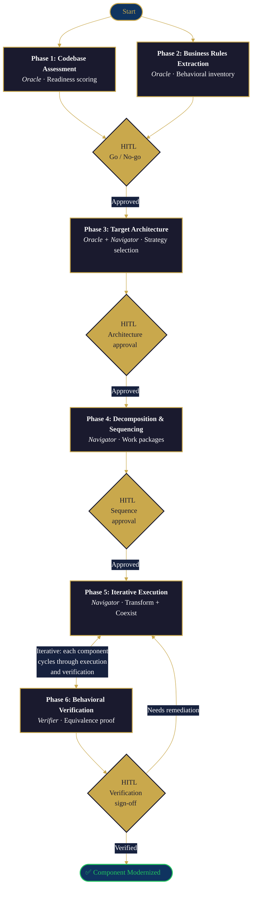

## Overview

Modernization fails not because organizations can't read their legacy code, but because they can't ensure that the new code does what the old code did.

71% of Fortune 500 companies still run mainframes. Most modernization projects fail — and the primary drivers are organizational (misaligned expectations, governance gaps, skills shortages), not technical. A third of COBOL programmers will retire by 2030. The pressure to modernize is real. The risk of doing it wrong is enormous.

The industry has responded with AI-assisted code reading and translation tools. But reading legacy code was never the hard part. The hard parts are understanding behavioral semantics across non-code artifacts, mapping hidden dependencies that span decades of accretion, proving behavioral equivalence between old and new systems, and sequencing the work so nothing breaks mid-flight. These are the problems that CoreStory addresses with the patterns in this playbook.

CoreStory provides persistent architectural intelligence across the entire modernization lifecycle — not just during discovery, but through decomposition, execution, and verification. It serves three roles:

- **Oracle** — explains system behavior, architectural patterns, dependency chains, and data flows across the full codebase
- **Navigator** — points to specific files, methods, and code paths where business logic, coupling, and risk live
- **Verifier** — compares legacy and modernized implementations to confirm behavioral equivalence

These roles map to a simple temporal model: **before** migration, CoreStory accelerates discovery from months to days by producing a structured specification automatically. **During** migration, it guides and verifies each work package against that specification — business rules, data contracts, integration behavior. **After** migration, it persists as the living specification for the modernized system, preventing the documentation decay that causes the next legacy crisis.

This playbook follows established industry frameworks (AWS, Google Cloud, Azure, Gartner) while going deeper in the areas where CoreStory adds unique value: persistent cross-session intelligence that accumulates understanding over time, rather than starting fresh with every query.

**Who this is for:** Engineering leaders, architects, and modernization teams planning or executing legacy system transformations. Also useful for consultants, PE portfolio teams, and system integrators managing modernization engagements.

**What you'll get:** A universal six-phase workflow linking to detailed sub-playbooks for each phase, plus architecture-to-architecture variants for the most common modernization patterns.

---

## When to Use This Playbook

- You're planning or executing a modernization of a legacy system (mainframe, monolith, legacy framework, on-prem infrastructure)
- You need a structured methodology that goes beyond "ask AI to rewrite the code"
- You have a codebase where business logic is scattered across application code, configuration, batch jobs, and non-code artifacts
- You need to prove behavioral equivalence between legacy and modernized systems
- You're evaluating which modernization strategy (the 7 Rs) to apply to different components
- You want to sequence a multi-month modernization program into executable work packages

## When to Skip This Playbook

- You're building a greenfield application with no legacy system to migrate from — use [Spec-Driven Development](/playbooks/spec-driven-development) instead
- You need to understand a single legacy codebase for acquisition purposes — use [M&A Technical Due Diligence](/playbooks/ma-technical-due-diligence)
- You need to extract business rules from a codebase but aren't planning a modernization — use [Business Rules Extraction](/playbooks/business-rules-extraction)
- The modernization is a simple lift-and-shift (Rehost) with no code changes — CoreStory adds minimal value to infrastructure-only moves
- The codebase is trivially small (under ~10k LOC) — you can refactor it directly without a phased methodology

---

## Prerequisites

### Organizational (address before Phase 1)

- **Executive sponsor** with budget authority and cross-team mandate
- **Governance model:** who approves architectural decisions, who owns the migration backlog, who resolves cross-team conflicts
- **Realistic timeline and budget expectations.** Reference: failed modernization projects routinely cost seven figures over 12–18 months. Plan accordingly.
- **Skills assessment.** 70% of organizations struggle to hire modernization-capable talent ([Kyndryl 2025](https://www.kyndryl.com/us/en/perspectives/articles/2025/01/state-of-it-infrastructure-report)). Plan for upskilling or partner engagement. CoreStory + AI agents serve as a force multiplier for thin teams, but they don't replace architectural judgment.
- **Compliance and regulatory constraints identified upfront.** 94% of enterprises say compliance highly influences modernization plans. Some patterns may be impossible for regulated workloads (data residency, PCI-DSS, HIPAA, SOX).
- **Change management strategy:** how will affected teams learn the new systems?

### Technical

- A **CoreStory account** with the legacy codebase ingested and ingestion complete
- An **AI coding agent** with CoreStory MCP configured (see [Supercharging AI Agents](/getting-started/supercharging-ai-agents) for setup)
- **Repository access** for the legacy codebase under analysis
- (Recommended) Access to architecture documentation, if it exists
- (Recommended) Domain experts who can validate business rules and architectural decisions — especially for mainframe systems where business logic hides in non-code artifacts (JCL, copybooks, CICS configuration, VSAM data stores)
- (Optional) Jira, Azure DevOps, or Linear MCP for Phase 4 work package creation (see [Using CoreStory with Jira](/playbooks/using-corestory-with-jira))

---

## How It Works

### The Six-Phase Framework

Modernization is a multi-month, multi-phase engineering program — not a code translation task. This playbook breaks it into six phases, each with a dedicated sub-playbook.

| Phase | Name | Purpose | CoreStory Role | Sub-Playbook |
|-------|------|---------|----------------|--------------|
| 1 | Codebase Assessment | Evaluate modernization readiness: architecture, dependencies, tech debt, coupling, risk — including non-code artifacts (JCL, configuration, data stores) | Oracle | [Codebase Assessment](/playbooks/modernization/codebase-assessment) |
| 2 | Business Rules Inventory | Extract, catalog, and validate all business rules the modernized system must preserve | Oracle + Navigator | [Business Rules Extraction](/playbooks/business-rules-extraction) *(existing playbook)* |
| 3 | Target Architecture & Strategy | Select modernization pattern (7 Rs), define target architecture, human approval gate | Oracle | [Target Architecture](/playbooks/modernization/target-architecture) |
| 4 | Decomposition & Sequencing | Identify service boundaries, map dependencies, produce ordered migration plan, push to Jira/Linear | Navigator | [Decomposition & Sequencing](/playbooks/modernization/decomposition-sequencing) |
| 5 | Iterative Execution | Transform → Coexist → Eliminate per component, using Strangler Fig / Branch by Abstraction | Oracle + Navigator | [Spec-Driven Development](/playbooks/spec-driven-development) *(existing playbook)* + architecture-to-architecture variants |
| 6 | Behavioral Verification | Prove modernized components preserve business rules from Phase 2 | Verifier | [Behavioral Verification](/playbooks/modernization/behavioral-verification) |

### How the Phases Connect

The phases form a dependency chain with an iterative loop at the end:

- **Phase 1** produces the assessment that informs **Phase 3** (strategy selection). You can't choose a modernization pattern without understanding what you're modernizing.
- **Phase 2** produces the behavioral contract that **Phase 6** verifies against. The business rules inventory is the definition of "correct" that the modernized system must satisfy.
- **Phase 3** selects the pattern that determines which **Phase 5** variant to use. A monolith-to-microservices migration executes differently than a mainframe-to-cloud migration.
- **Phase 4** produces the sequenced work plan that **Phase 5** executes. Each work package has dependencies, acceptance criteria, and a defined order.
- **Phases 5 and 6 are iterative** — each component cycles through execution and verification. A component isn't done until its behavioral equivalence is confirmed.



### CoreStory MCP Tools Used

This playbook and its sub-playbooks use the following tools from the CoreStory MCP server:

| Tool | Phase(s) | Purpose |
|------|----------|---------|
| `list_projects` | 1 | Find the target project |
| `create_conversation` | 1 | Start a dedicated conversation thread for each phase |
| `send_message` | 1, 2, 3, 4, 5, 6 | Query CoreStory for analysis, guidance, and verification |
| `get_project_prd` | 1 | Retrieve synthesized PRD for business context |
| `get_project_techspec` | 1 | Retrieve synthesized TechSpec for architecture analysis |
| `list_conversations` | Any | Review existing conversation threads from prior phases |
| `get_conversation` | Any | Retrieve conversation history for cross-phase reference |
| `rename_conversation` | Final | Mark completed threads with "RESOLVED" prefix |

**A note on the PRD and TechSpec:** These documents are often very large — too large for an agent to hold in a single context window. Rather than reading them end-to-end, query CoreStory about their contents via `send_message`. CoreStory has already ingested these documents and can answer targeted questions about them efficiently.

---

## Human-in-the-Loop Gates

Modernization involves irreversible architectural decisions and production-impacting deployments. CoreStory informs these decisions; humans make them. The following gates are non-negotiable checkpoints where human judgment is required.

| Gate | After Phase | Decision | Who Decides |
|------|-------------|----------|-------------|
| **Go/No-Go** | Phase 1 (Assessment) | Is this system ready for modernization? Is the organization ready? | Engineering leadership + executive sponsor |
| **Architecture Approval** | Phase 3 (Strategy) | What is the target architecture? Which modernization pattern? This is the critical architectural decision and must not be delegated to AI. | Architect / tech lead + stakeholders |
| **Sequence Approval** | Phase 4 (Sequencing) | Is the migration sequence correct? Are the work packages properly scoped? Are dependencies accurately mapped? Review before pushing to Jira/Linear. | Engineering lead |
| **Spec Review** | During Phase 5 (Execution) | Each component's delta spec (from Spec-Driven Development) is reviewed before implementation begins. | Tech lead / senior engineer |
| **Equivalence Sign-Off** | Phase 6 (Verification) | Does the behavioral equivalence report confirm the modernized component preserves all business rules? Approve before retiring the legacy component. | Domain expert + tech lead |

These gates exist because AI is excellent at analysis but should not make organizational commitments. Every gate produces an artifact (report, decision record, or approval) that becomes part of the modernization audit trail.

---

## The 7 Rs: Choosing a Modernization Strategy

The "7 Rs" taxonomy originated with Gartner (5 Rs), was extended by AWS to 6 and then 7, and has become the industry-standard decision framework for modernization strategy. Phase 3 of this playbook guides you through selecting the right R for each component. Here's the landscape and where CoreStory adds value:

| Strategy | Description | CoreStory Value |
|----------|-------------|-----------------|
| **Retire** | Decommission applications no longer needed | **Moderate** — Assessment identifies dead code and unused services to decommission safely |
| **Retain** | Keep in current environment (not ready or not worth migrating) | **High** — CoreStory rationalizes retain decision and assists with maintenance |
| **Rehost** (lift and shift) | Move without code changes | **Low** — No code changes means minimal CoreStory involvement |
| **Relocate** | Move VMs to cloud hypervisor (e.g., VMware → VMware Cloud on AWS) | **Low** — Infrastructure-level move, no application changes |
| **Replatform** (lift, tinker, shift) | Minor optimizations without changing core architecture | **Moderate** — CoreStory identifies integration points affected by infrastructure changes |
| **Refactor / Re-architect** | Restructure or fundamentally redesign the application | **Highest** — This is where CoreStory's persistent intelligence is transformative: service boundary identification, dependency mapping, behavioral verification |
| **Repurchase** | Replace with SaaS/COTS product (e.g., on-prem CRM → Salesforce) | **Moderate** — CoreStory helps inventory business rules that the SaaS replacement must cover; the [Feature Gap Analysis](/playbooks/feature-gap-analysis) playbook applies |

This playbook is most valuable for **Refactor / Re-architect** — the R that requires deep, persistent codebase understanding across the full lifecycle. It also adds significant value to **Repurchase** (via business rules inventory and gap analysis) and to the **Retire / Retain** decision itself (via rigorous assessment).

> **A note on "Rebuild":** Some frameworks cite Rebuild as an 8th R (ground-up rewrite). This playbook treats it as a variant of Refactor / Re-architect because the methodology is the same — the difference is scope, not process. Behavioral verification is equally critical regardless.

> **A note on hybrid strategies:** [Kyndryl data](https://www.kyndryl.com/us/en/perspectives/articles/2025/01/state-of-it-infrastructure-report) shows 53% of enterprises pursue hybrid strategies — applying different Rs to different components rather than a single approach across the entire portfolio. This is expected and healthy. The assessment phase (Phase 1) should produce a per-component recommendation, not a single system-wide strategy.

---

## Working with AI-Derived Findings

CoreStory's specification is AI-derived. It produces high-confidence structured artifacts from code analysis — but not every finding carries the same certainty, and not every behavior in the legacy system should be preserved unchanged. Two complementary systems govern how teams navigate these realities across phases.

### The Confidence Protocol

The Confidence Protocol governs how much human validation each finding requires. It prevents two failure modes: reviewing everything (doesn't scale) and reviewing nothing (too risky). SME time stays proportional to uncertainty, not system size.

| State | Meaning | Required Action | SME Review? |
|-------|---------|-----------------|-------------|
| **Verified** | In the spec + SME confirmed + test exists | Migrate as-is | Already done |
| **High-confidence** | In the spec + code evidence clear | Migrate; SME review only if high-risk or financial/compliance | Risk-based |
| **Hypothesized** | Suggestive evidence but ambiguous | Investigate before migrating — may need runtime observation or stakeholder interviews | Mandatory |
| **Contradicted** | CoreStory states X, but SME or test evidence shows Y | Investigate: is the code right and the SME assumption outdated, or did CoreStory misinterpret? | Mandatory |

**On Contradicted findings:** This is an expected occurrence, not a system failure. Contradictions surface cases where either the code does something different from what stakeholders believe (valuable: you've found a latent bug or undocumented change), or CoreStory misinterpreted a code path (fix the spec and continue). Both outcomes improve the modernization's accuracy.

The Confidence Protocol applies across phases: Phase 1 (Assessment) assigns initial confidence states, Phase 2 (Business Rules) refines them, and Phase 6 (Verification) can upgrade Hypothesized findings to High-confidence or Verified as evidence accumulates.

### Behavior Tagging

During Phase 3 (Target Architecture), every behavior identified in the spec gets tagged with an explicit migration intent. This forces a deliberate decision about each behavior — no silent changes.

| Tag | Meaning | Verification in Phase 6 |
|-----|---------|------------------------|
| `[PRESERVE]` | Behavior must be identical in the target | Automated equivalence test + SME sign-off |
| `[MODERNIZE]` | Same business outcome, modern implementation | SME confirms business outcome is identical |
| `[CHANGE]` | Deliberately modified (bug fix, enhancement, policy change) | Product owner approves; old behavior documented for audit |
| `[NEW]` | New behavior not in the legacy system (added during modernization) | Standard acceptance testing |
| `[RETIRE]` | Legacy behavior intentionally dropped | Stakeholder confirms behavior is no longer needed |

If `[CHANGE]` + `[NEW]` exceeds ~20% of tagged items in a work unit, the unit is drifting from modernization to rewrite — different risk characteristics. Flag to the program manager for scope review.

The full tagging workflow is covered in [Target Architecture](/playbooks/modernization/target-architecture). The tags flow forward into Phase 4 (each work package's scope is defined by its tags), Phase 5 (TDD assertions differ by tag), and Phase 6 (verification criteria differ by tag).

---

## Execution Patterns

Phase 5 (Iterative Execution) follows one of three incremental migration patterns. The Strangler Fig is the default; the others are used when the façade approach isn't feasible.

### Strangler Fig (Default)

The most widely recommended pattern for incremental modernization. Named by Martin Fowler after the strangler fig plant that gradually envelops its host tree.

1. **Transform:** Build the modernized version of the component using [Spec-Driven Development](/playbooks/spec-driven-development).
2. **Coexist:** Run both old and new versions simultaneously. Route traffic through a façade/proxy layer. Validate behavioral equivalence.
3. **Eliminate:** Once the modernized component is verified (Phase 6), retire the legacy component and remove the façade.

The façade enables instant rollback — if the modernized component fails verification, traffic routes back to legacy with no downtime.

### Branch by Abstraction

For deeply embedded components where a façade can't intercept traffic — shared libraries, data access layers, utility modules.

1. Introduce an abstraction layer within the codebase that both old and new implementations satisfy.
2. Build the new implementation behind the abstraction.
3. Switch consumers to the new implementation incrementally.
4. Remove the old implementation and (optionally) the abstraction layer.

Reference: Sam Newman, *Monolith to Microservices*. Use when: shared data access layers, utility libraries, deeply coupled internal components.

### Parallel Run (Shadow Traffic)

For high-risk components where behavioral equivalence must be proven in production before cutover.

1. Route copies of production requests to both legacy and modernized systems.
2. Compare responses; flag discrepancies.
3. Run until the discrepancy rate drops below threshold (typically below 0.01% for critical services).
4. Cut over to the modernized system; decommission legacy.

Use when: payment processing, financial calculations, regulatory-sensitive logic — anywhere a behavioral difference has catastrophic consequences.

> **Data synchronization during coexistence:** A rising pattern combines Strangler Fig with **Change Data Capture (CDC)** via Apache Kafka or Debezium to keep legacy and modern data stores in sync during the coexistence phase. This avoids the dual-write problem and enables real-time data consistency without modifying the legacy system's write path.

---

## Architecture-to-Architecture Variants

Phase 5 links to architecture-specific variant playbooks that provide pattern-specific guidance for the most common modernization patterns.

### Monolith → Microservices *(available now)*

The most common enterprise modernization pattern. Covers service boundary identification, API gateway introduction, data decomposition (the hardest challenge in this pattern), Saga pattern for distributed transactions, and the Strangler Fig execution workflow per service.

**[Read the Monolith to Microservices playbook →](/playbooks/modernization/monolith-to-microservices)**

### Legacy Framework → Modern Framework *(coming soon)*

E.g., Struts → Spring Boot, .NET Framework → .NET Core, AngularJS → React. Same codebase structure, modern runtime. Focuses on dependency upgrades, API contract preservation, and incremental migration.

### Mainframe → Cloud-Native *(coming soon)*

COBOL/mainframe systems to Java/Python on cloud infrastructure. Addresses the unique challenges of mainframe coupling, JCL batch jobs, VSAM data stores, CICS transaction processing, copybook data definitions, and the non-code artifacts that encode business logic never captured in application code.

### On-Prem → Cloud-Native *(coming soon)*

Infrastructure modernization with application refactoring. Covers cloud-native patterns (containers, serverless, managed services), data migration, and the operational shift from on-prem to cloud.

---

## Step-by-Step Overview

Each phase has a dedicated sub-playbook with full walkthroughs. This section provides a condensed overview of what happens at each phase and what it produces.

### Phase 1: Codebase Assessment

**Goal:** Systematically evaluate the legacy codebase's modernization readiness.

```
Start by finding the project and creating a conversation thread:
"List my CoreStory projects. I need to identify the project for [SystemName]."
```

The assessment covers architecture mapping, dependency analysis, tech debt identification, security and compliance review, testability evaluation, data architecture analysis, and — critically for mainframe systems — non-code artifact inventory (JCL, copybooks, CICS, VSAM, sort utilities, system exits, middleware configuration).

**Deliverable:** A Modernization Readiness Report with component-level readiness scores and a recommended modernization strategy per component.

**[Read the full Codebase Assessment playbook →](/playbooks/modernization/codebase-assessment)**

### Phase 2: Business Rules Inventory

**Goal:** Extract, catalog, and validate every business rule the modernized system must preserve.

This phase uses the existing [Business Rules Extraction](/playbooks/business-rules-extraction) playbook. The business rules inventory becomes the behavioral contract that Phase 6 verifies against — if a rule is missing from the inventory, it won't be verified.

**Deliverable:** A structured Business Rules Inventory using the BR-XXX template format.

**[Read the Business Rules Extraction playbook →](/playbooks/business-rules-extraction)**

### Phase 3: Target Architecture & Strategy

**Goal:** Choose the modernization pattern and define the target architecture.

This is the most human-driven phase. CoreStory provides the analysis — natural service boundaries, coupling hotspots, data dependency maps — but the architectural decision belongs to the architect and stakeholders.

```
Query CoreStory: "Given the current architecture, which components are natural
candidates for service extraction? Where are the natural service boundaries?"
```

**Deliverable:** An Architectural Decision Record documenting the selected strategy, target architecture, migration scope, constraints, and stakeholder approval.

**[Read the Target Architecture playbook →](/playbooks/modernization/target-architecture)**

### Phase 4: Decomposition & Sequencing

**Goal:** Break the modernization plan into executable work packages and order them by dependency.

CoreStory maps dependencies between components and identifies which must be modernized together (can't be separated) versus which can be extracted independently. The output is a sequenced migration plan with work packages ready for Jira or Linear.

```
Query CoreStory: "Which components share database tables or data stores?
Map the shared data dependencies."
```

**Deliverable:** A sequenced set of work packages with scope, acceptance criteria, dependencies, and estimated effort — optionally pushed to Jira/Linear as epics or stories.

**[Read the Decomposition & Sequencing playbook →](/playbooks/modernization/decomposition-sequencing)**

### Handling Change During Execution

Read this section before starting Phase 5. It applies throughout.

Modernization programs take months. The business doesn't pause during migration. Feature requests arrive, bugs get filed against the legacy system, and the target architecture evolves as the team learns. The behavior tagging system and CoreStory's persistent conversations are the mechanisms for handling this.

**New feature request arrives during migration.** Query CoreStory to identify which work unit the feature touches. If the module hasn't migrated yet, implement in legacy and tag as `[NEW]` for the work unit. If migration is in progress, implement in the target and add to the unit's scope. If the module already migrated, use the [Feature Implementation](/playbooks/feature-implementation) playbook against the modern codebase.

**Legacy bug discovered during migration.** Document in the work unit's CoreStory conversation. Tag the buggy behavior as `[CHANGE]` with rationale: "Legacy bug — correcting during migration." Write tests asserting the *correct* behavior (not the legacy bug). Get product owner sign-off that the behavioral change is intentional.

**Target architecture evolves mid-migration.** Document in the Phase 3 conversation. Assess impact on completed work units. Re-validate with CoreStory: "Given this architectural change, do any completed migration units need adjustment?"

**Scope creep management.** Monitor the tagging ratio per work unit. If `[CHANGE]` + `[NEW]` exceeds ~20% of tagged items, flag to the program manager — the unit is drifting from modernization to rewrite.

### Phase 5: Iterative Execution

**Goal:** Execute the modernization component by component using the Transform → Coexist → Eliminate pattern.

This phase uses the existing [Spec-Driven Development](/playbooks/spec-driven-development) playbook for generating delta specs per component, plus the relevant architecture-to-architecture variant for pattern-specific guidance.

**Deliverable:** Modernized components with façade/proxy layers for traffic routing during coexistence.

**Existing playbook:** [Spec-Driven Development →](/playbooks/spec-driven-development)
**First variant:** [Monolith to Microservices →](/playbooks/modernization/monolith-to-microservices)

### Phase 6: Behavioral Verification

**Goal:** Prove that each modernized component preserves the business rules cataloged in Phase 2.

Verification uses a four-tier strategy:

1. **Static verification** (CoreStory-assisted, no running code): Rule tracing, invariant checking, data flow comparison, edge case generation.
2. **Dynamic verification** (requires running code): Characterization testing (Golden Master), contract testing.
3. **Production-grade verification** (requires production-like environment): Shadow traffic testing, record-replay testing.
4. **Data migration verification** (if applicable): Row counts, checksums, semantic validation, referential integrity checks.

CoreStory is most powerful in Tier 1 (it holds both codebases' semantic understanding) and in generating test cases for Tiers 2–3. The dynamic tiers require additional tooling, but CoreStory guides what to test and interprets the results.

**Deliverable:** A Behavioral Equivalence Report with rule-by-rule verification status, behavioral differences analysis, and a recommendation (ready to eliminate legacy / needs remediation / needs domain expert review).

**[Read the Behavioral Verification playbook →](/playbooks/modernization/behavioral-verification)**

---

## How This Relates to Other Playbooks

| Playbook | Relationship to Code Modernization |
|----------|-----------------------------------|
| [Business Rules Extraction](/playbooks/business-rules-extraction) | **Phase 2** of the modernization workflow. Produces the behavioral contract that Phase 6 verifies against. |
| [Spec-Driven Development](/playbooks/spec-driven-development) | **Phase 5** execution methodology. Generates delta specs for each component being modernized. |
| [Feature Gap Analysis](/playbooks/feature-gap-analysis) | Useful within **Phase 5** when evaluating whether a modernized component covers all capabilities of the legacy component. Also applies to Repurchase (SaaS replacement) evaluations. |
| [Feature Implementation](/playbooks/feature-implementation) | Useful within **Phase 5** for TDD-style execution of individual component modernization. |
| [M&A Technical Due Diligence](/playbooks/ma-technical-due-diligence) | Shares **Phase 1** DNA — the assessment methodology is similar, but the lens differs: M&A evaluates a codebase you *don't* own for acquisition risk; Codebase Assessment evaluates a codebase you *do* own for transformation readiness. |
| [Using CoreStory with Jira](/playbooks/using-corestory-with-jira) | **Phase 4** integration — work packages from Decomposition & Sequencing can be pushed directly to Jira as epics and stories. |

---

## Agent Implementation Guides

<AccordionGroup>

<Accordion title="Claude Code">

#### Setup

1. **Configure the CoreStory MCP server** in your Claude Code settings (see [CoreStory MCP Server Setup Guide](/getting-started/mcp-server-setup)).

2. **Add the skill file.** Create the skill directory and file:

```bash
mkdir -p .claude/skills/code-modernization
```

Create `.claude/skills/code-modernization/SKILL.md` with the content from the skill file below.

3. **(Optional) Add the slash command:**

```bash
mkdir -p .claude/commands
```

Create `.claude/commands/modernize.md` with a short description referencing the six-phase modernization workflow.

4. **Commit to version control:**

```bash
git add .claude/skills/ .claude/commands/
git commit -m "Add CoreStory code modernization skill and command"
```

#### Usage

The skill activates automatically when Claude Code detects modernization-related requests:

```
Help me plan the modernization of our legacy system
Run a codebase assessment for modernization readiness
Start a modernization workflow on project X
```

Or invoke explicitly:

```
/modernize [SystemName]
```

#### Tips

- This skill is a **router**, not an executor. It determines which phase the user needs and delegates to the dedicated phase skill. It should never execute phase steps directly.
- Each phase has its own skill file with full procedural detail. The hub skill intentionally omits that detail to prevent Claude Code from racing through all phases at once.
- Create separate CoreStory conversations per phase to keep findings organized and produce clean audit trails.
- Keep the SKILL.md under 500 lines for reliable loading.

#### Skill File

Save as `.claude/skills/code-modernization/SKILL.md`:

````markdown
---
name: CoreStory Code Modernization
description: Orchestrates legacy system modernization using CoreStory's persistent code intelligence. Routes to the correct phase-specific skill and enforces sequential execution with human-in-the-loop gates between phases. Activates on modernization, migration, legacy system, or refactoring requests.
---

# CoreStory Code Modernization — Orchestrator

**This skill is a router and sequencer. It does NOT contain execution instructions for any phase.** When this skill activates, your job is to determine which phase the user needs, activate the dedicated skill for that phase, and enforce the gate between phases.

## Critical Rules

1. **Execute exactly one phase per session.** Never run multiple phases in a single pass.
2. **Always use the dedicated phase skill.** The summaries below are for orientation only — they do not contain enough detail to execute the phase correctly. Read and follow the dedicated skill for the active phase.
3. **After completing a phase, STOP.** Present the deliverable and wait for the user to explicitly approve before offering to advance to the next phase.
4. **Never skip phases.** Each phase depends on the outputs of the one before it.

## Activation Triggers

Activate when user requests:
- Code modernization or legacy modernization
- System migration or codebase migration
- Legacy refactoring or re-architecture
- Monolith decomposition or monolith-to-microservices
- Modernization assessment or readiness evaluation
- Any request containing "modernize", "migration", "legacy", "monolith", "mainframe"

## Prerequisites

- CoreStory MCP server configured
- At least one CoreStory project with completed ingestion (the legacy codebase)
- Read access to the repository for cross-referencing findings

**If you do not detect that you have access to CoreStory (e.g., `list_projects` fails or is unavailable), ask the user to verify that their MCP or API connection is properly configured and that this repository has been ingested. If the user has not yet created a CoreStory account, direct them to create one and upload their repo at [app.corestory.ai](https://app.corestory.ai).**

## Phase Detection

Before doing anything, determine where the user is in the process:

1. **Ask the user** which phase they want to work on, OR
2. **Check CoreStory conversations** (`list_conversations`) — look for completed phase markers:
   - "RESOLVED - [Assessment]..." → Phase 1 complete
   - "RESOLVED - [Business Rules]..." → Phase 2 complete
   - "RESOLVED - [Architecture]..." → Phase 3 complete
   - "RESOLVED - [Decomposition]..." → Phase 4 complete
   - Active "[Extraction]..." conversations → Phase 5 in progress
   - Active "[Verification]..." conversations → Phase 6 in progress
3. **If no prior work exists**, start at Phase 1.

Once you know the target phase, read and follow its dedicated skill completely.

---

## Phase 1: Codebase Assessment

**Purpose:** Evaluate the legacy system's architecture, dependencies, tech debt, and modernization readiness.

**Dedicated skill:** `codebase-assessment` — read `.claude/skills/codebase-assessment/SKILL.md` and follow its full workflow.

**Deliverable:** Modernization Readiness Report

**⛔ GATE: Do not proceed to Phase 2 until the user has reviewed the Readiness Report and given explicit go/no-go approval.**

---

## Phase 2: Business Rules Inventory

**Purpose:** Extract, catalog, and verify all business rules embedded in the legacy system.

**Dedicated skill:** This phase uses the **Business Rules Extraction** skill. Read the Business Rules Extraction skill file (`.claude/skills/business-rules-extraction/SKILL.md`) and follow its full workflow. If this skill is not installed, refer to the [Business Rules Extraction playbook](https://docs.corestory.ai/playbooks/business-rules-extraction) for setup instructions.

**Deliverable:** Business Rules Inventory (BR-XXX format)

**⛔ GATE: Do not proceed to Phase 3 until the user has reviewed the Business Rules Inventory and confirmed completeness.**

---

## Phase 3: Target Architecture & Strategy

**Purpose:** Evaluate modernization strategies (the 7 Rs), define the target architecture, and document the decision.

**Dedicated skill:** `target-architecture` — read `.claude/skills/target-architecture/SKILL.md` and follow its full workflow.

**Deliverable:** Architectural Decision Record (ADR)

**⛔ GATE: Do not proceed to Phase 4 until the architect or tech lead has approved the ADR.**

---

## Phase 4: Decomposition & Sequencing

**Purpose:** Break the modernization into discrete, sequenced work packages with dependency mapping and acceptance criteria.

**Dedicated skill:** `decomposition-sequencing` — read `.claude/skills/decomposition-sequencing/SKILL.md` and follow its full workflow.

**Deliverable:** Sequenced work packages (optionally pushed to Jira/Linear)

**⛔ GATE: Do not proceed to Phase 5 until the engineering lead has approved the sequence.**

---

## Phase 5: Iterative Execution (per component)

**Purpose:** Execute the modernization for each component following the Transform → Coexist → Eliminate pattern.

**Dedicated skill:** Use the variant that matches the target architecture:
- Monolith to microservices → `monolith-to-microservices` — read `.claude/skills/monolith-to-microservices/SKILL.md`
- Other patterns → Follow Spec-Driven Development for the delta spec

**Deliverable:** Modernized component with coexistence infrastructure

**⛔ GATE: Do not proceed to Phase 6 for a component until the delta spec has been reviewed and the Transform phase is functionally complete.**

---

## Phase 6: Behavioral Verification (per component)

**Purpose:** Verify that the modernized component preserves every business rule from the Phase 2 inventory.

**Dedicated skill:** `behavioral-verification` — read `.claude/skills/behavioral-verification/SKILL.md` and follow its full workflow.

**Deliverable:** Behavioral Equivalence Report

**⛔ GATE: Do not retire the legacy component until the domain expert or engineering lead has validated the Equivalence Report.**

---

## Error Handling

- **Project not found:** List available projects, ask user to specify
- **Generic answers from CoreStory:** Narrow queries with specific component names from Tech Spec
- **User unsure which phase they're in:** Check CoreStory conversations for completed phase markers (see Phase Detection above)
- **User wants to jump ahead:** Explain the dependency chain and what outputs are missing. Offer to start from the earliest incomplete phase.
- **Phase skill not installed:** Direct the user to the relevant playbook page on [docs.corestory.ai](https://docs.corestory.ai/playbooks/code-modernization) for setup instructions.
- **Legacy system uses non-code artifacts:** Explicitly ask about JCL, copybooks, CICS, VSAM — CoreStory surfaces these if prompted
````

</Accordion>

<Accordion title="GitHub Copilot">

GitHub Copilot supports agent skills — folders containing a `SKILL.md` file with YAML frontmatter that Copilot loads when relevant to a task.

Create `.github/skills/code-modernization/SKILL.md`:

```yaml
---
name: code-modernization
description: "Orchestrate legacy system modernization using CoreStory's persistent code intelligence. Routes to phase-specific skills and enforces sequential execution with human gates between phases."
---
```

```markdown
# Code Modernization Skill — Orchestrator

This skill is a router. It determines which phase the user needs and delegates to the dedicated phase skill. Do NOT execute phase steps from this file.

**Rules:** Execute one phase per session. Always use the dedicated phase skill. STOP after each phase and wait for user approval before advancing.

**If you do not detect that you have access to CoreStory (e.g., `list_projects` fails or is unavailable), ask the user to verify that their MCP or API connection is properly configured and that this repository has been ingested. If the user has not yet created a CoreStory account, direct them to create one and upload their repo at [app.corestory.ai](https://app.corestory.ai).**

## Phase 1: Codebase Assessment
Dedicated skill: `codebase-assessment` — Produces Modernization Readiness Report.
⛔ GATE: User must approve before advancing to Phase 2.

## Phase 2: Business Rules Inventory
Dedicated skill: `business-rules-extraction` — Produces BR-XXX format inventory.
⛔ GATE: User must confirm completeness before advancing to Phase 3.

## Phase 3: Target Architecture & Strategy
Dedicated skill: `target-architecture` — Produces Architectural Decision Record (ADR).
⛔ GATE: Architect/tech lead must approve ADR before advancing to Phase 4.

## Phase 4: Decomposition & Sequencing
Dedicated skill: `decomposition-sequencing` — Produces sequenced work packages.
⛔ GATE: Engineering lead must approve sequence before advancing to Phase 5.

## Phase 5: Iterative Execution (per component)
Dedicated skill: `monolith-to-microservices` (or relevant architecture variant).
⛔ GATE: Delta spec must be reviewed before advancing to Phase 6.

## Phase 6: Behavioral Verification (per component)
Dedicated skill: `behavioral-verification` — Produces Behavioral Equivalence Report.
⛔ GATE: Domain expert must validate before retiring legacy component.

Key principle: Oracle before Navigator — understand architecture from
CoreStory before navigating to specific code.
```

**Custom instructions (lightweight alternative):** Add to `.github/copilot-instructions.md`:

```markdown
## Code Modernization

When asked to modernize or migrate a legacy system:
1. Execute ONE phase at a time — never run multiple phases in a single session
2. ALWAYS start with a Codebase Assessment via CoreStory (architecture, dependencies, tech debt, non-code artifacts)
3. Extract business rules BEFORE any code changes — these define "correct"
4. Use the 7 Rs framework to select strategy per component (not one strategy for everything)
5. Sequence work packages by dependency chain — CoreStory maps shared data stores and coupling
6. Execute incrementally: Transform → Coexist → Eliminate (Strangler Fig default)
7. Verify behavioral equivalence for every component before retiring legacy
8. Human approval required at five gates: go/no-go, architecture, sequence, spec review, equivalence
9. STOP after each phase deliverable and wait for explicit human approval before advancing
```

</Accordion>

<Accordion title="Cursor">

Create `.cursor/rules/code-modernization/RULE.md`:

````markdown
---
description: CoreStory-powered code modernization orchestrator. Routes to phase-specific rules and enforces sequential execution with human gates. Activates for legacy modernization, system migration, monolith decomposition, and mainframe transformation.
alwaysApply: false
---

# CoreStory Code Modernization — Orchestrator

You are a modernization architect with access to CoreStory's code intelligence via MCP. **This rule is a router — it determines which phase the user needs and delegates to the dedicated phase rule. Do NOT execute phase steps from this file.**

## Critical Rules

1. **Execute exactly one phase per session.** Never run multiple phases in a single pass.
2. **Always use the dedicated phase rule.** The summaries below are for orientation only.
3. **After completing a phase, STOP.** Present the deliverable and wait for explicit user approval.
4. **Never skip phases.** Each phase depends on the outputs of the one before it.

## Activation Triggers

Apply when user requests: code modernization, legacy migration, system migration, monolith decomposition, mainframe modernization, re-architecture, or any refactoring at architectural scale.

**If you do not detect that you have access to CoreStory (e.g., `list_projects` fails or is unavailable), ask the user to verify that their MCP or API connection is properly configured and that this repository has been ingested. If the user has not yet created a CoreStory account, direct them to create one and upload their repo at [app.corestory.ai](https://app.corestory.ai).**

## Six-Phase Workflow

### Phase 1: Codebase Assessment
Dedicated rule: `codebase-assessment` — Produces Modernization Readiness Report.
⛔ GATE: User must approve before advancing to Phase 2.

### Phase 2: Business Rules Inventory
Dedicated rule: `business-rules-extraction` — Produces BR-XXX format inventory.
⛔ GATE: User must confirm completeness before advancing to Phase 3.

### Phase 3: Target Architecture & Strategy
Dedicated rule: `target-architecture` — Produces Architectural Decision Record (ADR).
⛔ GATE: Architect/tech lead must approve ADR before advancing to Phase 4.

### Phase 4: Decomposition & Sequencing
Dedicated rule: `decomposition-sequencing` — Produces sequenced work packages.
⛔ GATE: Engineering lead must approve sequence before advancing to Phase 5.

### Phase 5: Iterative Execution (per component)
Dedicated rule: `monolith-to-microservices` (or relevant architecture variant).
⛔ GATE: Delta spec must be reviewed before advancing to Phase 6.

### Phase 6: Behavioral Verification (per component)
Dedicated rule: `behavioral-verification` — Produces Behavioral Equivalence Report.
⛔ GATE: Domain expert must validate before retiring legacy component.

## Key Principles
- Oracle before Navigator: understand architecture from specs first
- Business rules define "correct" — extract them before changing anything
- Humans make architectural decisions; AI informs them
- Incremental execution — never big-bang rewrite
- Every component verified before legacy is retired
````

</Accordion>

<Accordion title="Factory.ai">

Create `.factory/droids/code-modernization.md`:

````markdown
---
name: CoreStory Code Modernization
description: Orchestrates legacy system modernization by routing to phase-specific droids and enforcing sequential execution with human gates between phases.
model: inherit
tools:
  - CoreStory:list_projects
  - CoreStory:get_project_prd
  - CoreStory:get_project_techspec
  - CoreStory:create_conversation
  - CoreStory:send_message
  - CoreStory:rename_conversation
  - CoreStory:list_conversations
  - CoreStory:get_conversation
---

# CoreStory Code Modernization — Orchestrator

**This droid is a router. It determines which phase the user needs and delegates to the dedicated phase droid. Do NOT execute phase steps from this file.**

## Critical Rules

1. **Execute exactly one phase per session.** Never run multiple phases in a single pass.
2. **Always delegate to the dedicated phase droid.** The summaries below are for orientation only.
3. **After completing a phase, STOP.** Present the deliverable and wait for explicit user approval.
4. **Never skip phases.** Each phase depends on the outputs of the one before it.

## Activation Triggers
- "Modernize [system]" or "migrate [system]"
- "Codebase assessment" or "modernization readiness"
- "Monolith to microservices" or "mainframe migration"
- Any legacy modernization, re-architecture, or migration request

## CoreStory MCP Tools
- `list_projects` — identify the target project
- `list_conversations` / `get_conversation` — detect which phase has been completed
- `create_conversation` — open named threads per phase
- `send_message` — query CoreStory (primary investigation tool)
- `rename_conversation` — mark completed threads "RESOLVED"
- `get_project_prd` / `get_project_techspec` — retrieve specs for context

**If you do not detect that you have access to CoreStory (e.g., `list_projects` fails or is unavailable), ask the user to verify that their MCP or API connection is properly configured and that this repository has been ingested. If the user has not yet created a CoreStory account, direct them to create one and upload their repo at [app.corestory.ai](https://app.corestory.ai).**

## Workflow

Phase 1: Codebase Assessment → delegate to `codebase-assessment` droid → ⛔ HITL go/no-go
Phase 2: Business Rules Inventory → delegate to `business-rules-extraction` droid → ⛔ HITL completeness
Phase 3: Target Architecture → delegate to `target-architecture` droid → ⛔ HITL architecture approval
Phase 4: Decomposition → delegate to `decomposition-sequencing` droid → ⛔ HITL sequence approval
Phase 5: Execution → delegate to `monolith-to-microservices` droid (or variant) → ⛔ HITL spec review
Phase 6: Verification → delegate to `behavioral-verification` droid → ⛔ HITL equivalence sign-off

## Key Principles
- Oracle before Navigator: understand architecture from specs first
- Business rules define "correct" — extract before changing anything
- Humans make architectural decisions; AI informs them
- Incremental execution using Strangler Fig (default), Branch by Abstraction, or Parallel Run
- Every component verified before legacy is retired
````

</Accordion>
</AccordionGroup>

---

## Tips & Best Practices

**Start with Phase 1, even if you think you know the codebase.** Engineers who've worked on a system for years consistently discover architectural connections, dead code paths, and undocumented dependencies during a formal assessment. CoreStory surfaces things that tribal knowledge misses.

**Create separate CoreStory conversations per phase.** Don't reuse a single thread across all six phases. Separate conversations keep findings organized, produce clean audit trails, and allow different team members to own different phases.

**Retain is a legitimate outcome.** 53% of enterprises pursue hybrid strategies ([Kyndryl 2025](https://www.kyndryl.com/us/en/perspectives/articles/2025/01/state-of-it-infrastructure-report)). Not every component needs to be modernized. The assessment phase should identify components where the cost of modernization exceeds the benefit — and "retain" is the correct strategy for those components.

**Don't skip the business rules inventory.** Phase 2 is the most frequently shortcut phase and the most common source of modernization failure. If you don't know what the legacy system does, you can't verify that the modernized system does the same thing. The business rules inventory is not optional.

**Sequence by dependency chain, not by perceived difficulty.** Teams often want to start with the "easiest" component. But if that component depends on a shared database that three other components also use, you'll immediately hit data decomposition challenges. Let the dependency graph drive the sequence.

**Use the architecture variant playbooks.** Generic modernization guidance is insufficient for the specific challenges of each pattern. Monolith-to-microservices has different hard problems (data decomposition, distributed transactions) than mainframe-to-cloud (JCL translation, VSAM migration, CICS session management).

**Query specificity matters.** "Tell me about the architecture" produces vague answers. "Which modules access the same database tables? Map the shared data dependencies between the order processing and inventory modules" produces actionable findings with file paths. Always name the specific component, entity, or workflow.

---

## Troubleshooting

**CoreStory returns generic or shallow answers about the legacy system.**

Your queries are too broad. After retrieving the Tech Spec, use the architectural vocabulary it provides — specific service names, module names, data model names — in your queries. "What are the dependencies?" is weak. "What are the dependencies between the OrderService and InventoryService, including shared database tables and message queue interactions?" is strong.

**The assessment reveals the system isn't ready for modernization.**

This is a valid and valuable finding. Common blockers: no test coverage (can't verify), extreme coupling (can't decompose), missing domain knowledge (can't validate business rules), insufficient budget or timeline. Use the assessment to build the case for investing in readiness *before* attempting modernization.

**Phase 3 produces analysis paralysis — too many options, no clear strategy.**

Start with the component that has the highest business value and the lowest coupling. Prove the methodology works on one component before scaling. The architectural decision doesn't have to cover every component upfront — you can reassess after the first few components are modernized.

**Work packages from Phase 4 are too large or too tightly coupled.**

Ask CoreStory more targeted decomposition questions: "What is the smallest independently-deployable subset of [component]?" and "If we extract just [feature], what temporary integration points are needed?" The goal is work packages that can be completed in 1–3 sprints.

**Behavioral verification reveals differences between legacy and modernized systems.**

Not all differences are bugs. Some are intentional improvements (better error handling, more consistent validation). The verification report should classify each difference as: (a) equivalent behavior, (b) intentional improvement, (c) acceptable deviation, or (d) bug requiring remediation. Only (d) blocks the Eliminate phase.

**Project not found or CoreStory tools unavailable.**

See the [Supercharging AI Agents](/getting-started/supercharging-ai-agents) troubleshooting section for MCP connection issues. Verify the project has completed ingestion by calling `list_projects` and checking the status.

---

## What's Next

**Start here:** [Codebase Assessment →](/playbooks/modernization/codebase-assessment) — Phase 1 is where every modernization engagement begins.

**For business rules extraction:** [Business Rules Extraction →](/playbooks/business-rules-extraction) — Phase 2 of the workflow.

**For the first architecture variant:** [Monolith to Microservices →](/playbooks/modernization/monolith-to-microservices) — the most common enterprise modernization pattern.

**For agent setup:** [Supercharging AI Agents with CoreStory →](/getting-started/supercharging-ai-agents) — MCP server configuration and agent setup.

**For Jira integration:** [Using CoreStory with Jira →](/playbooks/using-corestory-with-jira) — Phase 4 work package integration.
