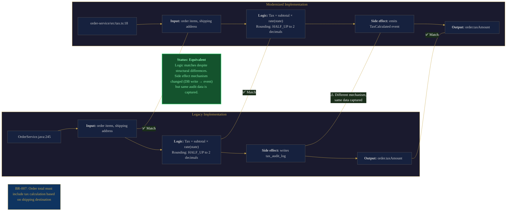

## Overview

You've modernized the component. It compiles. The tests pass. But does it actually do what the old code did?

This is the question that derails modernization programs. The hard part was never understanding what the legacy code says. The hard part is proving the new code preserves what the legacy code *does*: every business rule, every edge case, every invariant that accumulated over years of production use.

Phase 6 of the modernization workflow is where behavioral equivalence is established. The Business Rules Inventory from Phase 2 defines the behavioral contract — every rule the modernized system must preserve. This playbook provides a systematic methodology for verifying that contract: tracing each rule from the inventory to its implementation in the modernized code, identifying behavioral differences, testing edge cases, and producing a structured equivalence report that gives stakeholders the confidence to retire the legacy component.

CoreStory serves as a **Verifier** throughout this phase — comparing behavioral semantics across legacy and modernized codebases. It also operates as an **Oracle** for understanding the intent behind legacy implementations: "Why does this code handle negative quantities differently from zero quantities? Is that a business rule or a bug?" This distinction matters because not every legacy behavior should be preserved — some behaviors are bugs, workarounds, or artifacts of obsolete requirements. The verification process must surface these distinctions for human judgment.

**Who this is for:** Engineers executing modernization work packages, QA leads responsible for sign-off, and domain experts who can validate whether behavioral differences are intentional improvements or regressions.

**What you'll get:** A structured Behavioral Equivalence Report for each modernized component — rule-by-rule verification status, identified differences with analysis, missing rules, integration point verification, and a clear recommendation on whether the component is ready for the Eliminate phase.

---

## When to Use This Playbook

- You've completed the Transform phase for a work package and the modernized component is functionally complete
- You need to verify that the modernized code preserves all business rules identified in Phase 2
- You're in the Coexist phase and need to validate behavioral equivalence before retiring the legacy component
- A domain expert or stakeholder requires a structured verification report before approving legacy decommission
- You've identified behavioral differences during testing and need to systematically categorize them as intentional improvements, acceptable deviations, or regressions

## When to Skip This Playbook

- You haven't completed Phase 2 (Business Rules Inventory) — there's no behavioral contract to verify against. Go back to [Business Rules Extraction](/playbooks/business-rules-extraction)
- The modernization strategy is Rehost/Relocate with no application-level changes — behavioral equivalence is trivially preserved
- You're still in the Transform phase — finish the implementation first, then verify
- The component is being Retired (decommissioned) rather than modernized — no verification is needed for code that's being removed

---

## Prerequisites

- A **completed Business Rules Inventory** (Phase 2) — this is the behavioral contract. Without it, there's nothing to verify against
- A **completed Transform phase** for the work package under verification — the modernized component must be functionally complete
- A **CoreStory account** with both the legacy codebase and the modernized codebase ingested (or the modernized code available in the same project)
- An **AI coding agent** with CoreStory MCP configured (see [Supercharging AI Agents](/getting-started/supercharging-ai-agents) for setup)
- (Recommended) **Access to a domain expert** who can validate whether behavioral differences are intentional improvements, acceptable deviations, or regressions
- (Recommended) The **legacy system running in a test environment** for comparison testing where static analysis is insufficient

---

## How It Works

### CoreStory MCP Tools Used

| Tool | Step(s) | Purpose |
|------|----------|---------|
| `list_projects` | 1 | Confirm the target project |
| `create_conversation` | 1 | Start a dedicated verification thread |
| `send_message` | 2, 3, 4, 5 | Query CoreStory for rule tracing, behavioral comparison, and edge case analysis |
| `list_conversations` | 1 | Find the Business Rules Inventory conversation and prior phase threads |
| `get_conversation` | 1 | Retrieve the Business Rules Inventory for verification |
| `get_project_prd` | 1 | Retrieve PRD for business context behind rules |
| `rename_conversation` | 5 | Mark completed thread with "RESOLVED" prefix |

### The Behavioral Verification Workflow

> **Note:** The steps below are internal to this playbook. They are sub-steps of Phase 6 in the [six-phase modernization framework](/playbooks/code-modernization), not a separate numbering system.

This playbook follows a five-step pattern:

1. **Setup** — Load the Business Rules Inventory and the modernized component. Establish the verification scope and identify which rules apply to the component under test.
2. **Rule-by-Rule Verification** — For each business rule in the inventory, trace it to its implementation in the modernized code and verify semantic equivalence with the legacy implementation.
3. **Edge Case & Invariant Testing** — Identify boundary conditions, invariants, and edge cases that might behave differently between legacy and modernized implementations.
4. **Integration Point Verification** — Verify that the modernized component interacts correctly with adjacent systems — both legacy components still in the Coexist phase and other modernized components.
5. **Equivalence Report** — Produce the structured Behavioral Equivalence Report with rule-by-rule status, difference analysis, and a recommendation.

### Verification Approaches

Behavioral verification uses a tiered strategy. CoreStory is most powerful in Tier 1 (it holds both codebases' semantic understanding) and in generating the test cases and input sets for Tiers 2–4. The higher tiers require additional tooling and running environments, but CoreStory guides what to test and interprets the results.

#### Tier 1: Static Verification (CoreStory-Assisted)

No running code required. CoreStory compares behavioral semantics across the legacy and modernized codebases.

**Rule tracing** is the primary method. For each business rule in the inventory, CoreStory locates the implementation in both the legacy and modernized codebases and compares the behavioral semantics — not the syntax, but the actual logic: conditions, transformations, side effects, and outputs.

**Invariant checking** verifies that system-wide constraints are preserved. These are often implicit in legacy code — never explicitly documented but enforced by the implementation. Examples: "account balances never go negative," "order status transitions are one-directional," "all timestamps are stored in UTC." CoreStory can identify invariants in the legacy code and verify they're maintained in the modernized version.

**Data flow comparison** traces the path of data through both systems for a given operation. Where does data enter? How is it transformed? What side effects occur? Where does it exit? Divergences in the data flow are often the source of subtle behavioral differences.

**Edge case generation** uses CoreStory's understanding of the business rules to identify boundary conditions: null inputs, maximum values, concurrent access, timezone boundaries, leap years, currency rounding. These are the cases where modernized code most often diverges from legacy behavior.

#### Tier 2: Dynamic Verification (Requires Running Code)

When static analysis can't establish equivalence with sufficient confidence, dynamic testing provides empirical evidence.

**Characterization testing (Golden Master testing)** — coined by Michael Feathers in *Working Effectively with Legacy Code* — captures the legacy system's actual outputs for a comprehensive set of inputs. Those captured outputs become the "golden master" that the modernized system must match. This is the most practical approach for systems where business rules were never formally documented: the legacy system's behavior *is* the specification. Tool support: ApprovalTests, custom test harnesses.

**Contract testing** defines expected behavior at integration points using consumer-driven contracts. Particularly relevant for verifying API gateway / façade layer behavior during the Coexist phase. When the modernized service replaces the legacy component, every consumer's contract must still be satisfied. Tool support: Pact, Spring Cloud Contract.

#### Tier 3: Production-Grade Verification (Requires Production-Like Environment)

For high-risk components where production-like evidence is required before cutover.

**Shadow traffic testing (dark launching)** routes copies of production requests to both the legacy and modernized systems simultaneously, compares responses, and flags discrepancies. Run until the discrepancy rate drops below an acceptable threshold (typically below 0.01% for financial or regulatory-sensitive services, below 0.1% for standard services). Reference: [Microsoft Engineering Playbook's guidance on shadow testing](https://microsoft.github.io/code-with-engineering-playbook/automated-testing/shadow-testing/).

**Record-replay testing** captures actual production traffic from the legacy system, replays it against the modernized system, and compares outputs. Particularly valuable for batch processing workflows where you can capture input files and compare output files line by line. AWS Transform uses this approach: automated "bit-by-bit matching" of legacy expected data versus modernized results.

#### Tier 4: Data Migration Verification

If the modernization involves moving or transforming data stores, data integrity is a distinct verification concern from behavioral verification.

**Data reconciliation** compares legacy and modernized data stores across multiple dimensions: row counts (do we have all the records?), checksums (is the data identical?), semantic validation (do derived values compute correctly?), and referential integrity (are all foreign key relationships preserved?). This should be run both immediately after migration and again after the system has been processing live data in the Coexist phase.

> **When static analysis isn't enough:** If Tier 1 verification cannot establish equivalence for a rule — the logic is too complex, the edge cases too numerous, or the legacy implementation too opaque — escalate to Tier 2 (characterization testing) or Tier 3 (shadow traffic) for that specific rule. The Behavioral Equivalence Report should note which tier was used for each rule's verification.

### HITL Gate

> **After Step 5 (Equivalence Report):** A domain expert or engineering lead validates the Behavioral Equivalence Report before the legacy component is retired. This is the final gate before the Eliminate phase — the human must confirm that all verified rules are equivalent, all differences are acceptable, and all missing rules are addressed.

---

## Step-by-Step Walkthrough

### Step 1: Setup

Start by loading the Business Rules Inventory and establishing the verification scope for the specific component under test.

**Confirm the project and locate the Business Rules Inventory:**

```
List my CoreStory projects. I need the project for [SystemName].
Then list all conversations — I need the Business Rules Inventory
thread and the decomposition thread.
```

Look for "RESOLVED - [Business Rules] SystemName" and "RESOLVED - [Decomposition] SystemName" from prior phases.

**Retrieve the Business Rules Inventory:**

```
Retrieve the conversation history from our Business Rules Inventory
(conversation [conversation_id]). I need:
1. The complete list of business rules cataloged
2. For each rule: the rule ID, description, legacy implementation
   location, and classification (critical / important / minor)
3. Any rules that were flagged as ambiguous or requiring domain
   expert clarification
```

**Scope the verification to this component:**

```
send_message: "From the Business Rules Inventory, identify all
rules that apply to [ComponentName]. This includes:

1. Rules directly implemented in [ComponentName]
2. Rules that [ComponentName] enforces as part of a larger workflow
3. Rules that depend on [ComponentName]'s behavior (downstream rules)
4. Cross-cutting rules (authorization, validation, logging) that
   [ComponentName] participates in

Produce a scoped verification checklist with rule IDs, descriptions,
and the legacy implementation locations."
```

**Create the verification conversation:**

```
Create a CoreStory conversation titled
"[Verification] SystemName - ComponentName".
Store the conversation_id for all subsequent queries.
```

### Step 2: Rule-by-Rule Verification

This is the core of the verification process. For each business rule in the scoped checklist, verify that the modernized implementation preserves the behavioral semantics. The following example illustrates what rule tracing produces for a single business rule — tracing the legacy and modernized implementations side by side with comparison indicators:



**Trace rules to modernized implementations:**

```
send_message: "For each business rule in the verification checklist,
locate its implementation in the modernized codebase:

1. Where is the rule implemented? (file, function/method, line range)
2. Is the implementation in a single location or distributed across
   multiple files/services?
3. Is the implementation direct (explicit logic) or indirect
   (enforced via framework, middleware, database constraints)?

Map each rule to its modernized implementation location(s)."
```

**Compare behavioral semantics:**

```
send_message: "For each business rule, compare the legacy and
modernized implementations:

Rule: [Rule ID] - [Description]
Legacy: [file:line range]
Modern: [file:line range]

Compare:
1. Input conditions — do both implementations trigger on the same
   conditions?
2. Logic — are the transformations, calculations, and decisions
   semantically equivalent?
3. Side effects — do both produce the same downstream effects
   (database writes, events emitted, notifications sent)?
4. Error handling — do both handle failure cases the same way?
5. Output — given the same input, do both produce the same result?

Classify as:
- EQUIVALENT: Semantically identical behavior
- IMPROVED: Modernized version handles the rule better (explain how)
- DIFFERENT: Behavior differs (explain the difference)
- MISSING: Rule not found in modernized code"
```

**Handle ambiguous rules:**

```
send_message: "For rules where the legacy implementation is unclear
or appears to contain bugs:

1. What does the legacy code actually do? (not what it's supposed
   to do, but what it does)
2. Is the behavior intentional or accidental? Check commit history,
   comments, and surrounding context for clues
3. Does the modernized version reproduce the legacy behavior or
   'fix' it?
4. Flag this for domain expert review — should the modernized
   version preserve the bug or fix it?"
```

**Batch verification for rule clusters:**

For components with many rules, group related rules and verify them together:

```
send_message: "Group the remaining rules by functional area
(e.g., validation rules, calculation rules, authorization rules,
workflow rules). For each group:

1. Verify the group as a cluster — are all rules in this group
   implemented and semantically equivalent?
2. Identify any rules within the group that interact with each
   other — does the interaction behave the same in both systems?
3. Flag any rules where the modernized implementation changes the
   interaction pattern even if individual rules are equivalent"
```

### Step 3: Edge Case & Invariant Testing

Business rules are tested against their expected behavior. Edge cases test the boundaries where implementations often diverge.

**Identify boundary conditions:**

```
send_message: "For each verified business rule, identify the
boundary conditions and edge cases:

1. Null/empty inputs — how does each implementation handle missing data?
2. Maximum/minimum values — are there numeric limits, string length
   limits, or collection size limits?
3. Concurrent access — does the rule behave correctly when multiple
   users/processes trigger it simultaneously?
4. Temporal boundaries — timezone transitions, daylight saving,
   leap years, end-of-month/year
5. Currency and precision — rounding behavior, floating-point
   edge cases, multi-currency handling
6. State transitions — what happens at the boundaries between
   valid states?

For each edge case, compare the legacy and modernized behavior."
```

**Check system invariants:**

```
send_message: "Identify the invariants that the legacy system
enforces — constraints that are always true regardless of input:

1. Data integrity invariants (e.g., 'account balance equals sum
   of transactions')
2. State machine invariants (e.g., 'orders can only transition
   forward: pending → confirmed → shipped → delivered')
3. Referential invariants (e.g., 'every line item belongs to
   exactly one order')
4. Security invariants (e.g., 'user can only access their own data')
5. Temporal invariants (e.g., 'created_at is never after updated_at')

Are all of these invariants preserved in the modernized code?
If any are enforced differently (e.g., moved from application
code to database constraints), document the change."
```

**Test implicit behaviors:**

```
send_message: "What implicit behaviors exist in the legacy
implementation that might not be captured by explicit business rules?

1. Default values — what happens when optional parameters are omitted?
2. Ordering guarantees — does the legacy system return results in
   a specific order that consumers depend on?
3. Timing behavior — are there implicit timeouts, retry logic,
   or rate limits?
4. Logging and audit trail — does the legacy system produce audit
   records that downstream systems or compliance requires?
5. Error message format — do consumers parse error messages or
   depend on specific error codes?

These implicit behaviors are often the source of 'invisible'
regressions that don't show up until production."
```

### Step 4: Integration Point Verification

Verify that the modernized component interacts correctly with adjacent systems — especially important during the Coexist phase when some components are legacy and some are modernized.

**API contract verification:**

```
send_message: "Compare the API contracts (or function signatures,
message formats, etc.) between the legacy and modernized component:

1. Do all endpoints/methods that existed in legacy exist in modern?
2. Are request/response formats identical? Any added/removed/renamed
   fields?
3. Are HTTP status codes (or error codes) the same for the same
   conditions?
4. Are pagination, sorting, and filtering behaviors preserved?
5. Are authentication/authorization requirements identical?

Flag any differences — even additive changes (new optional fields)
can break consumers that do strict validation."
```

**Data format and encoding verification:**

```
send_message: "Compare data handling between legacy and modernized:

1. Character encoding — is the modernized component handling
   character sets the same way (UTF-8, Latin-1, etc.)?
2. Date/time formats — are timestamps formatted the same way
   in API responses and database records?
3. Numeric precision — are decimal places, rounding rules, and
   numeric types consistent?
4. Null handling — does the modernized component use null, empty
   string, or default values in the same places as legacy?
5. Serialization — JSON property names, XML element names, field
   ordering in responses"
```

**Downstream impact analysis:**

```
send_message: "For each system that consumes output from
[ComponentName]:

1. What does the consumer expect? (data format, response time,
   error handling)
2. Will the modernized component meet those expectations?
3. Are there any consumers that depend on legacy-specific
   behavior (e.g., a specific bug, a deprecated field, a
   particular response ordering)?
4. During the Coexist phase, does the façade correctly route
   traffic and translate between legacy and modern formats?"
```

### Step 5: Equivalence Report

The interactive dashboard below shows what the verification status looks like at a glance — hover over any square for rule details:

<iframe src="/playbooks/modernization/visuals/verification-dashboard.html" width="100%" height="750" style={{ border: 'none', borderRadius: '12px', marginBottom: '16px' }} title="Verification Status Dashboard — business rule verification status grid with hover details" />

> *Sample data shown above — replace with actual verification results for your component.*

Compile all verification findings into the structured Behavioral Equivalence Report.

**Generate the report:**

```
send_message: "Compile the verification results into a
Behavioral Equivalence Report for [ComponentName]:

1. Summary — total rules verified, equivalent, different, missing
2. Rule-by-rule verification table — ID, description, legacy
   location, modern location, status, notes
3. Behavioral differences — detailed analysis of each difference:
   is it an intentional improvement, acceptable deviation, or regression?
4. Missing rules — rules not found in modernized code, with
   recommended action
5. Edge case findings — boundary conditions where behavior differs
6. Integration point verification — API contract, data format,
   downstream impact results
7. Recommendation — ready for Eliminate, needs remediation, or
   needs domain expert review

Use the report template from this playbook."
```

**Mark the thread complete:**

```
Rename the conversation to
"RESOLVED - [Verification] SystemName - ComponentName".
```

---

## Output Format: Behavioral Equivalence Report

Each verified component produces a report following this template:

```markdown
# Behavioral Equivalence Report: [Component Name]

**Date:** [Date]
**Verified by:** [Engineer name + agent used]
**Legacy Component:** [identifier — service name, module path, or package]
**Modernized Component:** [identifier]
**CoreStory Project:** [project_id]
**Business Rules Inventory Reference:** [conversation_id from Phase 2]
**Work Package Reference:** [WP-XXX from Decomposition & Sequencing]

## Summary

| Metric | Count |
|--------|-------|
| Total rules in scope | [count] |
| Rules verified equivalent | [count] |
| Rules with intentional improvements | [count] |
| Rules with behavioral differences | [count] |
| Rules missing from modernized code | [count] |
| Rules requiring domain expert review | [count] |

**Overall status:** [Ready for Eliminate / Needs Remediation / Needs Review]

## Rule-by-Rule Verification

| Rule ID | Description | Legacy Location | Modern Location | Status | Notes |
|---------|-------------|----------------|-----------------|--------|-------|
| BR-001 | [Description] | `legacy/path:line` | `modern/path:line` | Equivalent | |
| BR-002 | [Description] | `legacy/path:line` | `modern/path:line` | Improved | [What improved] |
| BR-003 | [Description] | `legacy/path:line` | `modern/path:line` | Different | [See Differences] |
| BR-004 | [Description] | `legacy/path:line` | Not found | Missing | [See Missing Rules] |

## Behavioral Differences

### BR-003: [Rule Description]

**Legacy behavior:** [What the legacy code does]
**Modernized behavior:** [What the modernized code does]
**Difference:** [Specific behavioral difference]
**Classification:**
- [ ] Intentional improvement (modernized version is correct, legacy had a bug)
- [ ] Acceptable deviation (behavior differs but outcomes are equivalent)
- [ ] Regression (modernized version is incorrect, must be fixed)
**Domain expert review required:** [Yes/No]
**Action:** [Fix / Accept / Review with domain expert]

## Missing Rules

### BR-004: [Rule Description]

**Legacy implementation:** `legacy/path:line` — [brief description of legacy logic]
**Why missing:** [Rule was not implemented / Rule was consolidated into another rule / Rule is no longer applicable]
**Risk:** [What could go wrong if this rule is not preserved]
**Action:** [Implement / Confirm removal with domain expert / N/A]

## Edge Case Findings

| Edge Case | Legacy Behavior | Modern Behavior | Status |
|-----------|----------------|-----------------|--------|
| Null input to [field] | Returns default value | Throws validation error | Different |
| Maximum [value] exceeded | Silently truncates | Returns error message | Improved |
| Concurrent [operation] | Last-write-wins | Optimistic locking | Improved |

## Integration Point Verification

| Integration Point | Contract Match | Data Format Match | Notes |
|-------------------|---------------|-------------------|-------|
| [API endpoint] | Yes | Yes | |
| [Event published] | Yes | Partial | [Timestamp format differs] |
| [Database schema] | Yes | Yes | |

## Invariants Verified

| Invariant | Legacy Enforcement | Modern Enforcement | Preserved |
|-----------|-------------------|-------------------|-----------|
| [Description] | Application logic | Database constraint | Yes (mechanism changed) |
| [Description] | Application logic | Application logic | Yes |

## Recommendation

**Status:** [Choose one]
- [ ] **Ready for Eliminate** — All rules verified, differences are acceptable, no missing rules
- [ ] **Needs Remediation** — [count] rules must be fixed before proceeding (see Missing Rules / Regressions)
- [ ] **Needs Domain Expert Review** — [count] differences require human judgment before classification

**Required actions before Eliminate:**
1. [Action item — e.g., "Implement BR-004 in modernized component"]
2. [Action item — e.g., "Domain expert to review BR-003 difference"]
3. [Action item — e.g., "Fix timestamp format in event publishing"]

**Sign-off:**
- [ ] Engineering lead reviewed and approved
- [ ] Domain expert validated behavioral differences
- [ ] All required actions completed and re-verified
```

---

## Prompting Patterns Reference

### Verification Patterns

| Pattern | Example |
|---------|---------|
| **Rule tracing** | "Where is [Rule ID] implemented in the modernized code? Is the implementation semantically equivalent to the legacy version at [file:line]?" |
| **Behavioral diff** | "Compare how the legacy and modernized systems handle [specific scenario]. Are the outcomes identical?" |
| **Intent inference** | "The legacy code at [file:line] does [behavior]. Is this an intentional business rule or an artifact of the implementation?" |
| **Completeness check** | "Are there any business rules in the legacy [ComponentName] that are NOT in the Business Rules Inventory? Rules we might have missed?" |

### Edge Case Patterns

| Pattern | Example |
|---------|---------|
| **Boundary testing** | "What happens when [field] is null, empty, at maximum value, or at minimum value — in both legacy and modern?" |
| **Concurrency** | "What happens when two users simultaneously trigger [operation]? Does the legacy system handle this differently than modern?" |
| **Temporal boundaries** | "How do the legacy and modernized systems handle [operation] at timezone boundaries, DST transitions, and leap year dates?" |
| **Error propagation** | "When [upstream dependency] fails, how do legacy and modern handle the error? Same retry logic, same fallback, same error response?" |

### Integration Patterns

| Pattern | Example |
|---------|---------|
| **Contract comparison** | "Compare the API contract of legacy [endpoint] with modernized [endpoint]. Any differences in request/response format?" |
| **Data flow tracing** | "Trace the data flow for [operation] through both systems. Are there points where data is transformed differently?" |
| **Consumer impact** | "Which systems consume output from [ComponentName]? Will any of them break with the modernized version's behavior?" |

### Characterization Test Patterns

| Pattern | Example |
|---------|---------|
| **Golden master generation** | "What inputs should we capture to create a comprehensive golden master for [ComponentName]? Consider: representative cases, boundary values, error conditions, and high-frequency production scenarios." |
| **Input set design** | "Based on the business rules inventory, what is the minimum set of test inputs that exercises every rule in [ComponentName]?" |
| **Output comparison** | "The golden master test for [scenario] shows a difference in [field]. Is this a behavioral change or a formatting/precision difference?" |

### Production Verification Patterns

| Pattern | Example |
|---------|---------|
| **Shadow traffic scope** | "Which API endpoints in [ComponentName] handle the highest-risk business logic? These should be prioritized for shadow traffic testing." |
| **Discrepancy analysis** | "The shadow traffic comparison flagged [N] discrepancies. Analyze the patterns: are these concentrated in specific scenarios, or distributed randomly?" |
| **Record-replay design** | "What production traffic should we capture for record-replay testing of [ComponentName]? Consider: peak load scenarios, end-of-period processing, and cross-timezone operations." |

### Data Migration Patterns

| Pattern | Example |
|---------|---------|
| **Reconciliation checklist** | "What data integrity checks should we run after migrating [ComponentName]'s data? Consider: row counts, referential integrity, computed fields, and audit trail continuity." |
| **Semantic validation** | "Which derived or computed fields in [ComponentName]'s data store need to be recalculated and validated after migration?" |

---

## Best Practices

**Verify against the inventory, not against the legacy code.** The Business Rules Inventory from Phase 2 is the behavioral contract. Verify against that, not against every line of legacy code. Legacy code contains bugs, workarounds, dead code, and obsolete behavior — not all of it should be preserved. The inventory captures what *should* be preserved.

**Classify differences before fixing them.** Not every behavioral difference is a bug. Some are intentional improvements (the modernized version handles an edge case better). Some are acceptable deviations (the behavior differs in a way that doesn't affect outcomes). Only regressions need to be fixed. Classifying before fixing prevents wasted work on "fixing" improvements.

**Involve domain experts for ambiguous rules.** When the legacy code does something unusual and neither the engineer nor CoreStory can determine whether it's intentional, escalate to a domain expert. These ambiguous behaviors are often the most critical — they're the institutional knowledge that exists only in the code and in people's heads.

**Verify invariants, not just individual rules.** Individual rules can each be correct while their interaction produces different system-level behavior. Invariant checking catches these emergent differences — the system-wide constraints that no single rule fully defines but the system as a whole must maintain.

**Don't skip integration point verification.** Even if every business rule is perfectly equivalent, the modernized component can still break consumers if the API contract, data format, or error handling differs. This is especially important during the Coexist phase when the façade is translating between legacy and modern.

**Test implicit behaviors.** The most dangerous regressions are the ones that don't map to any explicit business rule — default values, ordering guarantees, timing behavior, error message formats. These "invisible" behaviors often aren't in the Business Rules Inventory because nobody thought to document them. Ask CoreStory to identify them.

**Verify incrementally, not all at once.** For components with many business rules, verify in batches grouped by functional area. This makes the verification manageable, allows parallel verification by multiple engineers, and produces partial results that can inform ongoing Transform work on other components.

**Let verification upgrade confidence states.** Each finding from earlier phases carries a confidence level (Verified, High-confidence, Hypothesized, or Contradicted — see [Working with AI-Derived Findings](/playbooks/code-modernization#working-with-ai-derived-findings)). Phase 6 is where Hypothesized findings can be promoted: a rule that was Hypothesized during assessment but now passes Tier 1 static verification and Tier 2 characterization testing can be upgraded to Verified. Track these upgrades in the Behavioral Equivalence Report — they strengthen the evidence base for stakeholder sign-off.

**Tailor verification depth to behavior tags.** If Phase 3 assigned [behavior tags](/playbooks/modernization/target-architecture), use them to calibrate verification effort. `PRESERVE` behaviors need full equivalence proof — same inputs, same outputs, same side effects. `MODERNIZE` behaviors need equivalence plus evidence of improvement. `CHANGE` behaviors need stakeholder sign-off that the new behavior matches intent, not legacy behavior. `RETIRE` behaviors need confirmation that removal doesn't break consumers. This prevents over-investing in behaviors that were intentionally changed while under-investing in behaviors that must be identical.

---

## Agent Implementation Guides

<AccordionGroup>

<Accordion title="Claude Code">

#### Setup

1. **Configure the CoreStory MCP server** in your Claude Code settings (see [CoreStory MCP Server Setup Guide](/getting-started/mcp-server-setup)).

2. **Add the skill file:**

```bash
mkdir -p .claude/skills/behavioral-verification
```

Create `.claude/skills/behavioral-verification/SKILL.md` with the content from the skill file below.

3. **Commit to version control:**

```bash
git add .claude/skills/
git commit -m "Add CoreStory behavioral verification skill"
```

#### Usage

```
Verify behavioral equivalence for [ComponentName]
Check if the modernized [ComponentName] preserves all business rules
Generate a behavioral equivalence report for [ComponentName]
```

#### Tips

- This skill focuses on Phase 6 of the broader modernization workflow. It expects Phase 2 (Business Rules Inventory) to be complete.
- The skill works best when both legacy and modernized code are in the same CoreStory project or when prior conversation threads contain the Business Rules Inventory.
- Keep the SKILL.md under 500 lines for reliable loading.

#### Skill File

Save as `.claude/skills/behavioral-verification/SKILL.md`:

````markdown
---
name: CoreStory Behavioral Verification
description: Verifies that modernized components preserve business rules from the Phase 2 inventory using CoreStory's code intelligence. Activates on verification, equivalence checking, or behavioral comparison requests.
---

# CoreStory Behavioral Verification

When this skill activates, guide the user through the five-step workflow to produce a Behavioral Equivalence Report for a modernized component.

## Activation Triggers

Activate when user requests:
- Behavioral verification or equivalence checking
- Business rule verification for a modernized component
- Comparison between legacy and modernized implementations
- Verification report generation
- Any request containing "verify", "equivalence", "behavioral", "business rules preserved", "regression check"

## Prerequisites

- Completed Business Rules Inventory (Phase 2)
- Modernized component functionally complete (Transform phase done)
- CoreStory MCP server configured with completed ingestion

**If you do not detect that you have access to CoreStory (e.g., `list_projects` fails or is unavailable), ask the user to verify that their MCP or API connection is properly configured and that this repository has been ingested. If the user has not yet created a CoreStory account, direct them to create one and upload their repo at [app.corestory.ai](https://app.corestory.ai).**

## Step 1: Setup
1. Identify target project (`list_projects`)
2. Locate Business Rules Inventory conversation (`list_conversations`)
3. Retrieve the inventory and scope to the component under verification
4. Create conversation: "[Verification] SystemName - ComponentName"

## Step 2: Rule-by-Rule Verification
- Trace each business rule to its modernized implementation
- Compare behavioral semantics: conditions, logic, side effects, error handling, output
- Classify: Equivalent / Improved / Different / Missing
- Flag ambiguous rules for domain expert review

## Step 3: Edge Case & Invariant Testing
- Test boundary conditions: nulls, max/min values, concurrency, temporal edges
- Verify system invariants are preserved
- Identify implicit behaviors not captured in explicit rules

## Step 4: Integration Point Verification
- Compare API contracts (endpoints, formats, status codes)
- Verify data format consistency (encoding, dates, precision, nulls)
- Assess downstream consumer impact

## Step 5: Equivalence Report
- Compile rule-by-rule verification results
- Analyze behavioral differences (improvement / deviation / regression)
- Document missing rules with recommended actions
- Produce recommendation: Ready for Eliminate / Needs Remediation / Needs Review

**HITL Gate: Domain expert or engineering lead validates the report before the legacy component is retired.**

## Error Handling
- **Business Rules Inventory not found:** Direct user to complete Phase 2 first
- **Modernized code not yet complete:** Partial verification is possible but flag incomplete areas
- **Ambiguous legacy behavior:** Flag for domain expert — do not assume it's a bug
- **Rule cannot be verified statically:** Recommend runtime comparison testing

## When Static Analysis Is Insufficient

If Tier 1 (static verification) cannot establish equivalence for a rule, escalate:

- **Tier 2 (Characterization Testing):** Generate a golden master test suite. Use CoreStory to identify the input set, then run the legacy system to capture outputs.
  ```
  send_message: "What inputs should I use to create a comprehensive golden
  master for [ComponentName]? I need inputs that exercise every business rule,
  boundary condition, and error path identified in the inventory."
  ```
- **Tier 3 (Shadow Traffic):** Design a shadow traffic configuration. Use CoreStory to identify which endpoints to shadow and what comparison logic to apply.
  ```
  send_message: "Which endpoints in [ComponentName] handle the highest-risk
  business logic? What fields in the response should I compare between legacy
  and modern to detect behavioral differences?"
  ```
- **Tier 4 (Data Migration):** If applicable, generate a data reconciliation checklist.
  ```
  send_message: "What data integrity checks should I run after migrating
  [ComponentName]'s data? Include row counts, referential integrity checks,
  and validation of computed/derived fields."
  ```
````

</Accordion>

<Accordion title="GitHub Copilot">

Add the following to `.github/copilot-instructions.md`:

```markdown
## Behavioral Verification

When asked to verify behavioral equivalence between legacy and modernized code:
1. ALWAYS load the Business Rules Inventory from Phase 2 first
2. Scope verification to the specific component under test
3. Trace each rule to its modernized implementation and compare semantics
4. Classify differences: Equivalent, Improved, Different, or Missing
5. Test edge cases and invariants — these catch the regressions that explicit rules miss
6. Verify integration points — API contracts, data formats, downstream consumers
7. Produce a structured Behavioral Equivalence Report
8. Domain expert must validate the report before legacy component is retired
9. If static analysis is inconclusive for a rule, escalate to Tier 2 (characterization/golden master testing), Tier 3 (shadow traffic), or Tier 4 (data reconciliation) as appropriate
```

**(Optional) Add a reusable prompt file.** Create `.github/prompts/behavioral-verification.prompt.md`:

````markdown
---
mode: agent
description: Verify behavioral equivalence between legacy and modernized components using CoreStory
---

Verify that the modernized component preserves all business rules from the Phase 2 inventory.

1. Load the Business Rules Inventory and scope to the component under verification
2. Trace each business rule to its modernized implementation
3. Compare behavioral semantics: conditions, logic, side effects, error handling, output
4. Classify: Equivalent / Improved / Different / Missing
5. Test edge cases, invariants, and implicit behaviors
6. Verify integration points and downstream consumer compatibility
7. Produce a Behavioral Equivalence Report with recommendation
````

</Accordion>

<Accordion title="Cursor">

Create `.cursor/rules/behavioral-verification/RULE.md`:

````markdown
---
description: CoreStory-powered behavioral verification for modernized components. Activates for equivalence checking, business rule verification, regression checking, or verification report generation.
alwaysApply: false
---

# CoreStory Behavioral Verification

You are a verification engineer with access to CoreStory's code intelligence via MCP. Verify that modernized components preserve the behavioral semantics of the legacy system.

## Activation Triggers

Apply when user requests: behavioral verification, equivalence checking, business rule verification, regression checking, or verification report generation for modernized components.

**If you do not detect that you have access to CoreStory (e.g., `list_projects` fails or is unavailable), ask the user to verify that their MCP or API connection is properly configured and that this repository has been ingested. If the user has not yet created a CoreStory account, direct them to create one and upload their repo at [app.corestory.ai](https://app.corestory.ai).**

## Five-Step Workflow

### Step 1: Setup
- Load Business Rules Inventory from Phase 2
- Scope to the component under verification
- Create verification conversation

### Step 2: Rule-by-Rule Verification
- Trace each rule to modernized implementation
- Compare: conditions, logic, side effects, error handling, output
- Classify: Equivalent / Improved / Different / Missing
- Flag ambiguous rules for domain expert review

### Step 3: Edge Case & Invariant Testing
- Boundary conditions: nulls, max/min, concurrency, temporal edges
- System invariants: data integrity, state machines, referential, security
- Implicit behaviors: defaults, ordering, timing, audit trails, error formats

### Step 4: Integration Point Verification
- API contract comparison (endpoints, formats, status codes, pagination)
- Data format verification (encoding, dates, precision, null handling)
- Downstream consumer impact analysis

### Step 5: Equivalence Report
- Rule-by-rule verification table
- Difference analysis with classification
- Missing rules with recommended actions
- Recommendation: Ready for Eliminate / Needs Remediation / Needs Review
- **HITL Gate: Domain expert validates report**

## Key Principles
- Verify against the inventory, not against every line of legacy code
- Classify differences before fixing them — not every difference is a bug
- Involve domain experts for ambiguous rules
- Don't skip integration point verification
- Test implicit behaviors — the most dangerous regressions are invisible
- If static analysis is inconclusive, escalate: Tier 2 (golden master), Tier 3 (shadow traffic), Tier 4 (data reconciliation)
````

</Accordion>

<Accordion title="Factory.ai">

Create `.factory/droids/behavioral-verification.md`:

````markdown
---
name: CoreStory Behavioral Verification
description: Verifies modernized components preserve business rules using CoreStory code intelligence
model: inherit
tools:
  - CoreStory:list_projects
  - CoreStory:get_project_prd
  - CoreStory:create_conversation
  - CoreStory:send_message
  - CoreStory:rename_conversation
  - CoreStory:list_conversations
  - CoreStory:get_conversation
---

# CoreStory Behavioral Verification

Execute the five-step workflow to produce a Behavioral Equivalence Report for a modernized component.

## Activation Triggers
- "Verify behavioral equivalence" or "check business rules"
- "Compare legacy and modernized" or "regression check"
- "Generate verification report" or "equivalence report"
- Any behavioral verification or rule comparison request

## CoreStory MCP Tools
- `CoreStory:list_projects` — identify the target project
- `CoreStory:get_project_prd` — retrieve PRD for business context
- `CoreStory:create_conversation` — open verification thread
- `CoreStory:send_message` — query CoreStory for rule tracing and comparison
- `CoreStory:list_conversations` / `CoreStory:get_conversation` — load Business Rules Inventory
- `CoreStory:rename_conversation` — mark completed thread "RESOLVED"

**If you do not detect that you have access to CoreStory (e.g., `list_projects` fails or is unavailable), ask the user to verify that their MCP or API connection is properly configured and that this repository has been ingested. If the user has not yet created a CoreStory account, direct them to create one and upload their repo at [app.corestory.ai](https://app.corestory.ai).**

## Workflow

Step 1: Setup → Load Business Rules Inventory, scope to component, create conversation
Step 2: Rule-by-Rule Verification → Trace, compare, classify (Equivalent/Improved/Different/Missing)
Step 3: Edge Case & Invariant Testing → Boundaries, invariants, implicit behaviors
Step 4: Integration Point Verification → API contracts, data formats, downstream consumers
Step 5: Equivalence Report → Compile findings → HITL domain expert validation

## Key Principles
- Verify against the Phase 2 inventory, not against every line of legacy code
- Classify differences before fixing: improvement, acceptable deviation, or regression
- Ambiguous legacy behavior → escalate to domain expert, don't assume it's a bug
- Test implicit behaviors — defaults, ordering, timing, audit trails
- Integration point verification is mandatory, not optional
- If static analysis is inconclusive, escalate: Tier 2 (golden master), Tier 3 (shadow traffic), Tier 4 (data reconciliation)
````

</Accordion>

</AccordionGroup>

---

## Troubleshooting

**The Business Rules Inventory is incomplete or missing rules.**

This is the most common verification failure. If the inventory doesn't cover all the rules in the component, verification will have gaps. Ask CoreStory: "Are there any business rules in the legacy [ComponentName] that are NOT in the Business Rules Inventory?" If significant rules are missing, go back to [Business Rules Extraction](/playbooks/business-rules-extraction) and update the inventory before continuing.

**Legacy behavior appears to be a bug — should the modernized version preserve it?**

This is a domain expert decision, not an engineering decision. Document the behavior, explain why you suspect it's a bug, and escalate. Some "bugs" are actually undocumented requirements — customers may depend on the buggy behavior. The safe default is to preserve legacy behavior unless a domain expert explicitly approves the change.

**The modernized component uses a completely different architecture — direct rule tracing is impossible.**

When the modernized code restructures logic significantly (e.g., extracting a rules engine, using event sourcing), direct file-to-file comparison won't work. Shift to behavioral diffing: compare outcomes for specific scenarios rather than code structure. Ask CoreStory: "Given input [scenario], what does the legacy system produce? What does the modernized system produce? Are they equivalent?"

**Too many rules to verify — the report would take weeks.**

Prioritize by risk. Verify critical rules (financial calculations, security, data integrity) first. Then important rules (core business logic, workflow). Minor rules (formatting, display) can be verified later or deferred to runtime testing. Ask CoreStory to help classify: "Which of these rules have the highest impact if they regress?"

**Static analysis is inconclusive for a rule.**

The legacy implementation is too complex, uses external state, or relies on runtime behavior that can't be verified through code analysis alone. Escalate to Tier 2: generate a characterization test (golden master) for that specific rule. If the rule involves production-specific behavior (load-dependent, timing-dependent), escalate to Tier 3 (shadow traffic). Document which tier was used in the Behavioral Equivalence Report.

**Integration point verification reveals incompatibilities during Coexist.**

If the modernized component's API contract differs from legacy, the façade layer must translate. This is expected during Coexist — the façade exists precisely for this purpose. Document the translation the façade performs, verify the façade produces legacy-compatible output, and plan for façade removal when all consumers are updated.

**Agent can't access CoreStory tools.**

See the [Supercharging AI Agents](/getting-started/supercharging-ai-agents) troubleshooting section for MCP connection issues. Verify the project has completed ingestion by calling `list_projects` and checking the status.

---

## What's Next

**Component passed verification:** Proceed to the Eliminate phase — retire the legacy component and remove the façade. See [Decomposition & Sequencing →](/playbooks/modernization/decomposition-sequencing) for the Eliminate phase structure in your work package.

**Component needs remediation:** Fix the missing rules or regressions, then re-run verification for the affected rules. You don't need to re-verify the entire component — just the rules that changed.

**Start the next component:** Move to the next work package in the migration sequence. Each component cycles through Transform → Coexist (with verification) → Eliminate.

**Return to the hub:** [Code Modernization →](/playbooks/code-modernization) — the full six-phase framework.

**For business rules extraction:** [Business Rules Extraction →](/playbooks/business-rules-extraction) — the Phase 2 playbook that produces the behavioral contract verified here.

**For agent setup:** [Supercharging AI Agents with CoreStory →](/getting-started/supercharging-ai-agents) — MCP server configuration and agent setup.
