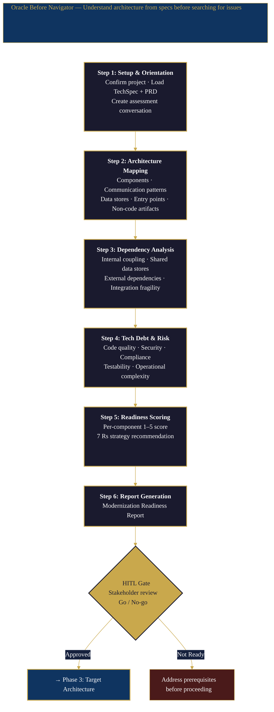
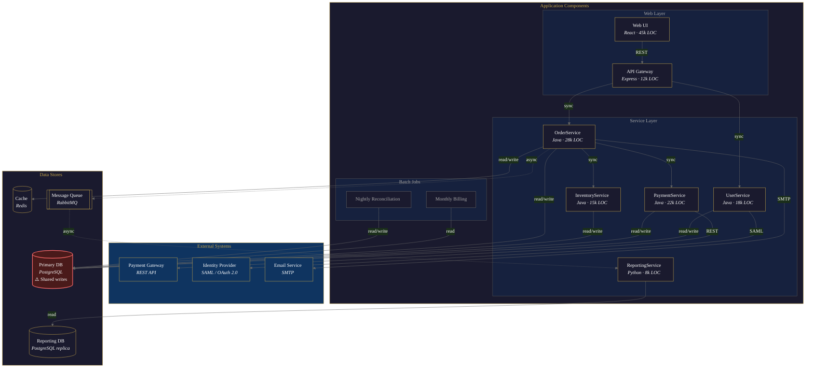

## Overview

Every modernization program starts with the same question: what exactly are we dealing with?

The answer is almost never what people expect. Engineering teams who've worked on a system for years consistently discover architectural connections, dead code paths, and undocumented dependencies during a formal assessment. Tribal knowledge covers the 20% of the system that changes regularly. The other 80% — the batch jobs that run once a month, the integration points nobody remembers building, the utility modules that seven services quietly depend on — hide until you look systematically.

Traditional assessment approaches rely on manual code sampling and architect interviews, producing a snapshot of what people *think* the system looks like. CoreStory changes this by ingesting and semantically understanding the entire codebase, giving your assessment team an **Oracle** that can answer specific architectural questions against the full system — not a sample, not a summary, the actual code.

This playbook provides a structured methodology for evaluating a codebase's modernization readiness across seven domains: architectural complexity, dependency chains, technical debt, security and compliance, testability, data architecture, and — critically for mainframe systems — non-code artifacts that encode business logic never captured in application code.

**Who this is for:** Architects, engineering leads, and modernization teams performing the first phase of a modernization initiative. Also useful for consultants and system integrators scoping modernization engagements.

**What you'll get:** A Modernization Readiness Report with an architecture map, dependency graph, tech debt inventory, risk register, and component-level readiness scores with a recommended modernization strategy per component.

**Relationship to M&A Due Diligence:** This playbook shares methodology DNA with the [M&A Technical Due Diligence](/playbooks/ma-technical-due-diligence) playbook — both systematically interrogate a codebase across risk domains. The difference is the lens. M&A evaluates a codebase you *don't* own for acquisition risk. Codebase Assessment evaluates a codebase you *do* own for transformation readiness. The interrogation categories differ accordingly: M&A focuses on deal-affecting risks (licensing, secrets, PII exposure); Codebase Assessment focuses on transformation-readiness factors (coupling, decomposability, testability, data architecture).

---

## When to Use This Playbook

- You're planning a modernization initiative and need a rigorous baseline of the current system's architecture, dependencies, and technical debt
- You need to determine *which* modernization strategy (the 7 Rs) applies to each component — not a single system-wide strategy
- You're evaluating whether a legacy system is ready for modernization at all, or whether prerequisites (test coverage, documentation, domain expertise) must be addressed first
- You need evidence-based scope and effort estimates for a modernization proposal
- You're inheriting a legacy system from another team and need architectural orientation before making changes

## When to Skip This Playbook

- You already have a recent, thorough architectural assessment and need to move directly to strategy selection — start at [Target Architecture](/playbooks/modernization/target-architecture)
- You're evaluating a codebase for acquisition rather than internal modernization — use [M&A Technical Due Diligence](/playbooks/ma-technical-due-diligence) instead
- The system is trivially small (under ~10k LOC) and its architecture is self-evident — you can proceed directly to refactoring
- You've already decided on a full rebuild with no legacy component reuse — the assessment adds less value when nothing will be retained

---

## Prerequisites

- A **CoreStory account** with the legacy codebase ingested and ingestion complete
- An **AI coding agent** with CoreStory MCP configured (see [Supercharging AI Agents](/getting-started/supercharging-ai-agents) for setup)
- **Repository access** for the legacy codebase (for the agent to cross-reference CoreStory findings against source)
- (Recommended) Access to **architecture documentation**, if it exists — even outdated docs help frame questions
- (Recommended) **Domain experts** who can validate architectural findings — especially for mainframe systems where business logic hides in non-code artifacts (JCL, copybooks, CICS configuration, VSAM data stores)

---

## How It Works

### CoreStory MCP Tools Used

This playbook uses the following tools from the CoreStory MCP server:

| Tool | Step(s) | Purpose |
|------|----------|---------|
| `list_projects` | 1 | Find the target project |
| `create_conversation` | 1 | Start a dedicated assessment conversation thread |
| `send_message` | 2, 3, 4, 5, 6 | Query CoreStory for architecture analysis and risk assessment |
| `get_project_prd` | 1 | Retrieve synthesized PRD for business context |
| `get_project_techspec` | 1 | Retrieve synthesized TechSpec for architecture analysis |
| `list_conversations` | Any | Review existing conversation threads |
| `get_conversation` | Any | Retrieve conversation history for report synthesis |
| `rename_conversation` | 6 | Mark completed thread with "RESOLVED" prefix |

**A note on the PRD and TechSpec:** These documents are often very large — too large for an agent to hold in a single context window. Rather than reading them end-to-end, query CoreStory about their contents via `send_message`. CoreStory has already ingested these documents and can answer targeted questions about them efficiently.

### The Assessment Workflow

> **Note:** The steps below are internal to this playbook. They are sub-steps of Phase 1 in the [six-phase modernization framework](/playbooks/code-modernization), not a separate numbering system.

Codebase assessment with CoreStory follows a six-step pattern:

1. **Setup & Orientation** — Confirm the target project, review synthesized specs for architectural context, and create a named conversation thread for the assessment.
2. **Architecture Mapping** — Map major components, services, data stores, and communication patterns. Establish the structural vocabulary that all subsequent steps reference.
3. **Dependency Analysis** — Identify internal coupling, external dependencies, shared data stores, and integration points. This step reveals what *can* be decomposed and what *must* move together.
4. **Tech Debt & Risk Assessment** — Catalog technical debt, security risks, compliance gaps, and code quality issues. Each finding includes severity and blast radius.
5. **Modernization Readiness Scoring** — Score each component on modernization readiness. Recommend a modernization strategy (from the 7 Rs) per component, not one strategy for the whole system.
6. **Report Generation** — Synthesize findings into the Modernization Readiness Report. This is the deliverable that feeds Phase 3 (Target Architecture) of the broader modernization workflow.

### Oracle Before Navigator

Before searching for specific issues or code paths, first use CoreStory to understand how the system is *designed* to work — its intended architecture, data flow patterns, and integration model. This architectural baseline makes it far easier to spot deviations, shortcuts, coupling hotspots, and technical debt. Ask "what is this system?" before asking "what's wrong with this system?"



---

## Step-by-Step Walkthrough

### Step 1: Setup & Orientation

Start every assessment by confirming the target and building architectural context.

**Confirm the target project:**

```
List my CoreStory projects. I need to identify the project for [SystemName].
```

The agent calls `list_projects` and returns your available projects. Confirm the correct project before proceeding — this prevents accidentally assessing the wrong codebase if multiple projects are loaded.

**Review synthesized specifications:**

```
For project [project_id], retrieve the Technical Specification and Product Requirements Document.
Give me a high-level summary of:
1. System architecture (major components, services, data stores)
2. Technology stack (languages, frameworks, infrastructure)
3. External integrations and third-party dependencies
4. Data model overview
5. Deployment model (how is this system deployed and operated?)
```

The agent calls `get_project_techspec` and `get_project_prd`. This gives you architectural orientation and — critically — the vocabulary (service names, module names, data model names) that makes all subsequent queries specific and productive.

**Create the assessment conversation:**

```
Create a CoreStory conversation titled "[Assessment] SystemName - Modernization Readiness".
Store the conversation_id — we'll use this thread for all assessment queries.
```

Using a dedicated conversation thread keeps the assessment organized and produces a clean audit trail that other team members can review.

### Step 2: Architecture Mapping

With architectural context established, use `send_message` to build a comprehensive map of the system's structure. This step establishes the facts that all subsequent steps analyze.

The following worked example shows what an architecture map looks like for a hypothetical e-commerce monolith. Your map will look different — this shows the structure and level of detail to aim for:



> Note the shared-write database highlighted in red — data coupling is typically the primary decomposition challenge.

**Component inventory:**

```
send_message: "Provide a complete inventory of the major components, services,
and modules in this system. For each, describe its purpose, the technology
it's built with, and its approximate size (files, lines of code if available).
Organize by logical domain or bounded context."
```

**Communication patterns:**

```
send_message: "How do the components in this system communicate with each other?
Map all inter-service communication patterns — synchronous calls (REST, gRPC,
direct method invocation), asynchronous messaging (queues, events, pub/sub),
and shared database access. For each communication path, identify the source
component, target component, and mechanism."
```

**Data store mapping:**

```
send_message: "What data stores does this system use? Map each database, cache,
file store, and message broker. For each, identify which components read from it,
which components write to it, and whether multiple components share the same store.
Flag any shared databases where multiple components write to the same tables."
```

**Entry points and boundaries:**

```
send_message: "Identify all external entry points into this system — API endpoints,
UI routes, batch job triggers, event consumers, scheduled tasks. For each,
describe what it does and which internal components it touches."
```

**Beyond the code (mainframe and legacy systems):**

For mainframe systems and older legacy platforms, business logic often lives outside application code. This assessment domain is critical — miss it and you'll undercount the scope of modernization by 30–50%.

```
send_message: "Identify all non-code artifacts that encode business logic or
system behavior. This includes:
- JCL (Job Control Language) workflows and batch scheduling
- Copybook definitions and data structure layouts
- CICS transaction definitions and screen maps
- VSAM/IMS data store configurations and access methods
- Sort utility control statements
- System exits and middleware configuration
- Stored procedures, triggers, and database-level business logic
- Configuration files that control business behavior (routing rules,
  validation thresholds, feature flags)

For each artifact type found, describe what business logic it encodes and
where it lives in the repository or deployment environment."
```

### Step 3: Dependency Analysis

Dependency analysis reveals what *can* be decomposed and what *must* move together. This is the step that most directly feeds Phase 4 (Decomposition & Sequencing) of the broader modernization workflow.

**Internal coupling:**

```
send_message: "Map the internal dependency chains between components. Which
components directly depend on which others? Identify:
1. Components with the highest fan-in (most other components depend on them)
2. Components with the highest fan-out (they depend on the most others)
3. Circular dependencies (A depends on B depends on A)
4. Hub components (everything passes through them)
For each dependency, specify whether it's a compile-time dependency, runtime
dependency, or data dependency."
```

**Shared data stores:**

```
send_message: "Which components share database tables or data stores? For each
shared resource, identify:
1. All components that read from it
2. All components that write to it
3. Whether there are foreign key relationships that cross component boundaries
4. Whether any components use database triggers or stored procedures that
   affect other components' data
This is the primary indicator of decomposition difficulty — shared data stores
are the hardest coupling to break."
```

**External dependencies:**

```
send_message: "List all external system dependencies — third-party APIs,
SaaS integrations, external databases, message brokers, identity providers,
payment processors, and any other systems this codebase communicates with.
For each, describe:
1. What data is exchanged
2. Which internal components interact with it
3. Whether the integration uses a standard protocol or custom logic
4. What happens if the external system is unavailable"
```

**Integration point fragility:**

```
send_message: "For the external integrations you identified, which are the most
fragile? Identify integrations with:
1. No retry logic or circuit breakers
2. Hardcoded URLs or credentials
3. Tight version coupling (would break if the external API changes)
4. No fallback behavior
5. Missing timeout configuration"
```

### Step 4: Tech Debt & Risk Assessment

This step catalogs specific issues that affect modernization feasibility, cost, and risk. Each finding should include a severity assessment and blast radius (how much of the system does it affect).

**Code quality and structural debt:**

```
send_message: "Identify areas of the codebase with high complexity or poor
separation of concerns:
1. God classes or modules (excessive responsibility, high line count)
2. Circular dependencies between modules
3. Duplicated business logic across components (same rule implemented in
   multiple places, possibly inconsistently)
4. Missing abstraction layers (direct database access from UI components,
   business logic in controllers, etc.)
5. Inconsistent patterns across similar components
For each finding, provide the file path and a brief description of the issue."
```

**Dead code and abandoned modules:**

```
send_message: "Are there modules, services, or code paths that appear to be
abandoned or unused — no recent modification, no test coverage, referenced
but not actively invoked at runtime? Identify:
1. Dead code paths (unreachable code, commented-out logic)
2. Unused dependencies (imported but never called)
3. Deprecated APIs still in use
4. Feature flags or configuration that control disabled features
List them with file paths and evidence of disuse."
```

**Security posture:**

```
send_message: "Assess the security posture of this codebase:
1. Authentication and authorization patterns — are they consistent across
   all entry points? Standard (OAuth 2.0, SAML, JWT) or custom?
2. Hardcoded secrets — API keys, passwords, tokens, connection strings
   in the codebase (provide file paths)
3. PII data flows — where is personally identifiable information collected,
   transmitted, and stored? Is it encrypted at rest and in transit?
4. Input validation — are there entry points that accept user input without
   validation or sanitization?
5. Dependency vulnerabilities — known CVEs in third-party libraries"
```

**Compliance considerations:**

```
send_message: "Identify compliance-relevant patterns in the codebase:
1. Data residency — where is data stored? Are there geographic constraints
   on where data can be processed or persisted?
2. Audit logging — is there systematic logging of data access and mutations?
3. Access control — is there role-based or attribute-based access control?
   How granular is it?
4. Data retention and deletion — are there mechanisms for data expiration
   or right-to-be-forgotten compliance?
Certain modernization patterns may be constrained by compliance requirements
(PCI-DSS, HIPAA, SOX, GDPR). Identifying these early prevents choosing a
strategy that compliance will later block."
```

**Testability assessment:**

```
send_message: "Evaluate the testability of this codebase:
1. What test coverage exists? Is it primarily unit tests, integration tests,
   or end-to-end tests?
2. Can individual components be tested in isolation, or do tests require
   the full system to be running?
3. What is the test infrastructure — CI/CD pipeline, test environments,
   test data management?
4. Are there characterization tests or golden master tests that capture
   current behavior?
5. Which critical code paths have NO test coverage?
Low test coverage is a modernization blocker — you can't verify behavioral
equivalence without a way to define 'correct.'"
```

**Operational complexity:**

```
send_message: "Describe the operational characteristics of this system:
1. How is the system deployed? Manual process, CI/CD pipeline, container
   orchestration, custom scripts?
2. What configuration management exists? Environment variables, config files,
   feature flags, database-driven configuration?
3. What monitoring and observability is in place? Logging, metrics, tracing,
   alerting?
4. What are the known operational pain points — frequent incidents, manual
   intervention required, scaling limitations?"
```

### Step 5: Modernization Readiness Scoring

With the architectural map, dependency graph, and risk inventory complete, score each component's readiness for modernization and recommend a strategy. The interactive heatmap below shows what the output looks like — click any row for component details:

<iframe src="/playbooks/modernization/visuals/readiness-heatmap.html" width="100%" height="600" style={{ border: 'none', borderRadius: '12px', marginBottom: '16px' }} title="Modernization Readiness Heatmap — interactive component-level readiness scores across assessment domains" />

> *Sample data shown above — replace with actual assessment scores from your Step 5 analysis.*

**Component-level readiness scoring:**

```
send_message: "Based on everything we've discussed — architecture, dependencies,
tech debt, security, testability, and operational complexity — score each major
component on modernization readiness. For each component, provide:

1. Component name and brief description
2. Readiness score (1-5):
   - 5: Ready to modernize immediately (low coupling, good test coverage,
     clear boundaries)
   - 4: Ready with minor preparation (some coupling to resolve, some tests
     to add)
   - 3: Moderate preparation needed (shared data stores, moderate coupling,
     limited test coverage)
   - 2: Significant preparation required (deep coupling, no tests, shared
     state with multiple components)
   - 1: Not ready (extreme coupling, no test coverage, undocumented business
     logic, compliance blockers)
3. Recommended strategy from the 7 Rs:
   Retire / Retain / Rehost / Relocate / Replatform / Refactor/Re-architect / Repurchase
4. Key blockers or prerequisites for modernization
5. Estimated relative effort (low / medium / high / very high)

Remember: 53% of enterprises pursue hybrid strategies — different components
get different strategies. Don't force a single approach."
```

**Recommended sequencing:**

```
send_message: "Given the readiness scores and dependency map, what order
would you recommend for modernizing these components? Consider:
1. Dependency chains (what must be modernized before what)
2. Components that must move together (can't be separated due to data coupling)
3. Quick wins (high readiness, high business value, low risk)
4. Risk sequencing (tackle the riskiest components early or late?)

Provide a recommended sequence with rationale for the ordering."
```

### Step 6: Report Generation

Synthesize the assessment into the Modernization Readiness Report — the deliverable that feeds Phase 3 (Target Architecture) of the broader modernization workflow.

```
Review our entire conversation history for this assessment thread.
Synthesize all findings into a Modernization Readiness Report with these sections:

1. Executive Summary — modernization readiness at a glance: overall readiness
   level, number of components assessed, recommended strategies, top 3-5
   findings that most affect modernization feasibility
2. Architecture Map — components, services, data stores, communication patterns,
   external integrations
3. Dependency Graph — internal coupling map, shared data stores, external
   dependencies, circular dependencies
4. Tech Debt Inventory — categorized by severity (critical / high / medium / low)
   and blast radius (how much of the system does it affect)
5. Risk Register — security, compliance, data integrity, and operational risks
   (each with file-level evidence and severity rating)
6. Component Readiness Scores — per-component assessment with readiness score,
   recommended strategy (7 Rs), key blockers, and estimated effort
7. Recommended Modernization Sequence — ordered list with dependency rationale
8. Prerequisites & Blockers — what must be addressed before modernization can
   begin (test coverage gaps, missing documentation, compliance requirements)
```

**Mark the assessment complete:**

```
Rename the conversation to "RESOLVED - [Assessment] SystemName - Modernization Readiness".
```

### HITL Gate

> **After Step 6 (Report Generation):** The Modernization Readiness Report must be reviewed and approved by technical leadership before proceeding to Phase 2 (Business Rules Inventory) or Phase 3 (Target Architecture). This is a go/no-go decision point.

The report should be reviewed by:

- **Technical leadership** (CTO, VP Engineering, or Principal Architect) — validates the assessment methodology and strategic recommendations
- **Product/business stakeholders** — validates that the recommended modernization strategy aligns with business priorities and timelines
- **(Recommended) Domain experts** — especially for mainframe or legacy systems where business logic resides in non-code artifacts. Domain experts can validate whether the assessment correctly identified hidden dependencies and business rules
- **(Recommended) Security/compliance** — if the assessment flagged compliance constraints that affect modernization strategy

**What gets decided at this gate:**
1. **Go / No-go:** Is modernization warranted, or is Retain the right strategy for all or most components?
2. **Scope confirmation:** Do the recommended strategies per component make sense? Should any be reclassified?
3. **Priority alignment:** Does the recommended sequencing align with business priorities?
4. **Prerequisite resolution:** Are there organizational prerequisites (staffing, governance, budget) that must be addressed before proceeding?

Do not proceed to Target Architecture without this approval. The assessment informs every downstream decision — an unapproved assessment creates compounding errors.

---

## Output Format: Modernization Readiness Report

The assessment produces a structured report that serves as the input to Phase 3 (Target Architecture & Strategy). Here is the template:

```markdown
# Modernization Readiness Report: [SystemName]

**Date:** [Date]
**Assessed by:** [Team/Individual]
**CoreStory Project:** [project_id]
**Assessment Conversation:** [conversation_id]

## Executive Summary

**Overall Readiness:** [Ready / Ready with Preparation / Significant Preparation Needed / Not Ready]

**Components Assessed:** [count]
**Recommended Strategy Distribution:**
- Retire: [count] components
- Retain: [count] components
- Rehost: [count] components
- Relocate: [count] components
- Replatform: [count] components
- Refactor / Re-architect: [count] components
- Repurchase: [count] components

**Top Findings:**
1. [Most significant finding affecting modernization feasibility]
2. [Second most significant]
3. [Third most significant]

## Architecture Map

### Components
| Component | Domain | Technology | Size | Communication Pattern |
|-----------|--------|------------|------|----------------------|
| [Name] | [Domain] | [Stack] | [LOC/files] | [Sync/Async/Shared DB] |

### Data Stores
| Store | Type | Components (Read) | Components (Write) | Shared? |
|-------|------|-------------------|--------------------|---------|
| [Name] | [RDBMS/NoSQL/Cache/...] | [List] | [List] | [Yes/No] |

### External Integrations
| System | Protocol | Components | Data Exchanged | Fallback? |
|--------|----------|------------|----------------|-----------|
| [Name] | [REST/SOAP/MQ/...] | [List] | [Description] | [Yes/No] |

## Dependency Graph

### Internal Coupling
[Describe coupling hotspots, hub components, circular dependencies]

### Shared Data Dependencies
| Shared Resource | Components | Coupling Severity | Decomposition Difficulty |
|----------------|------------|-------------------|------------------------|
| [Table/Store] | [List] | [High/Medium/Low] | [High/Medium/Low] |

## Tech Debt Inventory

| ID | Category | Description | Location | Severity | Blast Radius |
|----|----------|-------------|----------|----------|-------------|
| TD-001 | [Code Quality/Security/Compliance/...] | [Description] | [file path] | [Critical/High/Medium/Low] | [System-wide/Component/Local] |

## Risk Register

| ID | Domain | Risk | Evidence | Severity | Mitigation |
|----|--------|------|----------|----------|------------|
| RR-001 | [Security/Compliance/Data/Operational] | [Description] | [file path or finding] | [Critical/High/Medium/Low] | [Recommended action] |

## Component Readiness Scores

| Component | Readiness (1-5) | Recommended Strategy | Key Blockers | Effort |
|-----------|----------------|---------------------|-------------|--------|
| [Name] | [Score] | [7 Rs strategy] | [List] | [Low/Med/High/Very High] |

## Recommended Modernization Sequence

| Order | Component(s) | Strategy | Rationale | Prerequisites |
|-------|-------------|----------|-----------|--------------|
| 1 | [Name] | [Strategy] | [Why first] | [What must be in place] |

## Prerequisites & Blockers

### Must Address Before Modernization
- [Blocker 1 — description and recommended remediation]
- [Blocker 2]

### Recommended Preparation
- [Preparation item — what it enables]
```

---

## Prompting Patterns Reference

### Assessment Patterns

Effective assessment queries are specific, domain-anchored, and evidence-oriented. They ask for file paths, concrete examples, and measurable indicators — not summaries.

| Pattern | Example |
|---------|---------|
| **Component inventory** | "List all major components with their purpose, technology, and approximate size. Organize by domain." |
| **Communication mapping** | "Map all inter-service communication paths. For each, identify source, target, mechanism, and whether it's synchronous or asynchronous." |
| **Coupling detection** | "Which components share database tables? For each shared table, list all reading and writing components." |
| **Tech debt identification** | "Identify god classes over 500 lines with methods that mix business logic and infrastructure concerns. Provide file paths." |
| **Testability assessment** | "Which critical code paths have no test coverage? Identify the highest-risk untested paths." |
| **Non-code artifact discovery** | "Identify all JCL jobs, copybook definitions, and CICS transaction maps. For each, describe the business logic it encodes." |

### Query Specificity

After reviewing the Tech Spec in Step 1, use the architectural vocabulary it provides in all subsequent queries. Vague queries produce vague answers.

| Instead of | Use |
|-----------|-----|
| "Tell me about the architecture" | "Map the communication paths between OrderService, InventoryService, and PaymentService, including shared database tables and message queues" |
| "How's the code quality?" | "Identify modules with circular dependencies, classes over 500 lines, or methods with more than 5 parameters. Provide file paths." |
| "What are the dependencies?" | "Which components would break if we extracted OrderService as a standalone service? What data and logic would need to move with it?" |
| "Is it ready to modernize?" | "For the inventory module specifically: what is its test coverage, how many other components depend on it, and does it share database tables with other modules?" |

---

## Best Practices

**Start with the synthesized specs, not with questions.** Use `get_project_techspec` and `get_project_prd` before diving into `send_message` queries. The specs give you architectural vocabulary — service names, data model names, API patterns — that make your queries far more specific and productive.

**Assess every component, even the ones you think you know.** Engineers who've worked on a system for years consistently discover surprises during a formal assessment. CoreStory surfaces connections that tribal knowledge misses — the utility module that seven services quietly depend on, the batch job that silently populates a cache every night, the database trigger that enforces a business rule nobody documented.

**Don't forget non-code artifacts.** For mainframe systems and older legacy platforms, 30–50% of business logic lives in JCL workflows, copybook definitions, CICS transaction maps, stored procedures, and configuration files. If your assessment only covers application code, your modernization scope estimate will be significantly under-counted.

**Ask for file paths, always.** Every finding in the readiness report needs evidence. Train your queries to always request file paths and specific code references. "Identify X and provide the file path" should be your default pattern.

**Score honestly — Retain is a legitimate outcome.** 53% of enterprises pursue hybrid strategies ([Kyndryl 2025 State of IT Infrastructure Report](https://www.kyndryl.com/us/en/perspectives/articles/2025/01/state-of-it-infrastructure-report)). Not every component needs to be modernized. The assessment should identify components where the cost of modernization exceeds the benefit, and "Retain" is the correct strategy for those components. A good assessment saves money by preventing unnecessary modernization as much as by enabling necessary modernization.

**Low test coverage is a blocker, not a footnote.** If a component has no test coverage, you cannot verify behavioral equivalence after modernization. The readiness report should flag this as a prerequisite: "Before modernizing [component], establish characterization tests that capture current behavior." This is not optional — it's what prevents the 79% failure rate.

**Scope your queries to avoid noise.** A query like "find all technical debt" will return an overwhelming response. Break it into targeted categories: code quality, security, compliance, testability, operational complexity. Each produces focused, actionable findings.

**Track confidence levels for every finding.** Assessment findings are AI-derived — they vary in reliability. As you work through Steps 2–5, mentally categorize each finding as *Verified* (confirmed by a human or cross-referenced against running code), *High-confidence* (CoreStory is confident, consistent across multiple queries), *Hypothesized* (plausible but not yet validated), or *Contradicted* (conflicts with other evidence). This matters because downstream phases inherit your findings. A readiness score built on Hypothesized findings needs validation before it drives architectural decisions. See [Working with AI-Derived Findings](/playbooks/code-modernization#working-with-ai-derived-findings) for the full Confidence Protocol.

---

## Agent Implementation Guides

<AccordionGroup>

<Accordion title="Claude Code">

#### Setup

1. **Configure the CoreStory MCP server** in your Claude Code settings (see [CoreStory MCP Server Setup Guide](/getting-started/mcp-server-setup)).

2. **Add the skill file.** Create the skill directory and file:

```bash
mkdir -p .claude/skills/codebase-assessment
```

Create `.claude/skills/codebase-assessment/SKILL.md` with the content from the skill file below.

3. **(Optional) Add the slash command:**

```bash
mkdir -p .claude/commands
```

Create `.claude/commands/assess.md` with a short description referencing the six-step assessment workflow.

4. **Commit to version control:**

```bash
git add .claude/skills/ .claude/commands/
git commit -m "Add CoreStory codebase assessment skill and command"
```

#### Usage

The skill activates automatically when Claude Code detects assessment-related requests:

```
Run a codebase assessment for modernization readiness
Assess this system's modernization readiness
Evaluate the architecture for modernization planning
```

Or invoke explicitly:

```
/assess [SystemName]
```

#### Tips

- This skill focuses on Phase 1 of the broader modernization workflow. For the full six-phase workflow, use the code-modernization skill instead.
- Create a single CoreStory conversation for the entire assessment to maintain context across all steps.
- Keep the SKILL.md under 500 lines for reliable loading.

#### Skill File

Save as `.claude/skills/codebase-assessment/SKILL.md`:

````markdown
---
name: CoreStory Codebase Assessment
description: Evaluates a legacy codebase's modernization readiness using CoreStory's persistent code intelligence. Activates on assessment, readiness evaluation, or modernization planning requests.
---

# CoreStory Codebase Assessment

When this skill activates, guide the user through the six-step assessment workflow to produce a Modernization Readiness Report.

## Activation Triggers

Activate when user requests:
- Codebase assessment or modernization assessment
- Modernization readiness evaluation
- Architecture analysis for modernization planning
- Legacy system evaluation or analysis
- Any request containing "assess", "readiness", "evaluate architecture", "modernization planning"

## Prerequisites

- CoreStory MCP server configured
- At least one CoreStory project with completed ingestion (the legacy codebase)
- Read access to the repository for cross-referencing findings

**If you do not detect that you have access to CoreStory (e.g., `list_projects` fails or is unavailable), ask the user to verify that their MCP or API connection is properly configured and that this repository has been ingested. If the user has not yet created a CoreStory account, direct them to create one and upload their repo at [app.corestory.ai](https://app.corestory.ai).**

## Step 1: Setup & Orientation

1. **Identify the Target Project**
   ```
   Use CoreStory MCP: list_projects
   ```
   - Multiple projects → ask user which one to assess
   - Single project → confirm with user before proceeding
   - Verify ingestion is complete

2. **Retrieve Synthesized Specifications**
   ```
   Use CoreStory MCP: get_project_techspec
   Use CoreStory MCP: get_project_prd
   ```
   - Summarize: system architecture, technology stack, external integrations, data model, deployment model
   - This establishes the architectural vocabulary for all subsequent queries

3. **Create Assessment Conversation**
   ```
   Use CoreStory MCP: create_conversation
   Title: "[Assessment] SystemName - Modernization Readiness"
   ```
   Store conversation_id for all subsequent queries.

**Report:**
```
🔍 Starting codebase assessment for modernization readiness
Target: [project name]
Architecture: [high-level summary]
Tech Stack: [languages, frameworks, infrastructure]
CoreStory conversation: [conversation-id]
```

## Step 2: Architecture Mapping

Query CoreStory to map the system's structure:
- "Provide a complete inventory of components, services, and modules with purpose, technology, and size"
- "Map all inter-service communication patterns — sync, async, shared DB access"
- "What data stores are used? Which components share them?"
- "Identify all external entry points — APIs, batch triggers, event consumers, scheduled tasks"
- For mainframe/legacy: "Identify non-code artifacts encoding business logic — JCL, copybooks, CICS, VSAM, stored procedures, configuration"

## Step 3: Dependency Analysis

- "Map internal dependency chains. Identify highest fan-in, highest fan-out, circular dependencies, hub components"
- "Which components share database tables? List all readers and writers per shared resource"
- "List all external system dependencies with data exchanged, protocol, and fallback behavior"
- "Which external integrations are most fragile? Missing retries, hardcoded URLs, tight version coupling?"

## Step 4: Tech Debt & Risk Assessment

- "Identify god classes, circular dependencies, duplicated business logic, missing abstraction layers. Provide file paths."
- "Find dead code, unused dependencies, deprecated APIs still in use"
- "Assess security: auth patterns, hardcoded secrets, PII flows, input validation, dependency CVEs"
- "Identify compliance-relevant patterns: data residency, audit logging, access control, data retention"
- "Evaluate testability: coverage, test types, isolation capability, untested critical paths"
- "Describe operational complexity: deployment, config management, monitoring, known pain points"

## Step 5: Modernization Readiness Scoring

- "Score each component on readiness (1-5) with recommended 7 Rs strategy, key blockers, and effort estimate"
- "Recommend modernization sequence based on dependencies, coupling, risk, and business value"

## Step 6: Report Generation

1. **Synthesize Report**
   Compile findings into Modernization Readiness Report:
   - Executive Summary (overall readiness, top findings)
   - Architecture Map (components, data stores, integrations)
   - Dependency Graph (coupling, shared data, external deps)
   - Tech Debt Inventory (by severity and blast radius)
   - Risk Register (security, compliance, data, operational)
   - Component Readiness Scores (per-component 7 Rs recommendation)
   - Recommended Sequence (ordered migration plan)
   - Prerequisites & Blockers

2. **Mark Completed**
   ```
   Use CoreStory MCP: rename_conversation
   New title: "RESOLVED - [Assessment] SystemName - Modernization Readiness"
   ```

## Error Handling

- **Project not found:** List available projects, ask user to specify the target
- **CoreStory gives generic answers:** Narrow queries — use specific service names, module names from the Tech Spec
- **Response too long:** Break into smaller domain-specific queries
- **Legacy system uses non-code artifacts:** Explicitly ask about JCL, copybooks, CICS, VSAM — CoreStory surfaces these if prompted
- **Assessment reveals system isn't ready:** This is a valid finding — flag prerequisites that must be addressed first
````

</Accordion>

<Accordion title="GitHub Copilot">

#### Setup

1. **Configure the CoreStory MCP server** in your VS Code settings. Add it to your MCP server configuration (typically in VS Code settings JSON or the MCP configuration UI).

2. **Add custom instructions.** Copilot reads project-level instructions from `.github/copilot-instructions.md`. This is the primary mechanism for teaching Copilot specialized workflows:

```bash
mkdir -p .github
```

Add the following to `.github/copilot-instructions.md`:

```markdown
## Codebase Assessment for Modernization

When asked to assess a codebase for modernization readiness:
1. ALWAYS start by confirming the CoreStory project and retrieving the Tech Spec for architectural vocabulary
2. Map architecture first: components, data stores, communication patterns, non-code artifacts
3. Analyze dependencies: internal coupling, shared databases, external integrations, circular dependencies
4. Assess tech debt: code quality, security, compliance, testability, operational complexity
5. Score each component on readiness (1-5) with a 7 Rs strategy recommendation
6. Produce a Modernization Readiness Report — the deliverable for the next modernization phase
7. Always request file paths for every finding
```

3. **(Optional) Add a reusable prompt file.** Create `.github/prompts/codebase-assessment.prompt.md`:

````markdown
---
mode: agent
description: Assess a codebase's modernization readiness using CoreStory's code intelligence
---

Perform a codebase assessment for modernization readiness on the specified system using CoreStory.

1. Identify the target project and retrieve synthesized specs for architectural orientation
2. Map architecture: components, services, data stores, communication patterns, non-code artifacts
3. Analyze dependencies: internal coupling, shared data stores, external integrations
4. Assess tech debt and risk: code quality, security, compliance, testability, operations
5. Score each component's modernization readiness and recommend a 7 Rs strategy
6. Compile a Modernization Readiness Report and mark the conversation resolved
````

4. **Commit to version control:**

```bash
git add .github/copilot-instructions.md .github/prompts/
git commit -m "Add CoreStory codebase assessment instructions for Copilot"
```

#### Usage

In Copilot Chat (agent mode):

```
Assess this codebase for modernization readiness
Run a modernization readiness evaluation on project X
Evaluate the architecture for modernization planning
```

Or reference the prompt file:

```
@workspace /codebase-assessment [SystemName]
```

#### Tips

- Copilot's agent mode (available in VS Code) can execute terminal commands and edit files autonomously — this workflow works best in agent mode.
- On Team/Enterprise plans, organization-level instructions apply across all repositories.
- Copilot automatically references `.github/copilot-instructions.md` in chat responses.

</Accordion>

<Accordion title="Cursor">

#### Setup

1. **Configure the CoreStory MCP server** in Cursor's MCP settings (Settings → MCP Servers, or edit the MCP config JSON directly).

2. **Add project rules:**

```bash
mkdir -p .cursor/rules/codebase-assessment
```

Create `.cursor/rules/codebase-assessment/RULE.md` with the content from the rule file below.

3. **Commit to version control:**

```bash
git add .cursor/rules/
git commit -m "Add CoreStory codebase assessment rules for Cursor"
```

#### Usage

In Cursor's Composer or Chat, the rule activates automatically for assessment-related requests:

```
Assess this codebase for modernization readiness
Evaluate the architecture for modernization planning
Run a modernization readiness evaluation
```

#### Tips

- Rules with `alwaysApply: true` load in every session. Set this if your team regularly performs assessments. Otherwise, use `alwaysApply: false` with a good `description` so Cursor loads it when relevant.
- The `.cursor/rules/` directory structure is the current recommended approach.
- Rules apply to Composer and Chat but do not affect Cursor Tab or inline edits.

#### Project Rule

Save as `.cursor/rules/codebase-assessment/RULE.md`:

````markdown
---
description: CoreStory-powered codebase assessment for modernization readiness. Activates for modernization assessments, readiness evaluations, and architecture analysis for modernization planning.
alwaysApply: false
---

# CoreStory Codebase Assessment

You are a modernization architect with access to CoreStory's code intelligence via MCP. Follow the six-step assessment workflow to produce a Modernization Readiness Report.

## Activation Triggers

Apply when user requests: codebase assessment, modernization readiness, architecture evaluation, legacy system analysis, or modernization planning.

**If you do not detect that you have access to CoreStory (e.g., `list_projects` fails or is unavailable), ask the user to verify that their MCP or API connection is properly configured and that this repository has been ingested. If the user has not yet created a CoreStory account, direct them to create one and upload their repo at [app.corestory.ai](https://app.corestory.ai).**

## Six-Step Workflow

### Step 1: Setup & Orientation
- Identify target project (`CoreStory:list_projects`)
- Retrieve specs (`CoreStory:get_project_techspec`, `CoreStory:get_project_prd`)
- Summarize architecture, tech stack, integrations, data model
- Create assessment conversation (`CoreStory:create_conversation`)

### Step 2: Architecture Mapping
- Component inventory with purpose, technology, and size
- Communication patterns (sync, async, shared DB)
- Data store mapping with shared access analysis
- Entry points and boundaries
- Non-code artifacts (JCL, copybooks, CICS, VSAM, stored procs, config)

### Step 3: Dependency Analysis
- Internal coupling (fan-in, fan-out, circular deps, hub components)
- Shared data stores (readers, writers, cross-boundary foreign keys)
- External dependencies (protocol, data exchanged, fallback behavior)
- Integration fragility (missing retries, hardcoded URLs, tight coupling)

### Step 4: Tech Debt & Risk Assessment
- Code quality (god classes, duplication, missing abstractions)
- Security (auth patterns, secrets, PII, CVEs)
- Compliance (data residency, audit logging, retention)
- Testability (coverage, isolation, untested critical paths)
- Operational complexity (deployment, config, monitoring)

### Step 5: Modernization Readiness Scoring
- Per-component readiness score (1-5) with 7 Rs recommendation
- Recommended modernization sequence by dependency and risk

### Step 6: Report Generation
- Compile Modernization Readiness Report
- Rename conversation with "RESOLVED" prefix

## Key Principles
- Oracle before Navigator: understand architecture from specs first
- Evidence-based: every finding needs a file path
- Non-code artifacts matter: a significant share of mainframe business logic lives outside application code
- Retain is legitimate: not every component needs modernization
- Low test coverage is a blocker, not a footnote
````

</Accordion>

<Accordion title="Factory.ai">

#### Setup

1. **Configure the CoreStory MCP server** in your Factory.ai environment. Verify with the `/mcp` command that CoreStory tools are accessible.

2. **Add the custom droid:**

```bash
mkdir -p .factory/droids
```

Create `.factory/droids/codebase-assessment.md` with the content from the droid file below.

3. **Commit to version control:**

```bash
git add .factory/droids/
git commit -m "Add CoreStory codebase assessment droid"
```

#### Usage

Invoke the droid via the Task tool:

```
@codebase-assessment Assess [SystemName] for modernization readiness
```

Or describe the task and Factory.ai routes to the droid based on its activation triggers.

#### Tips

- Use `model: inherit` in the YAML frontmatter to use whatever model the session is configured with.
- The `tools` field explicitly lists required MCP tools — this restricts the droid to only the CoreStory tools needed for assessment.
- The assessment queries may produce long streaming responses — this is expected.

#### Custom Droid

Save as `.factory/droids/codebase-assessment.md`:

````markdown
---
name: CoreStory Codebase Assessment
description: Evaluates a legacy codebase's modernization readiness using CoreStory code intelligence
model: inherit
tools:
  - CoreStory:list_projects
  - CoreStory:get_project_prd
  - CoreStory:get_project_techspec
  - CoreStory:create_conversation
  - CoreStory:send_message
  - CoreStory:rename_conversation
  - CoreStory:list_conversations
  - CoreStory:get_conversation
---

# CoreStory Codebase Assessment

Execute the six-step assessment workflow to produce a Modernization Readiness Report.

## Activation Triggers
- "Assess [system] for modernization"
- "Codebase assessment" or "modernization readiness"
- "Evaluate architecture for modernization"
- "Legacy system analysis"
- Any assessment or readiness evaluation request

## CoreStory MCP Tools
- `CoreStory:list_projects` — identify the target project
- `CoreStory:get_project_prd` — retrieve synthesized PRD for business context
- `CoreStory:get_project_techspec` — retrieve Tech Spec for architecture
- `CoreStory:create_conversation` — open named assessment thread
- `CoreStory:send_message` — query CoreStory (primary investigation tool)
- `CoreStory:rename_conversation` — mark completed thread "RESOLVED"
- `CoreStory:list_conversations` / `CoreStory:get_conversation` — review threads

When instructions say "Query CoreStory", use `CoreStory:send_message`.

**If you do not detect that you have access to CoreStory (e.g., `list_projects` fails or is unavailable), ask the user to verify that their MCP or API connection is properly configured and that this repository has been ingested. If the user has not yet created a CoreStory account, direct them to create one and upload their repo at [app.corestory.ai](https://app.corestory.ai).**

## Workflow

Step 1: Setup & Orientation → Confirm project, retrieve specs, create conversation
Step 2: Architecture Mapping → Components, communication, data stores, entry points, non-code artifacts
Step 3: Dependency Analysis → Internal coupling, shared data, external deps, fragility
Step 4: Tech Debt & Risk → Code quality, security, compliance, testability, operations
Step 5: Readiness Scoring → Per-component 1-5 score, 7 Rs recommendation, sequence
Step 6: Report → Modernization Readiness Report → rename conversation "RESOLVED"

## Key Principles
- Oracle before Navigator: understand architecture from specs first
- Evidence-based: every finding needs a file path
- Non-code artifacts matter: JCL, copybooks, CICS, VSAM encode business logic
- Retain is legitimate: not every component needs modernization
- Low test coverage is a blocker, not a footnote
- Ask specific questions using vocabulary from the Tech Spec
````

</Accordion>

</AccordionGroup>

---

## Troubleshooting

**CoreStory returns generic or shallow answers about the architecture.**

Your queries are too broad. After retrieving the Tech Spec, use the architectural vocabulary it provides — specific service names, module names, data model names — in your queries. "What are the dependencies?" is weak. "Which components depend on OrderService, and do any of them share the orders database tables?" is strong.

**The assessment reveals the system isn't ready for modernization.**

This is a valid and valuable finding. Common blockers: no test coverage (can't verify behavioral equivalence), extreme coupling (can't decompose), missing domain knowledge (can't validate business rules), compliance constraints that limit target architecture options. Use the assessment to build the case for investing in readiness *before* attempting modernization. A good assessment prevents expensive failures.

**Non-code artifacts aren't showing up in the assessment.**

CoreStory will surface JCL, copybooks, CICS maps, and other non-code artifacts if you explicitly ask about them. The default assessment queries focus on application code. For mainframe and older legacy systems, always include the "Beyond the Code" queries from Step 2.

**Response exceeds token limit.**

Break large queries into smaller scopes. Instead of "Map the complete architecture," ask about specific domains or layers. If a response is truncated, ask the agent to continue or narrow the scope.

**Findings don't match current source code.**

CoreStory's analysis reflects the codebase at ingestion time. If the system has changed significantly since ingestion, request a re-ingestion before finalizing your assessment report. Always note the ingestion date in your report for traceability.

**Agent can't access CoreStory tools.**

See the [Supercharging AI Agents](/getting-started/supercharging-ai-agents) troubleshooting section for MCP connection issues. Verify the project has completed ingestion by calling `list_projects` and checking the status.

---

## What's Next

**Continue the modernization workflow:** This assessment feeds directly into Phase 3. Use the Modernization Readiness Report as the primary input for [Target Architecture & Strategy →](/playbooks/modernization/target-architecture).

**Extract business rules:** Phase 2 of the modernization workflow runs in parallel with or immediately after assessment. Use [Business Rules Extraction →](/playbooks/business-rules-extraction) to catalog the behavioral contract that Phase 6 verifies against.

**Return to the hub:** [Code Modernization →](/playbooks/code-modernization) — the full six-phase framework.

**For agent setup:** [Supercharging AI Agents with CoreStory →](/getting-started/supercharging-ai-agents) — MCP server configuration and agent setup.
