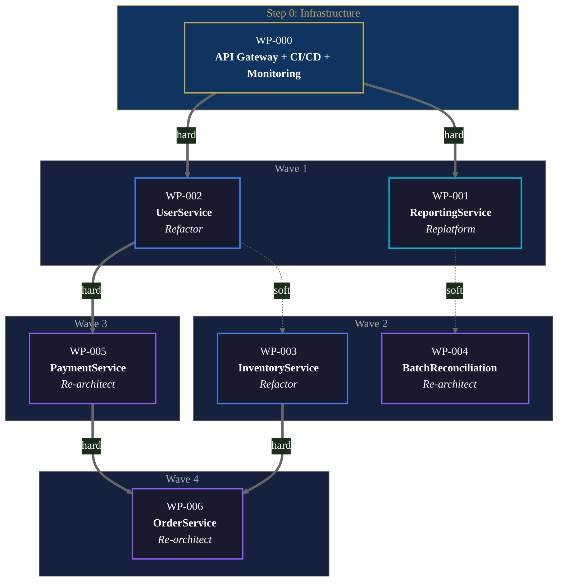

## Overview

You have the target architecture. Now the question is: how do you get there without breaking everything along the way?

Phase 4 of the modernization workflow is where strategy becomes execution planning. The Architectural Decision Record from Phase 3 defines what the system should become. This playbook turns that vision into a sequenced set of work packages — each one independently deployable, each one ordered by dependency, and each one structured around the Transform → Coexist → Eliminate cycle — the operational expression of the Strangler Fig pattern (Martin Fowler, 2004) that makes incremental modernization safe. Rather than replacing the legacy system in one big-bang release, each work package builds the new component (Transform), runs it alongside the legacy component with traffic routing (Coexist), and retires the legacy component only after behavioral equivalence is verified (Eliminate).

The sequencing problem is harder than it looks. You can't just pick the easiest component and start — if that component shares a database with three others, you'll immediately hit data decomposition challenges. You can't just follow the dependency graph blindly either — sometimes the highest-risk component should go first (to retire risk early) and sometimes it should go last (to learn from easier migrations first). The right sequence balances dependency constraints, risk appetite, business value delivery, and team capability.

CoreStory serves as a **Navigator** throughout this phase — mapping the specific dependencies, shared data stores, and integration points that determine what can be separated and what must move together. It also operates as an **Oracle** for understanding the implications of each sequencing choice: "If we modernize this component first, what temporary integration work is needed for everything that still depends on it?"

**Who this is for:** Engineering leads, project managers, and modernization teams responsible for planning and tracking the migration. Also useful for technical program managers coordinating cross-team modernization efforts.

**What you'll get:** A sequenced set of work packages with scope, acceptance criteria, dependencies, estimated effort, and the Transform/Coexist/Eliminate structure for each — optionally pushed to Jira or Linear as epics and stories.

---

## When to Use This Playbook

- You've completed Phase 3 (Target Architecture) and have an approved Architectural Decision Record
- You need to break a modernization initiative into executable, independently-deployable work packages
- You need to determine the migration sequence — what to modernize first, second, third — based on dependency analysis
- You're preparing to push migration work into Jira, Linear, or another project management system
- You need to identify which components *must* migrate together and which can be extracted independently

## When to Skip This Playbook

- You haven't defined the target architecture yet — go back to [Target Architecture](/playbooks/modernization/target-architecture)
- The modernization is a single-component refactor that doesn't need sequencing — use [Spec-Driven Development](/playbooks/spec-driven-development) directly
- You're doing a lift-and-shift (Rehost/Relocate) with no application-level decomposition
- You already have a sequenced migration plan and need to start execution — go to [Spec-Driven Development](/playbooks/spec-driven-development) for delta specs or the relevant [architecture variant](/playbooks/modernization/monolith-to-microservices)

---

## Prerequisites

- A **completed Target Architecture decision** (Phase 3) — the Architectural Decision Record is the primary input
- A **completed Codebase Assessment** (Phase 1) — the dependency graph and coupling analysis feed directly into sequencing
- A **CoreStory account** with the legacy codebase ingested and ingestion complete
- An **AI coding agent** with CoreStory MCP configured (see [Supercharging AI Agents](/getting-started/supercharging-ai-agents) for setup)
- (Optional) **Jira or Linear MCP** configured alongside CoreStory for work package creation (see [Using CoreStory with Jira](/playbooks/using-corestory-with-jira))
- (Recommended) The **engineering lead** who will own the migration backlog should be driving this phase — sequencing decisions affect team assignments, sprint planning, and delivery timelines

---

## How It Works

### CoreStory MCP Tools Used

| Tool | Step(s) | Purpose |
|------|----------|---------|
| `list_projects` | 1 | Confirm the target project |
| `create_conversation` | 1 | Start a dedicated decomposition thread |
| `send_message` | 2, 3, 4, 5 | Query CoreStory for dependency mapping and decomposition analysis |
| `list_conversations` | 1 | Find prior phase conversations (assessment, architecture) |
| `get_conversation` | 1 | Retrieve prior phase findings for cross-reference |
| `get_project_techspec` | 1 | Retrieve Tech Spec for component vocabulary |
| `get_project_prd` | 1 | Retrieve synthesized PRD for business context and requirements |
| `rename_conversation` | 6 | Mark completed thread with "RESOLVED" prefix |

### The Decomposition & Sequencing Workflow

> **Note:** The steps below are internal to this playbook. They are sub-steps of Phase 4 in the [six-phase modernization framework](/playbooks/code-modernization), not a separate numbering system.

This playbook follows a six-step pattern:

1. **Input Loading** — Load the target architecture decision and dependency map from prior phases. Establish the migration scope.
2. **Component Decomposition** — Break the migration into discrete, independently-deployable work packages. Identify what can be separated and what must move together.
3. **Dependency Mapping** — Map dependencies between work packages. Identify the critical path and blocking relationships.
4. **Sequencing** — Order work packages by dependency, risk, and business value. Produce the migration sequence.
5. **Work Package Definition** — Define each work package with scope, acceptance criteria, dependencies, estimated effort, and the Transform/Coexist/Eliminate structure.
6. **Ticketing System Integration** — Push work packages to Jira or Linear as epics and stories (if MCP is available).

### The Strangler Fig Execution Model

Each work package follows the Transform → Coexist → Eliminate cycle:

1. **Transform** — Build the modernized version of the component using [Spec-Driven Development](/playbooks/spec-driven-development). The legacy component remains untouched.
2. **Coexist** — Run both old and new versions simultaneously. Route traffic through a façade or proxy layer. Validate behavioral equivalence using [Behavioral Verification](/playbooks/modernization/behavioral-verification).
3. **Eliminate** — Once the modernized component passes verification, retire the legacy component and remove the façade.

This cycle is the reason sequencing matters: each work package's Coexist phase requires temporary integration points (anti-corruption layers, adapters, data synchronization) with the components that haven't migrated yet. The sequence determines how much temporary integration work is needed at each step.


### Branch by Abstraction

When a façade can't intercept traffic — shared libraries, data access layers, deeply embedded utility code — the Strangler Fig pattern doesn't apply. Branch by Abstraction (coined by Paul Hammant, popularized by Sam Newman in *Monolith to Microservices*) works from the inside:

1. **Introduce an abstraction layer** within the codebase that both old and new implementations can satisfy. This is an interface or adapter that wraps the current implementation.
2. **Build the new implementation** behind the abstraction. Both old and new implementations coexist in the codebase.
3. **Switch consumers incrementally.** Migrate callers from old to new one at a time, validating behavior at each step.
4. **Remove the old implementation** once all consumers have switched. Optionally remove the abstraction layer if it no longer adds value.

**Use when:** The component is consumed internally (shared libraries, data access layers, utility modules) rather than through external-facing endpoints. The key signal: if you can't put a proxy in front of it, use Branch by Abstraction.

**CoreStory query:** "Which internal components consume [ComponentName] directly? If we introduced an abstraction layer, what interface would both old and new implementations need to satisfy?"

### Parallel Run (Shadow Traffic)

For high-risk components where behavioral equivalence must be proven in production before cutover — payment processing, financial calculations, regulatory-sensitive logic — Parallel Run provides the strongest verification.

1. **Route copies of production requests** to both the legacy and modernized systems simultaneously.
2. **Compare responses** in real time. Flag discrepancies for analysis.
3. **Run until the discrepancy rate drops below threshold** (typically below 0.01% for critical services, below 0.1% for standard services).
4. **Cut over to the modernized system** and decommission the legacy component.

**Use when:** A behavioral difference has catastrophic consequences. The component handles money, regulatory compliance, or safety-critical logic. The organization needs production-grade evidence before stakeholders will approve cutover.

**Data synchronization during coexistence:** Combine with **Change Data Capture (CDC)** via Apache Kafka or Debezium to keep legacy and modern data stores in sync. This avoids the dual-write problem and enables real-time data consistency without modifying the legacy system's write path.

**CoreStory query:** "Which operations in [ComponentName] have the highest business impact if they produce incorrect results? These are the candidates for Parallel Run verification."

### HITL Gate

> **After Step 4 (Sequencing):** The engineering lead reviews the migration sequence, work package definitions, and dependency map before work packages are pushed to the ticketing system. This is the gate where the migration plan is approved for execution.

---

## Step-by-Step Walkthrough

### Step 1: Input Loading

Start by loading context from prior phases so all decomposition decisions are grounded in actual assessment and architecture data.

**Confirm the project and locate prior work:**

```
List my CoreStory projects. I need the project for [SystemName].
Then list all conversations — I need the assessment thread and
the architecture decision thread.
```

Look for "RESOLVED - [Assessment] SystemName" and "RESOLVED - [Architecture] SystemName" from prior phases.

**Retrieve architecture decision context:**

```
Retrieve the conversation history from our architecture decision
(conversation [conversation_id]). Summarize:
1. Selected strategy per component (from the ADR)
2. Target architecture — service boundaries, communication patterns,
   data architecture
3. Migration scope — which components are in scope for modernization
4. Key constraints and risks identified
```

**Create the decomposition conversation:**

```
Create a CoreStory conversation titled
"[Decomposition] SystemName - Migration Planning".
Store the conversation_id for all subsequent queries.
```

### Step 2: Component Decomposition

Break the migration scope into discrete work packages. The goal is to identify the smallest independently-deployable migration units.

**Identify migration units:**

```
send_message: "For each component identified in the target architecture
for modernization, determine whether it can be migrated independently
or must be migrated together with other components. Consider:

1. Which components share database tables or data stores that cannot
   be split without migrating both sides simultaneously?
2. Which components have synchronous call dependencies that would
   break if only one side is modernized?
3. Which components share business logic (duplicated or via shared
   libraries) that must be updated together?

Group the components into migration units — the smallest sets that
can be independently deployed. A migration unit might be a single
component or a cluster of tightly coupled components."
```

**Define work package boundaries:**

```
send_message: "For each migration unit you identified, define the
work package boundary:
1. What is included in this work package (components, data stores,
   integration points)?
2. What is excluded (remains on the legacy side during this migration)?
3. What temporary integration points (anti-corruption layers, adapters,
   data sync mechanisms) are needed between the migrated and
   non-migrated sides?
4. What is the expected outcome — what does 'done' look like for
   this work package?"
```

**Validate decomposition feasibility:**

```
send_message: "For each proposed work package, validate that it can
actually be deployed independently:
1. Can the modernized component function correctly while the rest
   of the system remains on the legacy platform?
2. Can the legacy system function correctly after this component
   is extracted?
3. What data consistency guarantees are needed during the coexistence
   period?
4. Is there a clean rollback path if the modernized component fails?"
```

### Step 3: Dependency Mapping

Map the dependencies between work packages to determine what must happen before what. The following example shows the dependency graph for our hypothetical e-commerce system — work packages arranged in waves, with the critical path highlighted in gold:



> Solid arrows = hard dependencies (must complete before). Dashed arrows = soft dependencies (easier if done first). Border color indicates strategy: cyan = Replatform, blue = Refactor, purple = Re-architect.

**Work package dependencies:**

```
send_message: "For each work package, what are the dependencies on
other work packages? Identify:
1. Hard dependencies — WP-X cannot start until WP-Y is complete
   (e.g., WP-Y creates an API that WP-X will consume)
2. Soft dependencies — WP-X is easier if WP-Y is done first, but
   can proceed independently with additional temporary integration work
3. Shared infrastructure dependencies — both WP-X and WP-Y require
   the same infrastructure change (e.g., API gateway, event bus,
   service mesh)

Map these as a dependency graph. Identify the critical path — the
longest chain of hard dependencies that determines the minimum
total migration timeline."
```

**Shared data dependencies:**

```
send_message: "Map the shared data dependencies across work packages:
1. Which work packages share database tables?
2. For each shared table, which work package should 'own' it in the
   target architecture?
3. What data synchronization is needed during the coexistence period
   for each shared table?
4. Are there any cross-work-package foreign key relationships that
   must be maintained during migration?"
```

**Infrastructure prerequisites:**

```
send_message: "What shared infrastructure must be in place before
any work packages can execute? Identify:
1. API gateway or service mesh (if the target architecture requires one)
2. Event bus or message broker (if moving from sync to async communication)
3. Service registry and discovery
4. Centralized logging/monitoring for the new services
5. CI/CD pipeline changes for the new deployment model

These are 'Step 0' work packages that must be completed before
component migration begins."
```

### Step 4: Sequencing

Order the work packages into a migration sequence. This is where engineering judgment matters most — there's no single correct sequence, and the right order depends on the team's risk appetite, business priorities, and capacity.

**Dependency-driven sequence:**

```
send_message: "Given the dependency graph, what is the recommended
order for executing these work packages? Consider:
1. Dependency chain — what must be done before what
2. Risk sequencing — should high-risk components go early (retire
   risk) or late (learn from easier migrations first)?
3. Business value — which components deliver the most value when
   modernized? Can we prioritize early wins?
4. Team capacity — are there work packages that can run in parallel
   on different teams?
5. Temporary integration cost — which sequence minimizes the total
   amount of anti-corruption layer and adapter code needed?

Provide a recommended sequence with rationale for the ordering.
Identify which work packages can run in parallel."
```

**Quick wins identification:**

```
send_message: "Which work packages are 'quick wins' — low coupling,
high readiness score, high business value, and few dependencies?
These are candidates for the first migration sprint. Proving the
methodology works on a quick win builds team confidence and
organizational support."
```

**Risk analysis per sequence position:**

```
send_message: "For the recommended sequence, identify the key risk
at each step:
1. What could go wrong at this step?
2. What is the blast radius if this work package fails?
3. Is there a clean rollback path?
4. What temporary integration complexity does this step introduce?

Flag any steps where the risk is concentrated — these need
additional verification or smaller batch sizes."
```

### Step 5: Work Package Definition

Define each work package in detail. This is the deliverable that feeds execution (Phase 5 of the hub) and the ticketing system.

**Generate work package definitions:**

```
send_message: "For each work package in the sequence, produce a
structured definition:

1. Work Package ID and name
2. Component(s) included
3. Strategy (Refactor / Re-architect / Replatform / etc.)
4. Dependencies (which work packages must complete first)
5. Blocked by (hard blockers)

For the Transform phase:
- Delta spec scope (what changes from legacy to target)
- Target patterns (architectural patterns to follow)
- Estimated files to create or modify
- Test strategy (unit, integration, behavioral)

For the Coexist phase:
- Façade/proxy approach (how traffic is routed between old and new)
- Data migration/sync strategy (if applicable)
- Rollback plan (how to revert if issues arise)
- Verification criteria (what must pass before proceeding to Eliminate)

For the Eliminate phase:
- Legacy components to decommission
- Façade/adapter removal (what temporary code gets cleaned up)
- Final verification (behavioral equivalence confirmation)

Also estimate:
- Relative effort (low / medium / high / very high)
- Duration estimate (in sprints, if possible)
- Team/skill requirements"
```

**Acceptance criteria per work package:**

```
send_message: "For each work package, define the acceptance criteria
that must be met before it's considered complete:
1. Functional criteria — what must the modernized component do?
2. Behavioral equivalence — which business rules from the Phase 2
   inventory must be verified?
3. Performance criteria — latency, throughput, resource utilization
   targets
4. Integration criteria — what must work with adjacent components?
5. Operational criteria — monitoring, alerting, deployment pipeline"
```

### Step 6: Ticketing System Integration

If your agent has a Jira or Linear MCP configured alongside CoreStory, push the work packages directly to your project management system.

**Create the migration epic (Jira):**

```
Create a Jira epic titled "[Modernization] SystemName - Migration Execution".
Set the description to a summary of the migration plan:
- Target architecture overview
- Number of work packages
- Estimated timeline
- Link to the CoreStory assessment and architecture decision conversations
```

**Create stories from work packages (Jira):**

```
For each work package, create a Jira story under the migration epic:

Title: "[WP-XXX] Transform: [ComponentName]"
Description:
- Strategy: [Refactor / Re-architect / etc.]
- Dependencies: [WP-YYY, WP-ZZZ]
- Blocked by: [WP-AAA must complete first]
- Delta spec scope: [what changes]
- Target patterns: [architectural patterns]
- Test strategy: [unit, integration, behavioral]
- Acceptance criteria: [from Step 5]

Labels: modernization, [strategy], [component-domain]
Priority: [based on sequence position]

Then create sub-tasks for the Coexist and Eliminate phases:
- "[WP-XXX] Coexist: [ComponentName] — façade setup and parallel run"
- "[WP-XXX] Eliminate: [ComponentName] — legacy decommission and cleanup"
```

**Link dependencies (Jira):**

```
For each work package dependency, create a Jira issue link:
- WP-002 "is blocked by" WP-001
- WP-003 "is blocked by" WP-001

This makes the dependency chain visible in the Jira board and
prevents work packages from being started out of order.
```

**Linear alternative:**

If using Linear instead of Jira, the structure maps as: epic → project or cycle, story → issue, sub-task → sub-issue. The same work package definitions apply — adapt the field names to Linear's model.

#### Linear Integration

Linear uses a different hierarchy than Jira. Map the modernization work packages as follows:

- **Project** = the modernization initiative
- **Cycle** = each migration wave (group of work packages executed together)
- **Issue** = one work package (the component being modernized)
- **Sub-issue** = the three phases: Transform, Coexist, Eliminate

```
For each work package, create a Linear issue with:
- Title: "[WP-XXX] [ComponentName] — [Strategy]"
- Description: Paste the work package scope, acceptance criteria, and dependencies
- Labels: "modernization", "[strategy]" (e.g., "refactor", "replatform")
- Cycle: Assign to the appropriate migration wave
- Sub-issues:
  1. "Transform: [ComponentName]" — linked to delta spec
  2. "Coexist: [ComponentName]" — includes façade/routing setup and verification criteria
  3. "Eliminate: [ComponentName]" — includes legacy decommission checklist

Set blocking relationships between sub-issues (Transform blocks Coexist blocks Eliminate)
and between work packages (per the dependency map from Step 4).
```

**No ticketing MCP available:**

If your agent doesn't have a Jira or Linear MCP configured, the work package definitions are still the primary output. Export them as a structured document that can be manually imported or used as the basis for ticket creation. See [Using CoreStory with Jira](/playbooks/using-corestory-with-jira) for Jira MCP setup.

**Mark the thread complete:**

```
Rename the conversation to
"RESOLVED - [Decomposition] SystemName - Migration Planning".
```

---

## Output Format: Work Package

Each work package follows this template:

```markdown
## Work Package: [Component Name]

**ID:** WP-001
**Component:** [Name]
**Strategy:** [Strangler Fig / Branch by Abstraction / Parallel Run] — [Refactor / Re-architect / Replatform]
**Migration Unit:** [Standalone / Cluster with WP-002, WP-003]
**Dependencies:** [WP-004, WP-005]
**Blocked by:** [WP-003 must complete first]
**Sequence Position:** [1st / 2nd / parallel with WP-002]
**Estimated Effort:** [Low / Medium / High / Very High]
**Estimated Duration:** [X sprints]

### Transform
- **Delta spec scope:** [what changes from legacy to target]
- **Target patterns:** [architectural patterns to follow]
- **Estimated files to create/modify:** [count]
- **Test strategy:** [unit, integration, behavioral]
- **Spec-Driven Development reference:** Use the delta spec approach from
  [Spec-Driven Development](/playbooks/spec-driven-development)

### Coexist
- **Façade/proxy approach:** [how traffic is routed between old and new]
- **Data migration strategy:** [if applicable — sync mechanism, CDC, dual-write]
- **Rollback plan:** [how to revert if issues arise]
- **Verification criteria:** [what must pass before proceeding to Eliminate]
- **Behavioral Verification reference:** Use the verification approach from
  [Behavioral Verification](/playbooks/modernization/behavioral-verification)

### Eliminate
- **Legacy components to decommission:** [list]
- **Façade removal:** [what temporary integration code gets cleaned up]
- **Final verification:** [behavioral equivalence confirmation]
- **Sign-off required:** [domain expert + tech lead]

### Acceptance Criteria
- [ ] All business rules from Phase 2 inventory verified for this component
- [ ] Performance meets or exceeds legacy baseline
- [ ] Integration with adjacent components confirmed
- [ ] Monitoring and alerting operational
- [ ] Rollback tested and documented
```

---

## Prompting Patterns Reference

### Decomposition Patterns

| Pattern | Example |
|---------|---------|
| **Migration unit identification** | "Which components share data stores that cannot be split without migrating both sides simultaneously?" |
| **Boundary validation** | "Can [component] function correctly as a standalone service while the rest remains on legacy?" |
| **Temporary integration scoping** | "If we extract [component] first, what anti-corruption layers and adapters are needed for the remaining legacy components?" |
| **Minimal cluster** | "What is the minimal set of components that must be modernized together? Can any be split further?" |

### Sequencing Patterns

| Pattern | Example |
|---------|---------|
| **Critical path** | "What is the longest chain of hard dependencies? This determines the minimum migration timeline." |
| **Quick win identification** | "Which work packages have low coupling, high readiness, and few dependencies? These go first." |
| **Parallel opportunity** | "Which work packages have no mutual dependencies and could run in parallel on different teams?" |
| **Risk concentration** | "Where in the sequence is the highest risk concentrated? Should we retire that risk early or late?" |
| **Integration cost minimization** | "Which sequence minimizes the total amount of temporary integration code (adapters, anti-corruption layers)?" |

---

## Best Practices

**Sequence by dependency chain, not by perceived difficulty.** Teams often want to start with the "easiest" component. But if that component depends on a shared database that three other components also use, you'll immediately hit data decomposition challenges. Let the dependency graph drive the sequence, then optimize within the constraints it sets.

**Start with a quick win.** Within the dependency constraints, front-load a work package that's low-risk, low-coupling, and high-visibility. Proving the methodology works on a real component builds team confidence and organizational support for the rest of the migration. This is especially important for teams that haven't done incremental modernization before.

**Don't underestimate temporary integration work.** Every work package's Coexist phase requires integration between the modernized component and the legacy system. Anti-corruption layers, API adapters, data synchronization mechanisms — this is real engineering work that must be scoped and scheduled. The best sequences minimize the total temporary integration burden.

**Identify infrastructure prerequisites early.** If the target architecture requires an API gateway, event bus, or service mesh, that infrastructure must be in place before component migration begins. Treat infrastructure as "Step 0" work packages with their own timelines and dependencies.

**Define "done" for each work package before starting.** The acceptance criteria — functional, behavioral, performance, integration, operational — should be agreed before the Transform phase begins. This prevents scope creep and provides clear exit criteria for the Eliminate phase.

**Plan for parallel execution where possible.** If two work packages have no mutual dependencies, they can run in parallel on different teams. This is the primary way to compress the migration timeline. The dependency mapping in Step 3 reveals these opportunities.

**Use the Coexist phase as a safety net.** The Coexist phase (running old and new simultaneously behind a façade) is what makes incremental modernization safe. Don't rush through it. Use it to validate behavioral equivalence, measure performance, and build confidence before cutting over. The façade enables instant rollback if anything goes wrong.

---

## Agent Implementation Guides

<AccordionGroup>

<Accordion title="Claude Code">

#### Setup

1. **Configure the CoreStory MCP server** in your Claude Code settings (see [CoreStory MCP Server Setup Guide](/getting-started/mcp-server-setup)).
2. **(Optional) Configure Jira MCP** for ticketing integration (see [Using CoreStory with Jira](/playbooks/using-corestory-with-jira)).

3. **Add the skill file:**

```bash
mkdir -p .claude/skills/decomposition-sequencing
```

Create `.claude/skills/decomposition-sequencing/SKILL.md` with the content from the skill file below.

4. **Commit to version control:**

```bash
git add .claude/skills/
git commit -m "Add CoreStory decomposition and sequencing skill"
```

#### Usage

```
Break the modernization plan into work packages
Sequence the migration for [SystemName]
Create migration work packages and push to Jira
```

#### Tips

- This skill focuses on Phase 4 of the broader modernization workflow. It expects Phase 3 (Target Architecture) to be complete.
- If Jira/Linear MCP is available, the skill can push work packages directly. If not, it produces structured definitions for manual import.
- Keep the SKILL.md under 500 lines for reliable loading.

#### Skill File

Save as `.claude/skills/decomposition-sequencing/SKILL.md`:

````markdown
---
name: CoreStory Decomposition & Sequencing
description: Breaks a modernization plan into sequenced, executable work packages using CoreStory's dependency analysis. Activates on decomposition, sequencing, migration planning, or work package requests.
---

# CoreStory Decomposition & Sequencing

When this skill activates, guide the user through the six-step workflow to produce sequenced work packages for modernization execution.

## Activation Triggers

Activate when user requests:
- Migration decomposition or work package creation
- Migration sequencing or ordering
- Sprint planning for modernization
- Pushing modernization work to Jira or Linear
- Any request containing "decompose", "sequence", "work packages", "migration plan", "migration order"

## Prerequisites

- Completed Target Architecture decision (Phase 3) with ADR
- CoreStory MCP server configured with completed ingestion
- (Optional) Jira or Linear MCP for ticketing integration

**If you do not detect that you have access to CoreStory (e.g., `list_projects` fails or is unavailable), ask the user to verify that their MCP or API connection is properly configured and that this repository has been ingested. If the user has not yet created a CoreStory account, direct them to create one and upload their repo at [app.corestory.ai](https://app.corestory.ai).**

## Step 1: Input Loading
1. Identify target project (`list_projects`)
2. Locate prior conversations (`list_conversations`) — assessment + architecture
3. Retrieve ADR and dependency analysis (`get_conversation`)
4. Create conversation: "[Decomposition] SystemName - Migration Planning"

## Step 2: Component Decomposition
- Identify migration units (smallest independently-deployable sets)
- Map shared data stores that force components to migrate together
- Define work package boundaries (included, excluded, temporary integration)
- Validate each can be deployed independently

## Step 3: Dependency Mapping
- Map hard dependencies (must complete before), soft dependencies (easier if done first)
- Map shared data dependencies and ownership
- Identify infrastructure prerequisites (API gateway, event bus, CI/CD)
- Identify the critical path

## Step 4: Sequencing
- Order by dependency chain, risk, business value, team capacity
- Identify quick wins for the first sprint
- Identify parallel execution opportunities
- Analyze risk concentration per sequence position

## Step 5: Work Package Definition
For each work package, define:
- Transform: delta spec scope, target patterns, files, test strategy
- Coexist: façade approach, data sync, rollback plan, verification criteria
- Eliminate: legacy decommission, façade removal, final verification
- Acceptance criteria: functional, behavioral, performance, integration, operational

## Step 6: Ticketing System Integration
If Jira/Linear MCP available:
- Create migration epic
- Create stories per work package with Transform/Coexist/Eliminate sub-tasks
- Link dependencies between work packages

**HITL Gate: Engineering lead approves sequence before pushing to ticketing system.**

## Error Handling
- **ADR not found:** Direct user to complete Target Architecture first
- **Components can't be separated:** Define as a cluster migration unit
- **Too many dependencies:** Look for infrastructure prerequisites that unblock multiple packages
- **Jira/Linear MCP not available:** Output structured work package definitions for manual import
````

</Accordion>

<Accordion title="GitHub Copilot">

Add the following to `.github/copilot-instructions.md`:

```markdown
## Decomposition & Sequencing

When asked to break a modernization plan into work packages or sequence a migration:
1. ALWAYS load the Target Architecture decision and dependency analysis from prior phases
2. Identify migration units — the smallest independently-deployable component sets
3. Map dependencies: hard (must-complete-before), soft (easier-if-done-first), infrastructure
4. Sequence by dependency chain first, then optimize for risk, business value, and team capacity
5. Structure each work package as Transform → Coexist → Eliminate with acceptance criteria
6. If Jira/Linear MCP is available, push as epic + stories with dependency links
7. Engineering lead must approve the sequence before execution begins
```

**(Optional) Add a reusable prompt file.** Create `.github/prompts/decomposition-sequencing.prompt.md`:

````markdown
---
mode: agent
description: Break a modernization plan into sequenced work packages using CoreStory's dependency analysis
---

Decompose the modernization plan for the specified system into executable work packages.

1. Load the Target Architecture decision and dependency analysis from prior phases
2. Break the migration into the smallest independently-deployable migration units
3. Map dependencies between work packages and identify the critical path
4. Sequence by dependency, risk, business value, and parallel execution opportunity
5. Define each work package with Transform/Coexist/Eliminate structure and acceptance criteria
6. Push to Jira/Linear if MCP is available, or output structured definitions
````

</Accordion>

<Accordion title="Cursor">

Create `.cursor/rules/decomposition-sequencing/RULE.md`:

````markdown
---
description: CoreStory-powered decomposition and sequencing for modernization execution planning. Activates for migration decomposition, work package creation, sequencing, or sprint planning.
alwaysApply: false
---

# CoreStory Decomposition & Sequencing

You are a modernization planner with access to CoreStory's code intelligence via MCP. Break the modernization plan into sequenced, executable work packages.

## Activation Triggers

Apply when user requests: migration decomposition, work package creation, migration sequencing, sprint planning for modernization, or Jira/Linear ticket creation for migration work.

**If you do not detect that you have access to CoreStory (e.g., `list_projects` fails or is unavailable), ask the user to verify that their MCP or API connection is properly configured and that this repository has been ingested. If the user has not yet created a CoreStory account, direct them to create one and upload their repo at [app.corestory.ai](https://app.corestory.ai).**

## Six-Step Workflow

### Step 1: Input Loading
- Load ADR and dependency analysis from prior phases
- Create decomposition conversation

### Step 2: Component Decomposition
- Identify migration units (smallest independently-deployable sets)
- Validate independent deployability for each unit
- Define boundaries: what's included, excluded, temporary integration needed

### Step 3: Dependency Mapping
- Hard and soft dependencies between work packages
- Shared data dependencies and ownership
- Infrastructure prerequisites (API gateway, event bus, CI/CD)
- Critical path identification

### Step 4: Sequencing
- Order by dependency → risk → business value → team capacity
- Identify quick wins and parallel opportunities
- Minimize total temporary integration cost
- **HITL Gate: Engineering lead approves sequence**

### Step 5: Work Package Definition
- Transform: delta spec, target patterns, test strategy
- Coexist: façade, data sync, rollback, verification criteria
- Eliminate: decommission, cleanup, final verification
- Acceptance criteria for each package

### Step 6: Ticketing Integration
- Epic + stories + dependency links (if Jira/Linear MCP available)
- Structured definitions for manual import (if no MCP)

## Key Principles
- Sequence by dependency chain, not perceived difficulty
- Start with a quick win to build confidence
- Don't underestimate temporary integration work
- Define "done" before starting each work package
- The Coexist phase is your safety net — don't rush it
````

</Accordion>

<Accordion title="Factory.ai">

Create `.factory/droids/decomposition-sequencing.md`:

````markdown
---
name: CoreStory Decomposition & Sequencing
description: Breaks a modernization plan into sequenced work packages using CoreStory dependency analysis
model: inherit
tools:
  - CoreStory:list_projects
  - CoreStory:get_project_techspec
  - CoreStory:get_project_prd
  - CoreStory:create_conversation
  - CoreStory:send_message
  - CoreStory:rename_conversation
  - CoreStory:list_conversations
  - CoreStory:get_conversation
---

# CoreStory Decomposition & Sequencing

Execute the six-step workflow to produce sequenced work packages for modernization.

## Activation Triggers
- "Decompose the migration plan" or "create work packages"
- "Sequence the modernization" or "migration order"
- "Push migration to Jira/Linear"
- Any decomposition, sequencing, or migration planning request

## CoreStory MCP Tools
- `CoreStory:list_projects` — identify the target project
- `CoreStory:get_project_techspec` — retrieve Tech Spec for component vocabulary
- `CoreStory:create_conversation` — open decomposition thread
- `CoreStory:send_message` — query CoreStory for dependency analysis
- `CoreStory:list_conversations` / `CoreStory:get_conversation` — load prior phase findings
- `CoreStory:rename_conversation` — mark completed thread "RESOLVED"

**If you do not detect that you have access to CoreStory (e.g., `list_projects` fails or is unavailable), ask the user to verify that their MCP or API connection is properly configured and that this repository has been ingested. If the user has not yet created a CoreStory account, direct them to create one and upload their repo at [app.corestory.ai](https://app.corestory.ai).**

## Workflow

Step 1: Input Loading → Load ADR and dependency analysis, create conversation
Step 2: Component Decomposition → Migration units, boundaries, feasibility
Step 3: Dependency Mapping → Hard/soft deps, shared data, infrastructure, critical path
Step 4: Sequencing → Order by dependency/risk/value → HITL sequence approval
Step 5: Work Package Definition → Transform/Coexist/Eliminate per package
Step 6: Ticketing → Epic + stories + dependency links (if Jira/Linear MCP available)

## Key Principles
- Sequence by dependency chain, not perceived difficulty
- Start with a quick win to build confidence
- Don't underestimate temporary integration work
- Each work package follows Transform → Coexist → Eliminate
- Define acceptance criteria before starting each package
````

</Accordion>

</AccordionGroup>

---

## Troubleshooting

**Everything seems tightly coupled — no clean decomposition points.**

This is common in monoliths. Look for the components with the lowest fan-in and fan-out — those are your best extraction candidates. If everything truly shares everything, consider a "modular monolith" intermediate step: introduce internal module boundaries within the monolith before extracting services. Ask CoreStory: "Which modules access the fewest shared database tables?"

**Work packages are too large (multi-month scope).**

Ask CoreStory more targeted decomposition questions: "What is the smallest independently-deployable subset of [component]?" and "If we extract just [specific feature], what temporary integration points are needed?" The goal is work packages that can be completed in 1–3 sprints. If a component truly can't be decomposed further, it may need a dedicated team.

**The dependency graph has circular dependencies between work packages.**

Circular dependencies usually indicate that the decomposition boundaries are wrong. Ask CoreStory: "Components A and B appear to depend on each other — what specific integration points create this cycle? Can any of them be broken with an anti-corruption layer or event-driven decoupling?" If the cycle can't be broken, the two work packages should be merged into a single migration unit.

**Sequencing produces analysis paralysis — too many valid orderings.**

Start with hard constraints (dependency chain), then optimize for one primary factor: either risk (tackle the riskiest component early to retire risk), or business value (deliver the highest-value modernization first), or team learning (start with the component the team understands best). Don't try to optimize for everything simultaneously.

**Jira/Linear MCP is not configured.**

The work package definitions are the primary output regardless of whether a ticketing MCP is available. Export the definitions as a structured document and import manually. See [Using CoreStory with Jira](/playbooks/using-corestory-with-jira) for Jira MCP setup instructions.

**Agent can't access CoreStory tools.**

See the [Supercharging AI Agents](/getting-started/supercharging-ai-agents) troubleshooting section for MCP connection issues. Verify the project has completed ingestion by calling `list_projects` and checking the status.

---

## What's Next

**Start executing:** With sequenced work packages in hand, begin Phase 5. Use [Spec-Driven Development →](/playbooks/spec-driven-development) for delta specs per component, and the relevant architecture variant for pattern-specific guidance: [Monolith to Microservices →](/playbooks/modernization/monolith-to-microservices).

**Verify as you go:** Each component's Coexist phase requires behavioral verification. Use [Behavioral Verification →](/playbooks/modernization/behavioral-verification) to prove the modernized component preserves business rules.

**Return to the hub:** [Code Modernization →](/playbooks/code-modernization) — the full six-phase framework.

**For Jira integration:** [Using CoreStory with Jira →](/playbooks/using-corestory-with-jira) — MCP setup and workflow patterns.

**For agent setup:** [Supercharging AI Agents with CoreStory →](/getting-started/supercharging-ai-agents) — MCP server configuration and agent setup.
