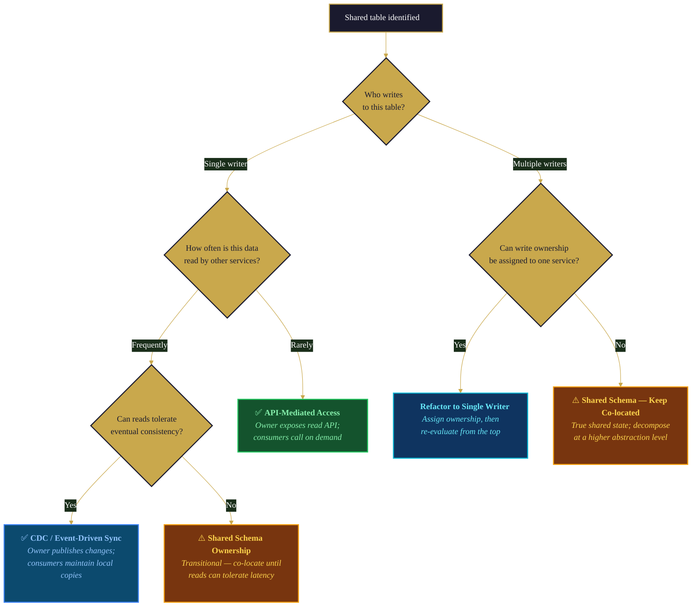

## Overview

Monolith-to-microservices is the most common enterprise modernization pattern — and the one with the highest failure rate. Teams that attempt it without deep architectural understanding of the monolith tend to fail in predictable ways: they draw service boundaries in the wrong places, they underestimate shared data dependencies, and they end up with a "distributed monolith" that's worse than what they started with.

This variant playbook provides pattern-specific guidance for Phase 5 (Iterative Execution) of the [Code Modernization](/playbooks/code-modernization) workflow. It covers the unique challenges of monolith decomposition: finding natural service boundaries, introducing the Strangler Fig façade, decomposing shared databases, choosing communication patterns, and executing the Transform → Coexist → Eliminate cycle for each extracted service.

CoreStory's role is critical here because the monolith's internal structure — the coupling patterns, data access hotspots, and hidden dependencies — is precisely what determines where services can and cannot be separated. CoreStory operates as an **Oracle** for understanding what the monolith actually does (as opposed to what the architecture diagram says it does), and as a **Navigator** for guiding each service extraction step by step.

This playbook executes the work packages defined in [Decomposition & Sequencing](/playbooks/modernization/decomposition-sequencing). If you haven't yet broken the modernization plan into sequenced work packages, start there. This playbook picks up at the point where you have a specific component to extract and need pattern-specific guidance for the monolith-to-microservices migration.

**Who this is for:** Engineers and architects executing a monolith-to-microservices migration. This playbook assumes you've already completed the assessment (Phase 1), business rules inventory (Phase 2), target architecture decision (Phase 3), and decomposition/sequencing (Phase 4). If you haven't, start with the [Code Modernization hub](/playbooks/code-modernization).

**What you'll get:** A concrete methodology for extracting services from a monolith — from identifying service boundaries through database decomposition to the façade-based execution pattern that makes incremental extraction safe.

---

## When to Use This Playbook

- Your Phase 3 decision selected Re-architect or Refactor with a microservices target architecture
- You're executing work packages from Phase 4 that involve extracting services from a monolith
- You need to identify service boundaries within a monolith that has unclear or undocumented module boundaries
- You need to decompose a shared database as part of service extraction
- You're introducing an API gateway or façade layer for the Strangler Fig pattern

## When to Skip This Playbook

- The target architecture is not microservices — if you're modernizing within a monolith (refactoring without extraction), use [Spec-Driven Development](/playbooks/spec-driven-development) directly
- The system is already service-oriented and you're re-platforming (e.g., moving from on-prem to cloud without architectural changes)
- You haven't completed Phases 1–4 — go back to the [Code Modernization hub](/playbooks/code-modernization)
- The monolith is small enough that extraction doesn't make sense — not every monolith needs to become microservices

---

## Prerequisites

- A **completed Target Architecture decision** (Phase 3) specifying microservices as the target
- A **completed Decomposition & Sequencing plan** (Phase 4) with ordered work packages
- A **completed Business Rules Inventory** (Phase 2) for behavioral verification during extraction
- A **CoreStory account** with the monolith codebase ingested and ingestion complete
- An **AI coding agent** with CoreStory MCP configured (see [Supercharging AI Agents](/getting-started/supercharging-ai-agents) for setup)
- (Recommended) **Access to the monolith's database schema** — either via CoreStory ingestion or direct access
- (Recommended) **Infrastructure for running extracted services** — container orchestration, API gateway, service mesh, or at minimum a reverse proxy for the façade layer
- (Recommended) **Observability tooling** — distributed tracing and centralized logging are essential for debugging issues during the Coexist phase

---

## How It Works

### CoreStory MCP Tools Used

| Tool | Step(s) | Purpose |
|------|----------|---------|
| `list_projects` | 1 | Confirm the target project |
| `create_conversation` | 1 | Start a dedicated extraction thread per service |
| `send_message` | 2, 3, 4, 5, 6 | Query CoreStory for boundary analysis, dependency mapping, and extraction guidance |
| `list_conversations` | 1 | Find prior phase conversations |
| `get_conversation` | 1 | Retrieve prior findings for cross-reference |
| `get_project_techspec` | 1, 2 | Retrieve Tech Spec for understanding monolith structure |
| `get_project_prd` | 2 | Retrieve PRD for business domain context |
| `rename_conversation` | 6 | Mark completed thread with "RESOLVED" prefix |

### The Monolith-to-Microservices Workflow

> **Note:** The steps below are internal to this playbook. They are sub-steps of Phase 5 in the [six-phase modernization framework](/playbooks/code-modernization), not a separate numbering system.

This playbook follows a six-step pattern for each service extraction:

1. **Context Loading** — Load the work package definition, prior phase findings, and establish the extraction scope.
2. **Service Boundary Identification** — Use CoreStory to validate and refine the service boundary defined in Phase 4. Identify exactly what code, data, and logic belongs to the new service.
3. **Database Decomposition Planning** — Map shared data dependencies and plan the data separation strategy for this service extraction.
4. **Façade & Communication Design** — Design the Strangler Fig façade layer and the communication patterns between the extracted service and the remaining monolith.
5. **Service Extraction Execution** — Execute the Transform → Coexist → Eliminate cycle using Spec-Driven Development for the delta spec.
6. **Verification & Cutover** — Verify behavioral equivalence and execute the cutover from monolith to extracted service.

### The Strangler Fig Pattern for Service Extraction

The Strangler Fig pattern is the execution model for monolith-to-microservices migration. Named after the strangler fig plant that grows around a host tree until it can support itself, the pattern incrementally replaces monolith functionality with extracted services:

1. **Introduce the façade.** Place an API gateway, reverse proxy, or routing layer in front of the monolith. Initially, it routes all traffic to the monolith unchanged.
2. **Extract one service.** Build the new microservice alongside the monolith. The façade routes requests for that service's domain to the new service instead of the monolith.
3. **Coexist.** Both the monolith (handling everything else) and the extracted service (handling its domain) run simultaneously. The façade manages the routing.
4. **Verify and eliminate.** Once the extracted service is verified, remove the corresponding code from the monolith. The façade continues routing.
5. **Repeat.** Extract the next service. The monolith shrinks with each extraction until only the façade remains (or the façade becomes the API gateway for the service mesh).

The key safety property: at every step, the system is functional. If the extracted service fails, the façade can route traffic back to the monolith. There is no big-bang cutover.


### HITL Gate

> **Before each service extraction:** The engineering lead reviews the service boundary, data decomposition plan, and façade design before extraction begins. This is especially important for the first extraction — it establishes the pattern that subsequent extractions will follow.

---

## Step-by-Step Walkthrough

### Step 1: Context Loading

Start by loading the work package definition and all relevant context from prior phases.

**Load the work package:**

```
List my CoreStory projects. I need the project for [SystemName].
Then list all conversations — I need the decomposition thread
and the architecture decision thread.
```

**Retrieve the specific work package details:**

```
Retrieve the conversation history from our decomposition planning
(conversation [conversation_id]). I need the details for
work package [WP-XXX]:
1. Components included in this extraction
2. Dependencies on other work packages
3. Hard blockers (what must complete first)
4. The Transform/Coexist/Eliminate plan
5. Acceptance criteria
```

**Create the extraction conversation:**

```
Create a CoreStory conversation titled
"[Extraction] SystemName - ServiceName (WP-XXX)".
Store the conversation_id for all subsequent queries.
```

### Step 2: Service Boundary Identification

Phase 4 defined the work package boundary at a high level. Now refine it to the specific code, data, and logic that will move to the new service.

**Map the domain boundary:**

```
send_message: "For the [ComponentName] extraction (WP-XXX),
identify the precise domain boundary within the monolith:

1. Which modules, packages, or namespaces contain the logic
   for this domain?
2. Which classes/functions are entirely within this domain?
3. Which classes/functions are shared with other domains
   (used by this component AND other components)?
4. Which database tables are owned by this domain (only
   accessed by this component)?
5. Which database tables are shared (accessed by this component
   AND other components)?

Distinguish between:
- MOVE: code that belongs entirely to the new service
- SHARE: code currently shared that needs to be duplicated or
  extracted into a shared library
- LEAVE: code that stays in the monolith"
```

**Identify hidden coupling:**

```
send_message: "What hidden coupling exists between [ComponentName]
and the rest of the monolith?

1. Direct function/method calls from other modules INTO this
   component — who depends on us?
2. Direct function/method calls FROM this component into other
   modules — who do we depend on?
3. Shared in-memory state (singletons, caches, thread-local storage)
4. Shared configuration values that this component reads
5. Implicit coupling through database triggers, stored procedures,
   or materialized views
6. Event/callback registrations where this component listens
   to events from other components or vice versa

For each coupling point, classify:
- Can be replaced with an API call (synchronous)
- Can be replaced with an event/message (asynchronous)
- Must be resolved before extraction (hard coupling)"
```

**Validate the boundary:**

```
send_message: "Given the domain boundary and coupling analysis,
is this service extraction feasible as defined?

1. Can the extracted service function independently (with API
   calls replacing direct coupling)?
2. Can the monolith function correctly after this code is removed
   (with API calls to the new service replacing internal calls)?
3. Are there any circular dependencies between this component
   and the monolith that would prevent clean extraction?
4. Is the boundary a clean domain boundary (aligned with a
   bounded context) or does it cut across domain logic?

If the boundary needs adjustment, what's the recommended change?"
```

### Step 3: Database Decomposition Planning

Shared databases are the hardest part of monolith-to-microservices. This phase plans how to separate data ownership for the service being extracted.

**Map data dependencies:**

```
send_message: "Map all database interactions for [ComponentName]:

1. Tables OWNED by this component (only this component writes to them)
2. Tables READ by this component but OWNED by others (read-only access)
3. Tables WRITTEN by this component AND other components (shared writes)
4. Foreign key relationships between owned tables and other tables
5. Stored procedures, views, or triggers that cross the component boundary
6. Any direct SQL queries that join across component boundaries

For tables with shared writes (#3), this is the critical challenge.
Identify which component should own each shared table in the target
architecture."
```

**Choose a data decomposition strategy:**

The right strategy depends on the coupling pattern. Use the following decision tree as a starting heuristic — the right strategy depends on your specific constraints:



```
send_message: "For each shared data dependency, recommend a
decomposition strategy:

Option A: Database-per-service (full separation)
- Each service gets its own database/schema
- Data that was joined becomes API calls
- Best for: cleanly separable data with clear ownership

Option B: Shared database with schema ownership
- One database, but each service owns specific schemas/tables
- Access control enforces ownership boundaries
- Best for: transitional state during migration, complex joins

Option C: Event-driven synchronization
- Services maintain their own copies of shared data
- Changes propagate via events (CDC, outbox pattern, domain events)
- Best for: read-heavy shared data where eventual consistency is acceptable

Option D: API-mediated access
- The owning service exposes the data via API
- Consuming services call the API instead of querying directly
- Best for: shared data with clear ownership and low-frequency access

For each shared table, which strategy applies? Consider:
- Query frequency (how often is this data accessed?)
- Consistency requirements (must reads see latest writes?)
- Join complexity (is this data joined with other service's data?)
- Volume (how much data, how fast does it change?)"
```

**Plan the data migration:**

```
send_message: "For the selected data decomposition strategy,
plan the migration:

1. What data needs to move? (tables, rows, schemas)
2. Migration sequence — can data be migrated incrementally
   or must it be a bulk migration?
3. During the Coexist phase, how is data kept in sync between
   the monolith's database and the new service's database?
4. What happens to foreign keys that cross the service boundary?
5. What's the rollback plan if the data migration fails?
6. Are there any data consistency windows where the system
   is in an inconsistent state? How long, and is it acceptable?"
```

### Step 4: Façade & Communication Design

Design the routing layer that enables the Strangler Fig pattern and the communication patterns between the extracted service and the monolith.

**Design the façade layer:**

```
send_message: "Identify all entry points into [ComponentName]
within the monolith:

1. HTTP endpoints (routes, controllers) — what URLs currently
   route to this component's logic?
2. Internal method calls from other modules — what functions
   does the monolith call into this component?
3. Background jobs or scheduled tasks — what jobs execute
   this component's logic?
4. Event handlers — what events trigger this component?
5. CLI commands or admin interfaces

For each entry point:
- Can it be routed through the façade (API gateway/reverse proxy)?
- Does it need an adapter (e.g., converting an internal method
  call to an HTTP/gRPC call)?
- Does it need to remain in the monolith temporarily with a
  thin wrapper that calls the new service?"
```

**Choose communication patterns:**

```
send_message: "For each interaction between the extracted service
and the remaining monolith, recommend a communication pattern:

Synchronous (REST/gRPC):
- Best for: request-response patterns, queries, operations that
  need immediate confirmation
- Risk: introduces latency, creates runtime coupling

Asynchronous (events/messaging):
- Best for: notifications, data propagation, operations that
  don't need immediate response
- Risk: introduces eventual consistency, harder to debug

For each interaction:
1. What is the current pattern in the monolith? (direct call,
   shared memory, database polling, etc.)
2. What should the modernized pattern be?
3. What is the latency tolerance?
4. What happens if the call fails? (retry, fallback, circuit breaker)
5. Is idempotency needed? (can the same message be processed twice safely?)"
```

**Design the anti-corruption layer:**

```
send_message: "The anti-corruption layer translates between
the monolith's internal model and the new service's model.

1. Where do the models diverge? (different field names, different
   data types, different enumerations, different units)
2. Where does the new service intentionally improve on the
   monolith's model? (better naming, cleaner types, explicit
   nullability)
3. What translation is needed at each integration point?
4. Should the anti-corruption layer live in the new service,
   in the monolith, or in the façade?

The anti-corruption layer is temporary — it will be removed
when all consumers have migrated to the new service's model.
Design it to be easy to remove."
```

### Step 5: Service Extraction Execution

Execute the Transform → Coexist → Eliminate cycle for this service. This is where the actual extraction happens.

**Transform: Build the new service**

Use [Spec-Driven Development](/playbooks/spec-driven-development) to create the delta spec for the new service:

```
send_message: "Generate a delta spec for extracting
[ComponentName] as a standalone service:

1. What the service does (business rules from Phase 2 inventory)
2. API contract (endpoints, request/response formats, authentication)
3. Data model (owned tables, with any schema improvements)
4. Integration points (how it communicates with other services
   and the remaining monolith)
5. Non-functional requirements (latency, throughput, availability)

The delta spec should capture what CHANGES from the monolith
to the extracted service — not a full system description.
Focus on the boundary: new APIs that replace internal calls,
data that moves, behavior that's preserved."
```

Build the service following the delta spec. The monolith remains untouched during Transform. Key implementation steps:

```
send_message: "For the [ComponentName] service implementation,
guide the extraction:

1. Which files from the monolith contain the logic to extract?
2. What modifications are needed to make this logic standalone?
   (remove internal dependencies, add API layer, add configuration)
3. What new infrastructure code is needed? (service bootstrap,
   health checks, configuration loading, database connection)
4. What test infrastructure is needed? (service-level tests,
   contract tests with the monolith facade)
5. What deployment configuration is needed? (Dockerfile,
   Kubernetes manifests, CI/CD pipeline)"
```

**Coexist: Run both versions simultaneously**

Configure the façade to route traffic:

```
send_message: "Design the Coexist phase configuration:

1. Façade routing rules — which requests go to the new service,
   which stay in the monolith?
2. Can we start with a percentage-based rollout (e.g., 10% to
   new service, 90% to monolith)?
3. How do we compare responses between old and new? (shadow
   traffic, dual-write with comparison, manual sampling)
4. What monitoring is needed to detect behavioral differences?
   (error rates, latency percentiles, business metrics)
5. What's the circuit breaker configuration? (when does the
   façade automatically fall back to the monolith?)
6. How long should the Coexist phase last before proceeding
   to Eliminate?"
```

Run [Behavioral Verification](/playbooks/modernization/behavioral-verification) — the systematic process of proving the extracted service preserves every business rule from the legacy implementation — during the Coexist phase:

```
Verify behavioral equivalence for [ComponentName] using the
Business Rules Inventory from Phase 2. Compare the extracted
service against the monolith's implementation.
```

**Eliminate: Retire the legacy code**

Once behavioral verification passes and the Coexist phase is stable:

```
send_message: "Plan the Eliminate phase for [ComponentName]:

1. Which code in the monolith should be removed?
   (controllers, services, repositories, models, configuration)
2. Which database tables/schemas should be dropped or
   transferred to the new service's database?
3. What façade routing rules should be updated?
   (remove the monolith path, keep only the service path)
4. What anti-corruption layer code should be removed?
5. Are there any other monolith components that referenced
   the removed code? How are those references updated?
6. What integration tests need to be updated to point to
   the service instead of the monolith?"
```

### Step 6: Verification & Cutover

Final verification before the extraction is considered complete.

**Post-elimination verification:**

```
send_message: "After removing [ComponentName] from the monolith:

1. Does the monolith still build and pass all remaining tests?
2. Does the extracted service continue to function correctly
   without the monolith code?
3. Are all integration points working? (test each consumer
   of the extracted service)
4. Is monitoring showing healthy metrics? (error rates,
   latency, throughput)
5. Is the data migration complete and consistent?
6. Can the system handle the full production load on the
   extracted service?"
```

**Mark the thread complete:**

```
Rename the conversation to
"RESOLVED - [Extraction] SystemName - ServiceName (WP-XXX)".
```

---

## Key Patterns & Strategies

### Service Boundary Identification Patterns

**Bounded Context alignment.** The strongest service boundaries align with Domain-Driven Design bounded contexts — areas of the codebase where a consistent domain model and ubiquitous language apply. Ask CoreStory: "What are the natural domain boundaries in this monolith based on the business concepts each module operates on?"

**Data ownership alignment.** Services should own their data. If two modules both write to the same tables, they likely belong in the same service (or the shared data needs to be decomposed). Ask CoreStory: "Which modules in this monolith access the same database tables? Map data ownership."

**Team ownership alignment.** In organizations where Conway's Law applies (most of them), service boundaries should align with team boundaries. A service owned by two teams is a service that will diverge. This is a human decision, but CoreStory can inform it by showing which code modules are most cohesive.

**Change frequency alignment.** Code that changes together should be in the same service. Code that changes independently is a candidate for separation. Ask CoreStory: "Which modules in this codebase have historically changed together? Which change independently?"

### Database Decomposition Strategies

**Database-per-service** is the target end state but rarely the first step. It requires resolving all cross-service joins, foreign keys, and shared writes. Best for services with clear data ownership and no cross-service joins.

**Shared database with schema ownership** is a practical intermediate step. Each service "owns" specific tables (enforced by convention or access control) but shares the same database server. This avoids the complexity of data replication while establishing ownership boundaries.

**Change Data Capture (CDC)** enables data synchronization between services without tight coupling. The owning service writes to its database; CDC propagates changes to consuming services' databases as events. Tools like Debezium, AWS DMS, or database-native logical replication handle the mechanics.

**The Outbox Pattern** provides reliable event publishing alongside database writes. Instead of publishing events directly (which risks inconsistency if the publish fails), the service writes both the data change and the event to the same database transaction. A separate process reads the outbox and publishes events. This guarantees at-least-once delivery.

### Distributed Transaction Management

When a business operation spans multiple services, the single database transaction that guaranteed ACID properties in the monolith no longer exists. This is one of the most common failure modes in monolith-to-microservices migrations: teams extract a service, then discover that a critical workflow relied on a transaction that spanned what are now two separate databases.

The **Saga pattern** manages distributed transactions through a sequence of local transactions with compensating actions for rollback.

**Choreography (event-driven):** Each service publishes events that trigger the next step. No central coordinator. Service A completes its local transaction and publishes an event; Service B listens for that event, performs its local transaction, and publishes the next event.

- **Use when:** Few services involved (2–3), low coordination complexity, the team is comfortable with event-driven debugging
- **Advantages:** No single point of failure, loose coupling, each service is fully autonomous
- **Drawbacks:** Harder to reason about the overall flow, harder to debug when something fails mid-saga, can create implicit coupling through event schemas
- **Watch for:** Circular event chains, missing compensating transactions, inconsistent event ordering

**Orchestration (coordinator-driven):** A central coordinator (saga orchestrator) manages the sequence. The orchestrator calls each service in order, tracks the state of the saga, and triggers compensating actions if any step fails.

- **Use when:** Many services involved (4+), complex coordination logic, the team needs visibility into the overall workflow state
- **Advantages:** Easier to understand and debug, clear ownership of the coordination logic, centralized error handling
- **Drawbacks:** The orchestrator is a single point of failure (mitigate with redundancy), tighter coupling between orchestrator and services
- **Tool support:** Temporal, AWS Step Functions, Camunda, Azure Durable Functions

**Identifying saga candidates with CoreStory:**

```
send_message: "Analyze the current transaction boundaries in [ComponentName].
Which operations currently execute within a single database transaction
but will span multiple services in the target architecture?

For each operation:
1. What data is written across what will become service boundaries?
2. What is the current rollback behavior if the operation fails midway?
3. What compensating actions would be needed in a saga?
4. Is the operation's consistency requirement strict (must be immediate)
   or eventual (can tolerate brief inconsistency)?"
```

**Decision guidance:** Start with choreography for simple, two-service interactions. Move to orchestration when you find yourself building ad-hoc coordination logic across events. Most real-world modernizations end up with a mix — choreography for simple flows, orchestration for complex multi-service workflows.

### Communication Patterns

**API Gateway routing** is the simplest Strangler Fig implementation. The gateway routes requests to the monolith or the extracted service based on URL path, header, or other criteria. This works well for HTTP-based entry points.

**Branch by abstraction** works for internal coupling. Introduce an interface/abstraction in the monolith where the extracted component is called. Initially, the implementation calls the monolith code. After extraction, swap the implementation to call the new service. This is the Strangler Fig pattern applied at the code level rather than the network level.

**Event-driven decoupling** replaces synchronous internal calls with asynchronous events. The monolith publishes events when state changes; the extracted service subscribes. This is more work to implement but reduces runtime coupling and enables independent scaling.

---

## Prompting Patterns Reference

### Boundary Identification Patterns

| Pattern | Example |
|---------|---------|
| **Domain boundary** | "What are the natural domain boundaries in this monolith? Which modules operate on the same business concepts?" |
| **Data ownership** | "Which modules write to the same database tables? Map the write access patterns." |
| **Coupling analysis** | "How many direct calls exist between [ModuleA] and [ModuleB]? What would need to change to make them independent?" |
| **Shared logic** | "What code is shared between [ModuleA] and [ModuleB]? Can it be extracted into a shared library, or does it belong in one service?" |

### Database Decomposition Patterns

| Pattern | Example |
|---------|---------|
| **Table ownership** | "For each database table, which module is the primary writer? Which modules only read?" |
| **Cross-boundary joins** | "Which SQL queries join tables that belong to different modules? These are the joins that must be decomposed." |
| **Foreign key mapping** | "What foreign key relationships cross the proposed service boundary? Which can be replaced with IDs and API lookups?" |
| **Data volume** | "How many rows are in each table that needs to migrate? What's the write frequency? This determines the migration strategy." |

### Extraction Patterns

| Pattern | Example |
|---------|---------|
| **Entry point mapping** | "What HTTP routes, internal calls, and background jobs currently invoke [ComponentName] logic?" |
| **Anti-corruption layer** | "Where do the monolith's data model and the new service's model diverge? What translations are needed?" |
| **Rollback planning** | "If the extracted service fails under production load, what is the fastest path to routing all traffic back to the monolith?" |
| **Contract testing** | "What contract tests should exist between the extracted service and its consumers to catch breaking changes?" |

### Distributed Transaction Patterns

| Pattern | Example |
|---------|---------|
| **Transaction boundary analysis** | "Which operations in [ComponentName] write to multiple database tables within a single transaction? Which of those tables will belong to different services?" |
| **Compensating action design** | "If the [ServiceA] step of [Operation] succeeds but the [ServiceB] step fails, what compensating action reverses the [ServiceA] change?" |
| **Consistency requirement** | "Does [Operation] require strong consistency (all-or-nothing, immediate) or can it tolerate eventual consistency (brief window of inconsistency)?" |
| **Saga variant selection** | "For the [Operation] workflow spanning [ServiceA], [ServiceB], [ServiceC]: is the coordination logic simple enough for choreography, or does the number of steps and error scenarios warrant orchestration?" |

---

## Best Practices

**Extract the smallest viable service first.** Your first extraction should be the simplest possible: low coupling, clear data ownership, few consumers. The goal is to prove the extraction pattern works — establishing the façade, the deployment pipeline, the monitoring, and the team's muscle memory — before tackling harder extractions. Getting the infrastructure right on an easy service is far cheaper than getting it wrong on a hard one.

**Don't break the monolith's database on day one.** Start with shared database/schema ownership. Let the extracted service access the monolith's database through a well-defined data access layer. Decompose the database later, once the service boundary is proven stable. Premature database decomposition is one of the most common causes of monolith-to-microservices failure.

**The façade is your safety net — invest in it.** The Strangler Fig façade (API gateway, reverse proxy, or routing layer) is what makes incremental extraction safe. It should support percentage-based routing (for gradual rollout), circuit breaking (for automatic fallback), and request mirroring (for comparison testing). Invest in making this layer robust before the first extraction.

**Design for independent deployment from day one.** The extracted service must be deployable without coordinating with monolith deployments. This means: independent CI/CD pipeline, independent configuration, independent database migrations, independent monitoring. If deploying the service requires a synchronized monolith deployment, you've built a distributed monolith.

**Contract tests are non-negotiable.** Every interaction between the extracted service and the monolith (or other services) must have a contract test. Consumer-driven contract testing (Pact, Spring Cloud Contract) ensures that the service's API doesn't break its consumers and that the service's expectations of its dependencies are met.

**Plan for the data synchronization tax.** During the Coexist phase, data often needs to be synchronized between the monolith's database and the new service's database. This synchronization is complex, error-prone, and temporary. Budget for it explicitly in your work packages, and design it to be removable.

**Monitor business metrics, not just technical metrics.** Error rates and latency are necessary but insufficient. Monitor the business outcomes: order completion rate, payment success rate, user conversion. If a business metric drops after extraction, there's a behavioral regression that technical metrics might not catch.

---

## Agent Implementation Guides

<AccordionGroup>

<Accordion title="Claude Code">

#### Setup

1. **Configure the CoreStory MCP server** in your Claude Code settings (see [CoreStory MCP Server Setup Guide](/getting-started/mcp-server-setup)).

2. **Add the skill file:**

```bash
mkdir -p .claude/skills/monolith-to-microservices
```

Create `.claude/skills/monolith-to-microservices/SKILL.md` with the content from the skill file below.

3. **Commit to version control:**

```bash
git add .claude/skills/
git commit -m "Add CoreStory monolith-to-microservices skill"
```

#### Usage

```
Extract [ServiceName] from the monolith
Plan the service boundary for [ComponentName]
Design the database decomposition for [ComponentName] extraction
Execute work package WP-XXX (monolith extraction)
```

#### Tips

- This skill is a Phase 5 variant that plugs into the broader modernization workflow. It expects Phases 1–4 to be complete.
- For the first extraction, spend extra time on Step 2 (boundary identification) and Step 4 (façade design) — these establish the pattern for all subsequent extractions.
- Keep the SKILL.md under 500 lines for reliable loading.

#### Skill File

Save as `.claude/skills/monolith-to-microservices/SKILL.md`:

````markdown
---
name: CoreStory Monolith to Microservices
description: Guides service extraction from a monolith using CoreStory's code intelligence and the Strangler Fig pattern. Activates on microservice extraction, service boundary, database decomposition, or monolith decomposition requests.
---

# CoreStory Monolith to Microservices

When this skill activates, guide the user through the six-step workflow to extract a service from a monolith.

## Activation Triggers

Activate when user requests:
- Service extraction from a monolith
- Service boundary identification or validation
- Database decomposition planning
- Strangler Fig implementation
- Any request containing "extract service", "microservice", "monolith", "service boundary", "decompose database"

## Prerequisites

- Completed Phases 1–4 of the modernization workflow
- CoreStory MCP server configured with completed ingestion
- Work package definition from Phase 4

**If you do not detect that you have access to CoreStory (e.g., `list_projects` fails or is unavailable), ask the user to verify that their MCP or API connection is properly configured and that this repository has been ingested. If the user has not yet created a CoreStory account, direct them to create one and upload their repo at [app.corestory.ai](https://app.corestory.ai).**

## Step 1: Context Loading
1. Identify target project (`list_projects`)
2. Locate prior conversations — decomposition, architecture, assessment
3. Retrieve work package details (`get_conversation`)
4. Create conversation: "[Extraction] SystemName - ServiceName (WP-XXX)"

## Step 2: Service Boundary Identification
- Map domain boundary: MOVE / SHARE / LEAVE classification
- Identify hidden coupling: direct calls, shared state, implicit deps
- Validate feasibility: can service and monolith function independently?

## Step 3: Database Decomposition Planning
- Map data dependencies: owned, read-only, shared writes
- Choose strategy: database-per-service, schema ownership, CDC, API-mediated
- Plan migration: sequence, sync during coexist, rollback

## Step 4: Façade & Communication Design
- Map all entry points into the component
- Design façade routing (API gateway / reverse proxy)
- Choose communication patterns (sync / async per interaction)
- Design anti-corruption layer

## Step 5: Service Extraction Execution
- Transform: build new service using Spec-Driven Development delta spec
- Coexist: configure façade, run both versions, monitor
- Eliminate: remove legacy code, update routing, clean up

## Step 6: Verification & Cutover
- Behavioral verification using Phase 2 inventory
- Post-elimination testing
- **HITL Gate: Engineering lead approves cutover**

## Error Handling
- **Circular dependencies:** Boundary needs adjustment, merge components or introduce event decoupling
- **Shared database can't be split:** Use schema ownership as intermediate step
- **Façade can't route cleanly:** Consider branch-by-abstraction at code level
- **Performance degradation after extraction:** Network calls replacing in-process calls — add caching, optimize APIs
````

</Accordion>

<Accordion title="GitHub Copilot">

Add the following to `.github/copilot-instructions.md`:

```markdown
## Monolith to Microservices

When asked to extract a service from a monolith or plan a microservices migration:
1. ALWAYS load the work package definition and prior phase findings
2. Map the precise domain boundary: code to MOVE, SHARE, or LEAVE
3. Identify hidden coupling: direct calls, shared state, database coupling
4. Plan database decomposition: choose strategy per shared table
5. Design the Strangler Fig façade and communication patterns
6. Execute Transform → Coexist → Eliminate with behavioral verification
7. Contract tests are non-negotiable for every service interaction
8. Start with shared database ownership; decompose fully later
```

**(Optional) Add a reusable prompt file.** Create `.github/prompts/monolith-to-microservices.prompt.md`:

````markdown
---
mode: agent
description: Extract a service from a monolith using CoreStory's code intelligence and the Strangler Fig pattern
---

Extract the specified service from the monolith following the Strangler Fig pattern.

1. Load the work package definition and prior phase findings
2. Map the precise service boundary within the monolith
3. Plan database decomposition for shared data dependencies
4. Design the façade layer and communication patterns
5. Generate a delta spec for the extracted service
6. Guide the Transform → Coexist → Eliminate cycle
7. Verify behavioral equivalence against the Phase 2 inventory
````

</Accordion>

<Accordion title="Cursor">

Create `.cursor/rules/monolith-to-microservices/RULE.md`:

````markdown
---
description: CoreStory-powered monolith-to-microservices extraction. Activates for service extraction, microservice decomposition, service boundary identification, or database decomposition.
alwaysApply: false
---

# CoreStory Monolith to Microservices

You are a microservices architect with access to CoreStory's code intelligence via MCP. Guide service extraction from a monolith using the Strangler Fig pattern.

## Activation Triggers

Apply when user requests: service extraction, microservice decomposition, service boundary identification, database decomposition for service extraction, or Strangler Fig implementation.

**If you do not detect that you have access to CoreStory (e.g., `list_projects` fails or is unavailable), ask the user to verify that their MCP or API connection is properly configured and that this repository has been ingested. If the user has not yet created a CoreStory account, direct them to create one and upload their repo at [app.corestory.ai](https://app.corestory.ai).**

## Six-Step Workflow

### Step 1: Context Loading
- Load work package, prior conversations, Tech Spec
- Create extraction conversation

### Step 2: Service Boundary Identification
- Domain boundary: MOVE / SHARE / LEAVE classification
- Hidden coupling: calls, shared state, implicit dependencies
- Boundary validation: independent deployability

### Step 3: Database Decomposition Planning
- Table ownership mapping (owned, read-only, shared writes)
- Strategy selection per dependency (database-per-service, schema ownership, CDC, API-mediated)
- Migration plan: sequence, sync, rollback

### Step 4: Façade & Communication Design
- Entry point mapping (HTTP, internal calls, jobs, events)
- Façade routing design (API gateway / reverse proxy)
- Communication patterns (sync / async per interaction)
- Anti-corruption layer design

### Step 5: Service Extraction Execution
- Transform: delta spec via Spec-Driven Development
- Coexist: façade routing, monitoring, comparison testing
- Eliminate: remove legacy code, clean up façade
- **HITL Gate: Engineering lead approves cutover**

### Step 6: Verification & Cutover
- Behavioral verification against Phase 2 inventory
- Post-elimination testing
- Business metric monitoring

## Key Principles
- Extract the smallest viable service first
- Don't decompose the database on day one
- The façade is your safety net — invest in it
- Contract tests are non-negotiable
- Monitor business metrics, not just technical metrics
````

</Accordion>

<Accordion title="Factory.ai">

Create `.factory/droids/monolith-to-microservices.md`:

````markdown
---
name: CoreStory Monolith to Microservices
description: Guides service extraction from a monolith using CoreStory code intelligence and the Strangler Fig pattern
model: inherit
tools:
  - CoreStory:list_projects
  - CoreStory:get_project_techspec
  - CoreStory:get_project_prd
  - CoreStory:create_conversation
  - CoreStory:send_message
  - CoreStory:rename_conversation
  - CoreStory:list_conversations
  - CoreStory:get_conversation
---

# CoreStory Monolith to Microservices

Execute the six-step workflow to extract a service from a monolith.

## Activation Triggers
- "Extract [service] from the monolith"
- "Plan service boundary for [component]"
- "Decompose the database for [component] extraction"
- Any monolith decomposition or service extraction request

## CoreStory MCP Tools
- `CoreStory:list_projects` — identify the target project
- `CoreStory:get_project_techspec` — understand monolith structure
- `CoreStory:get_project_prd` — business domain context
- `CoreStory:create_conversation` — open extraction thread
- `CoreStory:send_message` — query for boundary analysis and extraction guidance
- `CoreStory:list_conversations` / `CoreStory:get_conversation` — load prior phase findings
- `CoreStory:rename_conversation` — mark completed thread "RESOLVED"

**If you do not detect that you have access to CoreStory (e.g., `list_projects` fails or is unavailable), ask the user to verify that their MCP or API connection is properly configured and that this repository has been ingested. If the user has not yet created a CoreStory account, direct them to create one and upload their repo at [app.corestory.ai](https://app.corestory.ai).**

## Workflow

Step 1: Context Loading → Load work package and prior phase findings
Step 2: Service Boundary → Domain mapping (MOVE/SHARE/LEAVE), coupling analysis, validation
Step 3: Database Decomposition → Data dependencies, strategy selection, migration plan
Step 4: Façade Design → Entry points, routing rules, communication patterns, anti-corruption layer
Step 5: Extraction → Transform (delta spec) → Coexist (façade + monitoring) → Eliminate (cleanup)
Step 6: Verification → Behavioral equivalence → HITL cutover approval

## Key Principles
- Extract the smallest viable service first
- Start with shared database ownership, decompose later
- Façade enables safe rollback at every step
- Contract tests for every service interaction
- Monitor business metrics, not just technical metrics
````

</Accordion>

</AccordionGroup>

---

## Troubleshooting

**Can't find clean service boundaries — everything is tightly coupled.**

This is the most common challenge in monolith decomposition. Start by identifying the modules with the lowest fan-in (fewest inbound dependencies) — these are the easiest to extract. If no clean boundaries exist, consider an intermediate step: introduce module boundaries *within* the monolith (a "modular monolith") before extracting services. Ask CoreStory: "Which modules have the fewest inbound dependencies from other modules?"

**Shared database tables can't be cleanly assigned to one service.**

Use schema ownership as a transitional strategy: both services access the same database, but each "owns" specific tables. Enforce ownership via convention or database-level access control. Over time, decompose the database fully using CDC or the outbox pattern for data synchronization.

**Performance degrades after service extraction — API calls are slower than in-process calls.**

This is expected. Network calls replace in-process calls, adding latency. Mitigations: add caching in the extracted service for frequently-read data, batch API calls where possible, use gRPC instead of REST for internal service communication, and consider whether the service boundary is correct — if two services call each other constantly, they might belong together.

**The façade introduces a single point of failure.**

Use a highly-available API gateway or load balancer for the façade layer. Most cloud providers offer managed API gateways with built-in redundancy (AWS API Gateway, Azure API Management, GCP API Gateway). For self-hosted, use a cluster of reverse proxies (Nginx, Envoy, HAProxy) behind a load balancer.

**Data consistency issues during the Coexist phase.**

Dual-write scenarios (where both the monolith and the extracted service can write to shared data) are inherently risky. Prefer single-writer patterns: one system is the source of truth for each piece of data, and the other reads via API or receives updates via events. If dual-write is unavoidable, use the outbox pattern with at-least-once delivery and idempotent consumers.

**The extracted service works in testing but fails under production load.**

This usually means the service wasn't tested with production-scale data or traffic patterns. Use shadow traffic (mirror production requests to the new service without serving the response) during the Coexist phase to validate performance before cutover. Also check: database connection pooling, thread/goroutine limits, memory allocation, and external dependency timeouts.

**Agent can't access CoreStory tools.**

See the [Supercharging AI Agents](/getting-started/supercharging-ai-agents) troubleshooting section for MCP connection issues. Verify the project has completed ingestion by calling `list_projects` and checking the status.

---

## What's Next

**Extract the next service:** Move to the next work package in the migration sequence from [Decomposition & Sequencing →](/playbooks/modernization/decomposition-sequencing). Each extraction follows the same six-step pattern, but gets faster as the team builds muscle memory and the infrastructure matures.

**Verify as you extract:** Each extraction's Coexist phase requires behavioral verification. Use [Behavioral Verification →](/playbooks/modernization/behavioral-verification) to prove each extracted service preserves its business rules.

**Refine the delta spec:** For each component's Transform phase, use [Spec-Driven Development →](/playbooks/spec-driven-development) to create the delta spec that defines what changes from monolith to service.

**Return to the hub:** [Code Modernization →](/playbooks/code-modernization) — the full six-phase framework.

**For Jira integration:** [Using CoreStory with Jira →](/playbooks/using-corestory-with-jira) — tracking extraction work packages.

**For agent setup:** [Supercharging AI Agents with CoreStory →](/getting-started/supercharging-ai-agents) — MCP server configuration and agent setup.
