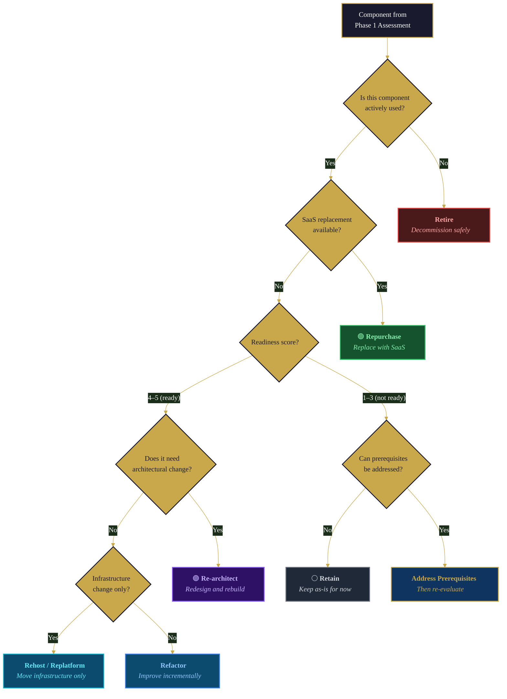

## Overview

Phase 3 of the modernization workflow is where strategy becomes structure. You have the assessment data from Phase 1 and the business rules inventory from Phase 2. Now the question is: what are we modernizing *to*, and how?

This is the most human-driven phase in the entire modernization workflow. CoreStory provides the analysis — natural service boundaries, coupling hotspots, data dependency maps, effort estimates — but the architectural decision belongs to the architect and stakeholders. AI is excellent at revealing what a system *is*; humans decide what it *should become*.

The reason this boundary matters: architectural decisions are organizational commitments. They determine team structure, hiring plans, vendor contracts, timelines, and budgets. They affect compliance posture, operational complexity, and the skills your team needs to develop. These are not decisions an AI should make, no matter how good its analysis is.

CoreStory serves as an **Oracle** throughout this phase — explaining system behavior, identifying natural boundaries and extension points, and quantifying the gap between current and target states. It also serves as a **Navigator** when defining the target architecture, pointing to specific code patterns, data flows, and integration points that inform where boundaries should be drawn.

**Who this is for:** Architects, engineering leads, and technical decision-makers responsible for choosing the modernization strategy and defining the target architecture. Also useful for consultants and system integrators presenting options to stakeholders.

**What you'll get:** An Architectural Decision Record (ADR) documenting the selected modernization strategy, target architecture, migration scope, constraints, and stakeholder approval — the input that Phase 4 (Decomposition & Sequencing) turns into executable work packages.

---

## When to Use This Playbook

- You've completed Phase 1 (Codebase Assessment) and have a Modernization Readiness Report with component-level readiness scores
- You need to choose a modernization strategy (from the 7 Rs) for each component — not a single system-wide strategy
- You need to define the target architecture before decomposing work into executable packages
- You're presenting modernization options to stakeholders and need data-backed analysis to support the recommendation
- You need to document an architectural decision with rationale, constraints, and approval for the audit trail

## When to Skip This Playbook

- You've already made the architectural decision and need to decompose it into work packages — go to [Decomposition & Sequencing](/playbooks/modernization/decomposition-sequencing)
- You're still assessing the current system — go back to [Codebase Assessment](/playbooks/modernization/codebase-assessment)
- The modernization is a straightforward lift-and-shift (Rehost/Relocate) with no architectural changes — this playbook adds minimal value to infrastructure-only moves
- You're doing a single-component refactor that doesn't require a formal architectural decision — use [Spec-Driven Development](/playbooks/spec-driven-development) directly

---

## Prerequisites

- A **completed Codebase Assessment** (Phase 1) — the Modernization Readiness Report is the primary input to this phase
- A **completed or in-progress Business Rules Inventory** (Phase 2) — understanding what the system *does* is essential for deciding what it should *become*
- A **CoreStory account** with the legacy codebase ingested and ingestion complete
- An **AI coding agent** with CoreStory MCP configured (see [Supercharging AI Agents](/getting-started/supercharging-ai-agents) for setup)
- **The right people in the room:** This phase requires architectural judgment. The architect or tech lead who will own the target architecture should be driving this phase, not delegating it to the agent.
- (Recommended) Access to the Codebase Assessment conversation thread in CoreStory for cross-referencing findings

---

## How It Works

### CoreStory MCP Tools Used

| Tool | Step(s) | Purpose |
|------|----------|---------|
| `list_projects` | 1 | Confirm the target project |
| `create_conversation` | 1 | Start a dedicated architecture decision thread |
| `send_message` | 2, 3, 4 | Query CoreStory for strategy exploration and architecture definition |
| `list_conversations` | 1 | Find the assessment conversation from Phase 1 |
| `get_conversation` | 1 | Retrieve assessment findings for cross-reference |
| `get_project_techspec` | 1 | Retrieve Tech Spec for architectural vocabulary |
| `get_project_prd` | 1 | Retrieve synthesized PRD for business context and requirements |
| `rename_conversation` | 5 | Mark completed thread with "RESOLVED" prefix |

### The Strategy & Architecture Workflow

> **Note:** The steps below are internal to this playbook. They are sub-steps of Phase 3 in the [six-phase modernization framework](/playbooks/code-modernization), not a separate numbering system.

This playbook follows a five-step pattern:

1. **Input Review** — Load the Codebase Assessment report and Business Rules Inventory from prior phases. Establish the baseline that all strategy decisions reference.
2. **Strategy Exploration** — Query CoreStory to explore which modernization patterns are feasible given the current architecture. This is the divergent phase — open the option space before narrowing.
3. **Target Architecture Definition** — Define the target architecture with CoreStory's guidance on natural service boundaries, extension points, and alignment with the selected strategy.
4. **Risk & Effort Estimation** — Assess the gap between current and target architecture. Estimate effort and risk per component. This is where the strategy meets reality.
5. **Decision Documentation** — Record the architectural decision, rationale, constraints, and approval in an Architectural Decision Record (ADR). This artifact feeds Phase 4 and serves as the audit trail.

### The HITL Boundary

This phase has the most critical human-in-the-loop gate in the entire modernization workflow:

> **After Step 4:** The architect or tech lead reviews the target architecture, strategy recommendations, and risk/effort estimates. This is the gate where the architectural decision is made and approved by stakeholders. It must not be delegated to AI.

CoreStory's role is to provide the best possible analysis so the human decision-maker has complete information. The agent should present options with trade-offs, not make recommendations that assume the decision is already made.

---

## Step-by-Step Walkthrough

### Step 1: Input Review

Start by loading context from prior phases so all strategy exploration is grounded in actual assessment data.

**Confirm the project and locate prior work:**

```
List my CoreStory projects. I need the project for [SystemName].
Then list all conversations — I need to find the assessment thread
from Phase 1.
```

The agent calls `list_projects` and `list_conversations` to locate the assessment conversation. If you used the naming convention from the Codebase Assessment playbook, look for "RESOLVED - [Assessment] SystemName - Modernization Readiness".

**Retrieve assessment context:**

```
Retrieve the conversation history from our codebase assessment
(conversation [conversation_id]). Summarize:
1. Overall readiness level and top findings
2. Component-level readiness scores and recommended strategies
3. Key coupling hotspots and shared data dependencies
4. Major blockers or prerequisites identified
```

The agent calls `get_conversation` to retrieve the assessment findings. This establishes the baseline for strategy exploration.

**Create the architecture decision thread:**

```
Create a CoreStory conversation titled
"[Architecture] SystemName - Strategy & Target Architecture".
Store the conversation_id — we'll use this thread for all
strategy exploration queries.
```

### Step 2: Strategy Exploration

With the assessment baseline loaded, explore which modernization patterns are feasible. This is the divergent phase — the goal is to understand the option space before narrowing to a decision.

**Natural boundaries and decomposition candidates:**

```
send_message: "Given the current architecture, which components are
natural candidates for service extraction? Where are the natural
service boundaries in this codebase? What data and logic would need
to move with each service?"
```

**Coupling and independence analysis:**

```
send_message: "Which components have the lowest coupling and could be
modernized independently with minimal risk? Which components are so
tightly coupled that they must be modernized together? Identify the
component clusters."
```

**Strategy feasibility per component:**

```
send_message: "Evaluate the feasibility of each migration strategy for each major component identified in the assessment:

1. **Retire:** Decommission entirely — is this component still needed? Does usage data support keeping it?
2. **Retain:** Keep in current state — is modernization worth the cost and risk for this component?
3. **Rehost (lift and shift):** Move to cloud without code changes — does this component benefit from cloud infrastructure alone?
4. **Relocate:** Move to a different platform (e.g., VMware to VMware Cloud on AWS) — is this an infrastructure-level move?
5. **Replatform (lift, tinker, shift):** Minor optimizations without core redesign — can targeted changes capture most of the value?
6. **Refactor / Re-architect:** Redesign as a modern service — does the coupling, data model, or architecture require fundamental restructuring?
7. **Repurchase:** Replace with SaaS/COTS — does a commercial product cover this component's business rules adequately?

For each strategy, evaluate: effort (engineering months), risk (what could go wrong), dependencies (what else must change), and payoff timeline (when do benefits materialize).

Remember that different components can — and usually should — get different strategies."
```

**Deployment model implications:**

```
send_message: "What is the current deployment model and what would
need to change for [target pattern]? Describe the gap between current
deployment infrastructure and what [microservices / cloud-native /
containerized / serverless] would require."
```

**Existing alignment:**

```
send_message: "Where does the current architecture already align with
[target pattern]? Which components, patterns, or infrastructure
elements can be carried forward without change? Where are the biggest
gaps?"
```

### Step 3: Target Architecture Definition

Narrow from exploration to definition. Use CoreStory to validate the emerging target architecture against the actual codebase.

**Service boundary definition:**

```
send_message: "If we extract [component] as a standalone service,
what integration points need to be created? What shared data would
need to be decoupled? What anti-corruption layers would be needed
for the components that still depend on it?"
```

**Pattern carryforward:**

```
send_message: "What existing patterns in the codebase should carry
forward to the target architecture? Identify design patterns, API
conventions, data access patterns, and configuration approaches that
are well-implemented and should be preserved."
```

**Gap analysis:**

```
send_message: "For the target architecture we're defining — [describe
target] — where does the current codebase already align and where are
the biggest structural gaps? For each gap, describe what would need
to change."
```

**Data architecture implications:**

```
send_message: "How should the data architecture change to support the
target architecture? Identify:
1. Shared databases that need to be split
2. Data that needs to be replicated or synchronized between services
3. Foreign key relationships that cross the proposed service boundaries
4. Database-level business logic (triggers, stored procedures) that
   would need to move to application code
This is often the hardest part of the architecture change — be specific."
```

**Cross-cutting concerns:**

```
send_message: "How should cross-cutting concerns be handled in the
target architecture? Address:
1. Authentication and authorization — centralized or per-service?
2. Logging and observability — what changes?
3. Configuration management — how does it scale to multiple services?
4. Error handling and resilience — circuit breakers, retries, fallbacks?
5. API versioning and contract management"
```

**Behavior tagging:**

Once service boundaries and patterns are defined, tag every behavior identified in the specification with an explicit migration intent. This prevents silent changes — each behavior gets a deliberate decision.

```
send_message: "For each behavior in the specification that falls within
[component/service boundary], assign one of these tags:

- PRESERVE — behavior carries forward exactly as-is
- MODERNIZE — same behavior, improved implementation (performance,
  maintainability, security)
- CHANGE — behavior is intentionally altered (new business logic,
  different rules)
- NEW — behavior that doesn't exist in the current system
- RETIRE — behavior being intentionally removed

For each tagged behavior, note:
1. Which tag and why
2. What verification would confirm correctness for this tag
3. Any dependencies on other behaviors"
```

The tags have direct consequences downstream:

- **Phase 4 (Decomposition):** Each work package's scope is defined by its tags. A package dominated by `PRESERVE` and `MODERNIZE` is lower-risk than one heavy on `CHANGE` and `NEW`.
- **Phase 5 (Execution):** TDD assertions differ by tag. `PRESERVE` behaviors get regression tests asserting identical output. `CHANGE` behaviors get tests asserting the *new* expected output. `NEW` behaviors need tests written from scratch.
- **Phase 6 (Verification):** Verification criteria differ by tag. `PRESERVE` items require behavioral equivalence proof. `MODERNIZE` items require equivalence plus improvement metrics. `CHANGE` items require stakeholder sign-off on the new behavior.

**Scope creep detection:** If `CHANGE` + `NEW` tags exceed roughly 20% of the tagged items in a work unit, the unit is drifting from modernization toward rewrite — fundamentally different risk characteristics. Flag to the program manager for scope review before proceeding to Phase 4.

### Step 4: Risk & Effort Estimation

Quantify the gap between current and target state so the decision-makers have realistic expectations.

**Component-level effort estimation:**

```
send_message: "For the target architecture we've defined, estimate
the relative effort for each component migration:

For each component, provide:
1. Current state → Target state (brief description of the change)
2. Effort estimate (low / medium / high / very high)
3. Key risks specific to this component
4. Dependencies — what must be done before this component can migrate
5. Temporary integration work needed during migration (anti-corruption
   layers, adapters, data sync)

Be honest about uncertainty — flag areas where the effort is hard
to estimate and why."
```

**Risk register for the migration:**

```
send_message: "What are the top risks of pursuing this target
architecture? Consider:
1. Data migration risks (shared databases, data consistency during cutover)
2. Integration risks (breaking existing integrations, API compatibility)
3. Performance risks (latency from service decomposition, network overhead)
4. Organizational risks (team skill gaps, operational complexity increase)
5. Compliance risks (data residency changes, audit trail continuity)
6. Rollback risks (can we revert if something goes wrong mid-migration?)

For each risk, suggest a mitigation strategy."
```

**Alternative architectures:**

```
send_message: "What alternative target architectures should be
considered? For example:
- A less aggressive decomposition (fewer services, larger boundaries)
- A staged approach (intermediate architecture before final target)
- A different pattern entirely (modular monolith instead of microservices)

For each alternative, describe the trade-offs compared to the
primary target architecture."
```

This is where the human decision-maker should engage directly. The agent has surfaced the options, feasibility analysis, effort estimates, and risks. The architect reviews this analysis and makes the call.

### Step 5: Decision Documentation

Record the decision in an Architectural Decision Record. This artifact serves three purposes: it documents the rationale for future reference, it provides the input for Phase 4 (Decomposition & Sequencing), and it creates the audit trail for governance.

**Generate the ADR:**

```
Based on our strategy exploration, target architecture definition,
and risk analysis, generate an Architectural Decision Record using
this template:

1. Current State — summary from the Codebase Assessment
2. Selected Strategy — which of the 7 Rs for each component, and why
3. Target Architecture — description of the target state with
   component responsibilities and communication patterns
4. Migration Scope — component-by-component migration table
5. Constraints & Assumptions — what bounds this decision
6. Risks & Mitigations — top risks with mitigation strategies
7. Approval checklist — architecture review, stakeholder sign-off,
   risk acknowledgment
```

**Mark the thread complete:**

```
Rename the conversation to
"RESOLVED - [Architecture] SystemName - Strategy & Target Architecture".
```

---

## Output Format: Architectural Decision Record

The following diagram illustrates the transformation from current to target architecture — the visual complement to the ADR's Components table. Mapping arrows show which current modules become which target services, color-coded by strategy:


The primary deliverable is an ADR that feeds Phase 4 (Decomposition & Sequencing). Here is the template:

```markdown
# Architectural Decision Record: [Project Name] Modernization

**Decision Date:** [Date]
**Decision Maker(s):** [Names and roles]
**CoreStory Project:** [project_id]
**Assessment Reference:** [conversation_id from Phase 1]
**Architecture Thread:** [conversation_id from this phase]

## Current State

[Summary from the Codebase Assessment — architecture overview, key findings,
readiness scores. Keep this concise; reference the full assessment for detail.]

## Selected Strategy

**Primary pattern:** [e.g., Refactor / Re-architect — monolith to microservices]

**Rationale:**
[Why this strategy was selected over alternatives. Reference specific findings
from the assessment and strategy exploration that support the decision.]

**Hybrid strategy note:**
[Which components get which strategy. Not everything gets the same treatment.]

## Target Architecture

[Description of the target state — component responsibilities, service
boundaries, communication patterns, data architecture, deployment model.
Include enough detail for Phase 4 to decompose into work packages.]

### Components
| Component | Current Role | Target Role | Strategy |
|-----------|-------------|-------------|----------|
| [Name] | [Current description] | [Target description] | [7 Rs strategy] |

### Communication Patterns
[How services will communicate in the target architecture — sync/async,
API gateway, event bus, etc.]

### Data Architecture
[How data ownership changes — which databases split, which stay shared
during migration, data sync strategy during coexistence]

## Migration Scope

| Component | Current State | Target State | Strategy | Priority | Risk | Effort |
|-----------|--------------|-------------|----------|----------|------|--------|
| [Name] | [Description] | [Description] | [R] | [1-5] | [H/M/L] | [L/M/H/VH] |

**Effort scale:** L = <1 engineering month, M = 1–3 months, H = 3–6 months, VH = 6+ months (per component, including testing and verification).
**Risk scale:** L = rollback trivial, no data migration; M = rollback planned, data migration required; H = rollback complex, cross-team dependencies; VH = irreversible or regulatory implications.

## Constraints & Assumptions

- [Constraint 1 — e.g., "PCI-DSS compliance requires payment data to remain
  in the existing data center during migration"]
- [Constraint 2 — e.g., "Team has no Kubernetes experience; container
  orchestration must be introduced incrementally"]
- [Assumption 1 — e.g., "Business rules inventory will be complete before
  execution begins"]

## Risks & Mitigations

| Risk | Severity | Mitigation |
|------|----------|------------|
| [Risk description] | [Critical/High/Medium/Low] | [Mitigation strategy] |

## Alternatives Considered

| Alternative | Trade-offs | Why Not Selected |
|-------------|-----------|-----------------|
| [Alternative architecture] | [Pros and cons] | [Reason for rejection] |

## Approval

- [ ] Architecture review complete
- [ ] Stakeholder sign-off
- [ ] Risk assessment acknowledged
- [ ] Budget and timeline approved
- [ ] Team capability assessment complete
```

---

## Prompting Patterns Reference

### Strategy Exploration Patterns

The goal of Step 2 is to open the option space. Use divergent queries that explore multiple strategies rather than converging on one prematurely.

| Pattern | Example |
|---------|---------|
| **Feasibility scan** | "For each component, evaluate the feasibility of all seven strategies: Retire, Retain, Rehost, Relocate, Replatform, Refactor/Re-architect, and Repurchase. For each, assess effort, risk, dependencies, and payoff timeline." |
| **Boundary detection** | "Where are the natural service boundaries? What data and logic would need to move with each proposed service?" |
| **Coupling clusters** | "Which components are so tightly coupled they must be modernized together? Identify the minimal migration units." |
| **What-if analysis** | "If we extract OrderService as a standalone service, what integration points and anti-corruption layers are needed?" |
| **Deployment gap** | "What is the gap between the current deployment model and what microservices/cloud-native would require?" |

The following decision tree provides a starting heuristic for mapping component characteristics to modernization strategies. This is a heuristic, not a prescription — the architect makes the final call:



### Architecture Definition Patterns

Step 3 narrows from exploration to definition. Use convergent queries that validate specific architectural choices.

| Pattern | Example |
|---------|---------|
| **Integration point mapping** | "If we extract [component], what shared data must be decoupled and what new integration points are created?" |
| **Pattern preservation** | "What existing design patterns, API conventions, and data access patterns should carry forward to the target architecture?" |
| **Gap quantification** | "For the target architecture, where does the current codebase align and where are the biggest structural gaps?" |
| **Data decomposition** | "Which shared databases need to split? Which foreign key relationships cross the proposed service boundaries?" |
| **Cross-cutting resolution** | "How should auth, logging, config, and error handling work in the target architecture?" |

---

## Best Practices

**Present options, not conclusions.** The agent should surface multiple feasible strategies with trade-offs, not converge on a single recommendation. The architectural decision belongs to the human. Framing matters: "Here are three viable approaches with their trade-offs" is better than "You should do X."

**Ground every recommendation in assessment data.** Every strategy recommendation should reference specific findings from the Phase 1 assessment. "Re-architect is recommended for OrderService because the assessment found it shares 12 database tables with 4 other services and has a readiness score of 2" is actionable. "Re-architect is recommended for OrderService because it would benefit from modernization" is not.

**Don't force a single strategy.** 53% of enterprises pursue hybrid strategies ([Kyndryl 2025 State of IT Infrastructure Report](https://www.kyndryl.com/us/en/perspectives/articles/2025/01/state-of-it-infrastructure-report)). Different components should get different strategies based on their readiness scores, coupling profiles, and business value. The ADR should explicitly document the per-component strategy, not a single system-wide approach.

**Address data architecture explicitly.** Data decomposition is consistently the hardest part of modernization — especially for monolith-to-microservices patterns. The target architecture must address how shared databases will be handled during and after migration. Skipping this produces a target architecture that looks clean on paper but is infeasible in practice.

**Include alternatives considered.** Documenting rejected alternatives and the reasons for rejection is as valuable as documenting the selected strategy. It prevents relitigating the decision later and demonstrates that the choice was deliberate.

**Account for organizational constraints.** The best technical architecture is useless if the team can't build or operate it. Factor in team skills, hiring timelines, operational complexity, compliance constraints, and budget when evaluating strategies. CoreStory can analyze the code; the humans must assess the organization.

**Use a staged target if needed.** Not every modernization needs to reach the final target architecture in one program. An intermediate architecture (e.g., modular monolith before microservices) may be more feasible and still deliver significant value. The ADR should document whether the target is the final state or an intermediate step.

---

## Agent Implementation Guides

<AccordionGroup>

<Accordion title="Claude Code">

#### Setup

1. **Configure the CoreStory MCP server** in your Claude Code settings (see [CoreStory MCP Server Setup Guide](/getting-started/mcp-server-setup)).

2. **Add the skill file:**

```bash
mkdir -p .claude/skills/target-architecture
```

Create `.claude/skills/target-architecture/SKILL.md` with the content from the skill file below.

3. **Commit to version control:**

```bash
git add .claude/skills/
git commit -m "Add CoreStory target architecture skill"
```

#### Usage

The skill activates automatically when Claude Code detects architecture decision requests:

```
Help me choose a modernization strategy for our legacy system
Define the target architecture for our modernization
What's the best migration pattern for this codebase?
```

#### Tips

- This skill focuses on Phase 3 of the broader modernization workflow. It expects Phase 1 (Codebase Assessment) to be complete.
- The skill should present options and trade-offs, not make the architectural decision. The human decides.
- Keep the SKILL.md under 500 lines for reliable loading.

#### Skill File

Save as `.claude/skills/target-architecture/SKILL.md`:

````markdown
---
name: CoreStory Target Architecture & Strategy
description: Guides the architectural decision for modernization — strategy selection, target architecture definition, risk/effort estimation. Activates on architecture decision, strategy selection, or target architecture requests.
---

# CoreStory Target Architecture & Strategy

When this skill activates, guide the user through the five-step workflow to produce an Architectural Decision Record (ADR).

## Activation Triggers

Activate when user requests:
- Modernization strategy selection or architecture decision
- Target architecture definition for modernization
- Migration pattern evaluation or comparison
- Any request containing "target architecture", "migration strategy", "modernization pattern", "7 Rs", "architecture decision"

## Prerequisites

- Completed Codebase Assessment (Phase 1) with Modernization Readiness Report
- CoreStory MCP server configured with completed ingestion
- The human decision-maker should be driving this phase

**If you do not detect that you have access to CoreStory (e.g., `list_projects` fails or is unavailable), ask the user to verify that their MCP or API connection is properly configured and that this repository has been ingested. If the user has not yet created a CoreStory account, direct them to create one and upload their repo at [app.corestory.ai](https://app.corestory.ai).**

## Step 1: Input Review
1. Identify target project (`list_projects`)
2. Locate assessment conversation (`list_conversations`)
3. Retrieve assessment findings (`get_conversation`)
4. Summarize: readiness scores, coupling hotspots, shared data deps, blockers
5. Create conversation: "[Architecture] SystemName - Strategy & Target Architecture"

## Step 2: Strategy Exploration
Query CoreStory to explore the option space:
- "Which components are natural candidates for service extraction?"
- "Which components have lowest coupling and could be modernized independently?"
- "Which components are so tightly coupled they must be modernized together?"
- "For each component, evaluate feasibility of all seven strategies: Retire, Retain, Rehost, Relocate, Replatform, Refactor/Re-architect, Repurchase"
- "What deployment model changes would [target pattern] require?"

**Present options with trade-offs. Do NOT converge on a single recommendation.**

## Step 3: Target Architecture Definition
- "If we extract [component], what integration points and shared data must be decoupled?"
- "What existing patterns should carry forward to the target architecture?"
- "Where does the current architecture align with [target] and where are the biggest gaps?"
- Address data architecture: shared DBs to split, FK relationships crossing boundaries, data sync
- Address cross-cutting concerns: auth, logging, config, error handling

## Step 4: Risk & Effort Estimation
- Per-component effort estimate (current → target, effort, risks, dependencies)
- Top migration risks with mitigations (data, integration, performance, org, compliance, rollback)
- Alternative architectures with trade-offs

**HITL Gate: Present analysis to architect/tech lead for the architectural decision.**

## Step 5: Decision Documentation
- Generate Architectural Decision Record (ADR):
  Current State | Selected Strategy | Target Architecture | Migration Scope |
  Constraints | Risks & Mitigations | Alternatives Considered | Approval
- Rename conversation: "RESOLVED - [Architecture] SystemName - Strategy & Target Architecture"

## Error Handling
- **Assessment not found:** Direct user to complete Codebase Assessment first
- **Too many options, no clarity:** Focus on the highest-value, lowest-coupling component first
- **Stakeholders disagree:** Document competing alternatives with trade-offs for each
- **Data decomposition unclear:** Ask targeted questions about shared table access patterns
````

</Accordion>

<Accordion title="GitHub Copilot">

#### Setup

Add the following to `.github/copilot-instructions.md`:

```markdown
## Target Architecture & Strategy Selection

When asked to define a target architecture or select a modernization strategy:
1. ALWAYS start by loading the Codebase Assessment findings from the prior phase
2. Explore multiple strategies per component — never converge on one option prematurely
3. Use the 7 Rs framework (Retire, Retain, Rehost, Relocate, Replatform, Refactor/Re-architect, Repurchase)
4. Address data architecture explicitly — shared databases are the hardest decomposition challenge
5. Estimate effort and risk per component with specific evidence from the assessment
6. Present options with trade-offs — the human makes the architectural decision, not the AI
7. Document the decision in an Architectural Decision Record (ADR) with rationale, constraints, and approval
```

**(Optional) Add a reusable prompt file.** Create `.github/prompts/target-architecture.prompt.md`:

````markdown
---
mode: agent
description: Define a target architecture and select modernization strategy using CoreStory's code intelligence
---

Guide the architecture decision for modernization of the specified system using CoreStory.

1. Load the Codebase Assessment findings from the prior phase
2. Explore strategy options per component (7 Rs framework)
3. Define target architecture with service boundaries, data architecture, communication patterns
4. Estimate effort and risk per component
5. Present options with trade-offs for the human decision-maker
6. Document the decision in an Architectural Decision Record (ADR)

Critical: Present options, not conclusions. The architectural decision belongs to the human.
````

</Accordion>

<Accordion title="Cursor">

Create `.cursor/rules/target-architecture/RULE.md`:

````markdown
---
description: CoreStory-powered target architecture and strategy selection for modernization. Activates for architecture decisions, strategy selection, migration pattern evaluation.
alwaysApply: false
---

# CoreStory Target Architecture & Strategy

You are a modernization architect with access to CoreStory's code intelligence via MCP. Guide the user through strategy selection and target architecture definition.

## Activation Triggers

Apply when user requests: target architecture, modernization strategy, migration pattern selection, architecture decision, or 7 Rs evaluation.

**If you do not detect that you have access to CoreStory (e.g., `list_projects` fails or is unavailable), ask the user to verify that their MCP or API connection is properly configured and that this repository has been ingested. If the user has not yet created a CoreStory account, direct them to create one and upload their repo at [app.corestory.ai](https://app.corestory.ai).**

## Five-Step Workflow

### Step 1: Input Review
- Load Codebase Assessment findings from prior phase
- Summarize readiness scores, coupling hotspots, shared data dependencies

### Step 2: Strategy Exploration
- Explore multiple strategies per component (7 Rs framework)
- Identify natural service boundaries and coupling clusters
- Evaluate deployment model implications
- **Present options with trade-offs — do not converge prematurely**

### Step 3: Target Architecture Definition
- Define service boundaries, communication patterns, data architecture
- Identify shared databases to split and cross-boundary dependencies
- Address cross-cutting concerns (auth, logging, config, resilience)
- Preserve well-implemented existing patterns

### Step 4: Risk & Effort Estimation
- Per-component effort estimate with risks and dependencies
- Top migration risks with mitigations
- Alternative architectures with trade-offs
- **HITL Gate: Human makes the architectural decision**

### Step 5: Decision Documentation
- Generate Architectural Decision Record (ADR)
- Rename conversation with "RESOLVED" prefix

## Key Principles
- Present options, not conclusions — the human decides
- Different components should get different strategies (hybrid is normal)
- Data decomposition is the hardest part — address it explicitly
- Ground every recommendation in assessment data
- Account for organizational constraints, not just technical feasibility
````

</Accordion>

<Accordion title="Factory.ai">

Create `.factory/droids/target-architecture.md`:

````markdown
---
name: CoreStory Target Architecture & Strategy
description: Guides modernization strategy selection and target architecture definition using CoreStory code intelligence
model: inherit
tools:
  - CoreStory:list_projects
  - CoreStory:get_project_techspec
  - CoreStory:get_project_prd
  - CoreStory:create_conversation
  - CoreStory:send_message
  - CoreStory:rename_conversation
  - CoreStory:list_conversations
  - CoreStory:get_conversation
---

# CoreStory Target Architecture & Strategy

Execute the five-step workflow to produce an Architectural Decision Record (ADR).

## Activation Triggers
- "Define target architecture for [system]"
- "Select modernization strategy" or "choose migration pattern"
- "Architecture decision" or "7 Rs evaluation"
- Any target architecture or strategy selection request

## CoreStory MCP Tools
- `CoreStory:list_projects` — identify the target project
- `CoreStory:get_project_techspec` — retrieve Tech Spec for architecture
- `CoreStory:create_conversation` — open strategy exploration thread
- `CoreStory:send_message` — query CoreStory (primary investigation tool)
- `CoreStory:list_conversations` / `CoreStory:get_conversation` — load prior phase findings
- `CoreStory:rename_conversation` — mark completed thread "RESOLVED"

**If you do not detect that you have access to CoreStory (e.g., `list_projects` fails or is unavailable), ask the user to verify that their MCP or API connection is properly configured and that this repository has been ingested. If the user has not yet created a CoreStory account, direct them to create one and upload their repo at [app.corestory.ai](https://app.corestory.ai).**

## Workflow

Step 1: Input Review → Load assessment findings, create conversation
Step 2: Strategy Exploration → Explore 7 Rs per component, find boundaries and coupling clusters
Step 3: Target Architecture → Define boundaries, data architecture, communication, cross-cutting concerns
Step 4: Risk & Effort → Per-component estimates, risk register, alternatives → HITL architecture approval
Step 5: Documentation → Architectural Decision Record → rename conversation "RESOLVED"

## Key Principles
- Present options, not conclusions — the human decides
- Different components should get different strategies
- Data decomposition is the hardest part — address explicitly
- Ground every recommendation in assessment data
- Account for organizational constraints, not just technical feasibility
````

</Accordion>

</AccordionGroup>

---

## Troubleshooting

**The assessment conversation can't be found.**

Use `list_conversations` to see all available threads. If the assessment used the naming convention from the Codebase Assessment playbook, search for "RESOLVED - [Assessment]". If the assessment was done in a prior session or by a different team member, you may need to retrieve the assessment report as a document rather than through CoreStory conversation history.

**CoreStory recommends a single strategy for everything.**

Push back with targeted queries. Ask about specific components: "What about the payment processing module specifically — could it be retained while the rest is re-architected? What would the integration boundary look like?" Different components have different readiness profiles, and the analysis should reflect that.

**The target architecture is too ambitious for the team.**

Consider a staged approach. Ask CoreStory: "What intermediate architecture could we reach that delivers value but is less complex than full microservices?" A modular monolith or a partial decomposition (extracting 2–3 high-value services while keeping the rest monolithic) is often the right first step.

**Data decomposition seems impossible.**

This is the most common sticking point in monolith-to-microservices patterns. Ask targeted questions: "Which tables are written by only one module?" (those are the easy ones), "Which tables are written by multiple modules?" (those need careful planning), "Can we use an event-driven approach to sync data between services during coexistence?" The [Monolith to Microservices](/playbooks/modernization/monolith-to-microservices) variant playbook addresses this in detail.

**Stakeholders can't agree on a strategy.**

Document each competing approach as an alternative in the ADR with trade-offs. Use CoreStory to provide objective data: effort estimates, risk profiles, component dependency analysis. Data-backed trade-offs are easier to resolve than opinion-based disagreements.

**Agent can't access CoreStory tools.**

See the [Supercharging AI Agents](/getting-started/supercharging-ai-agents) troubleshooting section for MCP connection issues. Verify the project has completed ingestion by calling `list_projects` and checking the status.

---

## What's Next

**Decompose and sequence:** The ADR feeds directly into Phase 4. Use [Decomposition & Sequencing →](/playbooks/modernization/decomposition-sequencing) to break the target architecture into executable work packages ordered by dependency.

**Extract business rules (if not complete):** If Phase 2 is still in progress, complete it before starting execution. Use [Business Rules Extraction →](/playbooks/business-rules-extraction) — the behavioral contract that Phase 6 verifies against.

**Review the first variant:** If the selected strategy is monolith-to-microservices, review [Monolith to Microservices →](/playbooks/modernization/monolith-to-microservices) for pattern-specific guidance.

**Return to the hub:** [Code Modernization →](/playbooks/code-modernization) — the full six-phase framework.

**For agent setup:** [Supercharging AI Agents with CoreStory →](/getting-started/supercharging-ai-agents) — MCP server configuration and agent setup.
